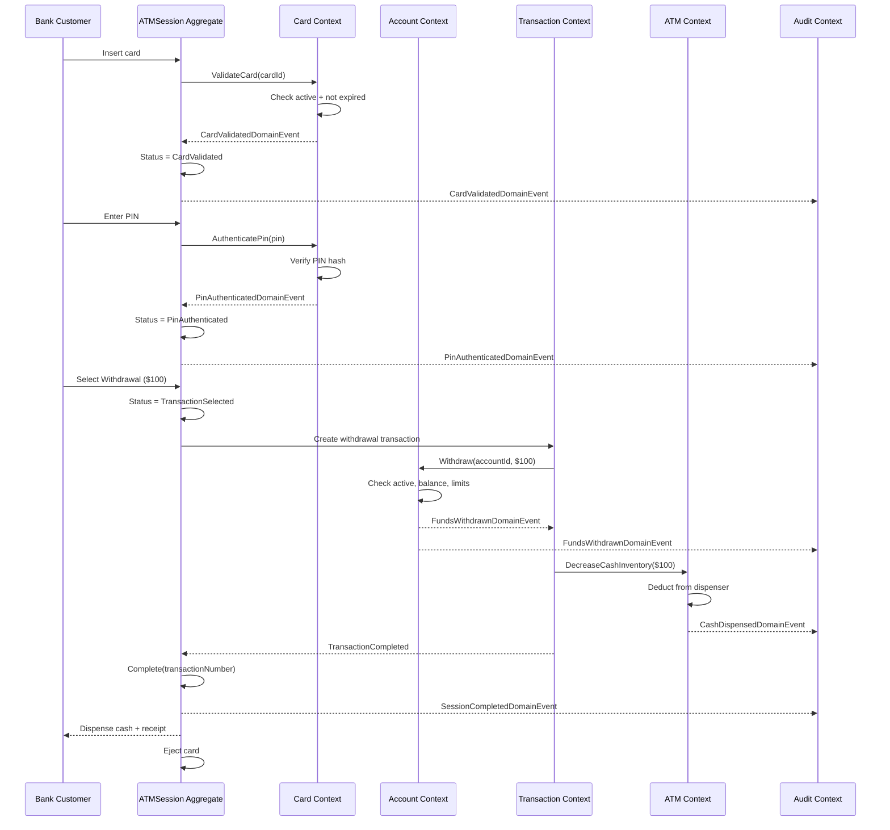

# Bounded Contexts — Deep Dive

## Executive Summary

This document provides a deep-dive into each of the four primary bounded contexts — **Card**, **Account**, **Transaction**, and **ATM** — plus the **Audit** supporting subdomain and the **ATMSession** sub-context introduced by ADR-005. For each context we document its responsibilities, aggregates, domain events, ubiquitous language, dependencies, persistence model, and considerations for future microservice extraction.

The contexts interact through in-process MediatR command/query dispatch and domain event notifications. Context mapping patterns include conformist, partnership, and shared kernel relationships as described in the [Context Map](./ContextMap.md).

---

## Bounded Context Overview

```mermaid
C4Container
    title Bounded Context Overview — Bank ATM System

    System_Boundary(atm_system, "Bank ATM System") {
        Container_Boundary(card, "Card Context") {
            Component(card_agg, "DebitCard Aggregate", "CardNumber, Pin, ExpirationDate, IssueDate, CardStatus")
            Component(card_events, "Domain Events", "CardValidated, PinAuthFailed, CardConfiscated, CardBlocked")
        }
        Container_Boundary(account, "Account Context") {
            Component(account_agg, "Account Aggregate", "Balance, Currency, AccountStatus")
            Component(account_events, "Domain Events", "FundsWithdrawn, FundsDeposited, DailyLimitExceeded")
        }
        Container_Boundary(txn, "Transaction Context") {
            Component(txn_agg, "ATMTransaction Aggregate", "Amount, Type, Status, ATMId, AccountId")
            Component(txn_events, "Domain Events", "TransactionApproved, TransactionCompleted, TransactionCancelled")
        }
        Container_Boundary(atm_ctx, "ATM Context") {
            Component(atm_agg, "ATM Aggregate", "Identifier, Location, ATMStatus")
            Component(disp_agg, "CashDispenser Aggregate", "Denomination, Count")
        }
        Container_Boundary(session, "ATMSession Sub-context") {
            Component(session_agg, "ATMSession Aggregate", "State machine: Started → ... → Completed/Cancelled")
            Component(session_events, "Domain Events", "SessionStarted, CardValidated, PinAuth, SessionCompleted, SessionCancelled")
        }
        ContainerDb(audit, "Audit Context", "AuditLog entries from all contexts")
    }

    Rel(card, audit, "Emits events →")
    Rel(account, audit, "Emits events →")
    Rel(txn, audit, "Emits events →")
    Rel(atm_ctx, audit, "Emits events →")
    Rel(session, audit, "Emits events →")
    Rel(atm_ctx, card, "Validates card →")
    Rel(atm_ctx, txn, "Initiates transaction →")
    Rel(atm_ctx, session, "Manages session →")
    Rel(txn, account, "Checks balance →")
```

---

## 1. Card Context

### Responsibilities and Ownership

The Card context owns the lifecycle of a debit card from issuance through terminal status (expired, blocked, or confiscated). It is the authoritative source for:

- Whether a card is active, expired, blocked, or confiscated
- PIN verification and failed‑attempt tracking
- Card number validity (Luhn check)
- Card confiscation business rules (3 failed PIN attempts → confiscated)

### Aggregate Root

**`DebitCard`** (`Banking.Domain.Cards.Aggregate.DebitCard`)

| Property | Type | Description |
|---|---|---|
| `Id` | `Guid` | Unique identifier |
| `AccountId` | `Guid` | Owning account |
| `CardNumber` | `CardNumber` | Luhn‑validated 16‑digit value object |
| `Pin` | `Pin` | 4–6 digit PIN value object |
| `ExpirationDate` | `ExpirationDate` | Expiry with `IsExpired` guard |
| `IssueDate` | `IssueDate` | Date of issue |
| `Status` | `CardStatus` | Active, Blocked, Expired, Confiscated |
| `FailedAttempts` | `int` | Running count of failed PIN attempts |

**Factory method:** `DebitCard.Issue(id, accountId, cardNumber, pin, expirationDate)`

**Key behavior methods:**

- `Validate()` — checks active + not expired; raises `CardValidatedDomainEvent`
- `AuthenticatePin(Pin pin)` — matches PIN; increments failures or resets; raises `PinAuthenticatedDomainEvent` / `PinAuthenticationFailedDomainEvent`; confiscates after 3 failures
- `Confiscate(string reason)` — forcibly confiscate (e.g., lost/stolen card)
- `Block(string reason)` — block card administratively
- `Expire()` — mark as expired (terminal status)

### Domain Events Produced

| Event | When Raised |
|---|---|
| `CardValidatedDomainEvent` | Card is successfully validated (active + not expired) |
| `PinAuthenticatedDomainEvent` | PIN matches (failed attempts reset to 0) |
| `PinAuthenticationFailedDomainEvent` | PIN does not match; includes `FailedAttempts` count |
| `CardConfiscatedDomainEvent` | Confiscation triggered (3 failed attempts, lost, stolen) |
| `CardBlockedDomainEvent` | Card is administratively blocked |

### Domain Events Consumed

None. The Card context does not depend on events from other contexts.

### Value Objects

| Value Object | Module | Validation |
|---|---|---|
| `CardNumber` | `Cards.ValueObjects` | 16 digits, Luhn checksum, exposes `LastFourDigits` |
| `Pin` | `Cards.ValueObjects` | 4–6 digits only |
| `ExpirationDate` | `Cards.ValueObjects` | Must be in the future; exposes `IsExpired` |
| `IssueDate` | `Cards.ValueObjects` | Must not be in the future |

### Ubiquitous Language (Card)

| Term | Definition |
|---|---|
| **Card** | A physical or virtual debit card issued to a customer |
| **PIN** | Personal Identification Number, 4–6 digits, used for cardholder authentication |
| **Card Validation** | The act of verifying a card is active and not expired |
| **PIN Authentication** | The act of verifying the cardholder knows the correct PIN |
| **Confiscated Card** | A card retained by the ATM system due to security policy violation |
| **Blocked Card** | A card administratively blocked by the bank |

### Dependencies on Other Contexts

None. The Card context is the most independent of the four primary contexts. It holds a `AccountId` reference but does not depend on Account context behavior.

### Persistence Model

| Table | Key Columns |
|---|---|
| `DebitCards` | `Id`, `AccountId`, `CardNumber_Value`, `Pin_Value`, `ExpirationDate_Value`, `IssueDate_Value`, `Status`, `FailedAttempts` |

Card is mapped via EF Core Fluent API in `CardConfiguration`.

### Future Microservice Extraction

The Card context is the strongest candidate for early extraction because:

- It has zero dependencies on other contexts
- Its aggregate boundary is clear and self‑contained
- It exposes simple query API (`IsCardValid?`, `AuthenticatePin?`)

**Extraction concern:** PIN hashing. Currently `Pin` is stored as plain value for training purposes; in production, the PIN hash would be stored and verification would be a hash comparison. This must be resolved before extraction.

### Open Questions and Assumptions

1. **PIN storage:** Assumption is plain value for training; ADR needed for hashing strategy.
2. **Card issuance:** Not exposed via API yet — domain model supports `Issue()` but no command handler exists.
3. **AccountId coupling:** Currently a `Guid` reference; no foreign key enforcement exists.

---

## 2. Account Context

### Responsibilities and Ownership

The Account context owns the financial account model, including balance management, currency enforcement, and account status lifecycle.

### Aggregate Root

**`Account`** (`Banking.Domain.Aggregates.Account`)

| Property | Type | Description |
|---|---|---|
| `Id` | `Guid` | Unique identifier |
| `AccountHolder` | `string` | Customer name |
| `Balance` | `decimal` | Current account balance |
| `Currency` | `string` | ISO currency code (e.g., "USD") |
| `Status` | `AccountStatus` | Active, Frozen, Closed |
| `CreatedAt` | `DateTime` | Account opening timestamp |

### Domain Events Produced

(Planned — not yet implemented)

| Event | When Raised |
|---|---|
| `AccountCreatedDomainEvent` | Account is opened |
| `FundsWithdrawnDomainEvent` | Successful withdrawal (includes amount, new balance) |
| `FundsDepositedDomainEvent` | Successful deposit |
| `DailyLimitExceededDomainEvent` | Withdrawal exceeds daily limit |

### Domain Events Consumed

None.

### Value Objects

| Value Object | Module | Notes |
|---|---|---|
| `AccountStatus` (enum) | `Banking.Domain.Aggregates` | Active, Frozen, Closed |

### Ubiquitous Language (Account)

| Term | Definition |
|---|---|
| **Account** | A financial account belonging to a customer (savings or checking) |
| **Balance** | The current amount of funds in the account |
| **Currency** | The monetary unit of the account (e.g., USD, EUR) |
| **Daily Withdrawal Limit** | Maximum amount that can be withdrawn in a single day |
| **Frozen Account** | An account temporarily suspended from transactions |

### Dependencies on Other Contexts

None directly, but the Transaction context calls into Account to check balances and perform withdrawals.

### Persistence Model

| Table | Key Columns |
|---|---|
| `Accounts` | `Id`, `AccountHolder`, `Balance`, `Currency`, `Status`, `CreatedAt` |

### Future Microservice Extraction

The Account context is highly business‑critical, but its contract is simple: query balance, debit funds, credit funds. When extracted, it must expose a transactional API (with idempotency keys) to prevent double‑debits.

**Extraction concern:** Daily limit tracking is currently not implemented. The `WithdrawnToday` field and the daily‑limit check logic need to be added.

### Open Questions and Assumptions

1. **Daily withdrawal limits:** Not yet implemented in the aggregate.
2. **Account → Card relationship:** Currently a `Guid` reference; no navigation property from Account to DebitCard.
3. **Overdraft:** Not modeled; assumed insufficient funds = failed withdrawal.

---

## 3. Transaction Context

### Responsibilities and Ownership

The Transaction context owns the lifecycle of ATM transactions — withdrawal, deposit, and balance inquiry. It tracks status transitions and coordinates with the Account context for funds availability.

### Aggregate Root

**`ATMTransaction`** (`Banking.Domain.Aggregates.ATMTransaction`)

| Property | Type | Description |
|---|---|---|
| `Id` | `Guid` | Unique identifier |
| `ATMId` | `Guid` | ATM that executed the transaction |
| `AccountId` | `Guid` | Target account |
| `DebitCardId` | `Guid` | Card used |
| `Amount` | `decimal` | Transaction amount |
| `Currency` | `string` | ISO currency code |
| `Type` | `TransactionType` | Withdrawal, Deposit, BalanceInquiry |
| `Status` | `TransactionStatus` | Pending, Completed, Failed, Cancelled |
| `Timestamp` | `DateTime` | Creation time |
| `FailureReason` | `string?` | Reason if Failed |

### Domain Events Produced

(Planned — not yet implemented)

| Event | When Raised |
|---|---|
| `TransactionApprovedDomainEvent` | Transaction is approved by account context |
| `TransactionCompletedDomainEvent` | Transaction finishes successfully |
| `TransactionCancelledDomainEvent` | Transaction is cancelled by user or timeout |

### Domain Events Consumed

- `FundsWithdrawnDomainEvent` — consumed by `AtmCashInventoryHandler` to decrease ATM cash inventory

### Value Objects

| Value Object | Module | Notes |
|---|---|---|
| `TransactionType` (enum) | `Banking.Domain.Aggregates` | Withdrawal, Deposit, BalanceInquiry |
| `TransactionStatus` (enum) | `Banking.Domain.Aggregates` | Pending, Completed, Failed, Cancelled |

### Ubiquitous Language (Transaction)

| Term | Definition |
|---|---|
| **Transaction** | A single ATM operation (withdrawal, deposit, or balance inquiry) |
| **Pending Transaction** | A transaction that has been initiated but not yet completed |
| **Failed Transaction** | A transaction that could not be completed due to business rule violation or system error |
| **Withdrawal** | Removal of cash funds from an account |
| **Deposit** | Addition of cash funds to an account |
| **Balance Inquiry** | A non‑mutating request for current account balance |

### Dependencies on Other Contexts

| Dependency | Type | Reason |
|---|---|---|
| Account Context | Strong | Must check balance, verify funds, perform debit |
| Card Context | Weak | Holds `DebitCardId` but only as a reference |
| ATM Context | Weak | Holds `ATMId` but only as a reference |

### Persistence Model

| Table | Key Columns |
|---|---|
| `ATMTransactions` | `Id`, `ATMId`, `AccountId`, `DebitCardId`, `Amount`, `Currency`, `Type`, `Status`, `Timestamp`, `FailureReason` |

### Future Microservice Extraction

The Transaction context is the most orchestrator‑heavy context. When extracted, it must coordinate with Account and ATM services via distributed transactions or saga pattern.

**Extraction concern:** The current `ATMTransaction` holds direct `Guid` references to `AccountId` and `DebitCardId`. In a microservice, these would become service references, not foreign keys.

### Open Questions and Assumptions

1. **Deposit transactions:** The domain model includes `Deposit` in `TransactionType`, but deposit workflows are not implemented in the application layer.
2. **Balance inquiry as a transaction:** Currently modeled as a transaction but may become a simple query in the future.
3. **Saga orchestration:** No saga pattern is yet designed for cross‑context failures.

---

## 4. ATM Context

### Responsibilities and Ownership

The ATM context owns the physical ATM model — its identity, location, operational status, and cash inventory. It also manages the `CashDispenser` sub‑aggregate for each denomination.

### Aggregate Roots

**`ATM`** (`Banking.Domain.Aggregates.ATM`)

| Property | Type | Description |
|---|---|---|
| `Id` | `Guid` | Unique identifier |
| `Identifier` | `string` | Human‑readable ATM code |
| `Location` | `string` | Physical location description |
| `Status` | `ATMStatus` | Online, Offline, Maintenance |
| `LastMaintenance` | `DateTime?` | Timestamp of last maintenance |

**`CashDispenser`** (`Banking.Domain.Aggregates.CashDispenser`)

| Property | Type | Description |
|---|---|---|
| `Id` | `Guid` | Unique identifier |
| `ATMId` | `Guid` | Owning ATM |
| `Denomination` | `decimal` | Bill denomination (e.g., 20, 50) |
| `Count` | `int` | Number of bills available |

### Domain Events Produced

(Planned — not yet implemented)

| Event | When Raised |
|---|---|
| `CashDispensedDomainEvent` | Cash is dispensed to customer |
| `CashLoadedDomainEvent` | Cash is loaded into the ATM |
| `ATMStatusChangedDomainEvent` | ATM goes online/offline/maintenance |

### Domain Events Consumed

| Event | Handler | Action |
|---|---|---|
| `FundsWithdrawnDomainEvent` | `AtmCashInventoryHandler` | Decreases ATM cash inventory |

### Value Objects

| Value Object | Module | Notes |
|---|---|---|
| `ATMStatus` (enum) | `Banking.Domain.Aggregates` | Online, Offline, Maintenance |

### Ubiquitous Language (ATM)

| Term | Definition |
|---|---|
| **ATM** | Automated Teller Machine — the physical hardware at a bank branch or remote location |
| **Cash Dispenser** | The sub‑system within an ATM that holds and dispenses bills of a specific denomination |
| **Cash Inventory** | The total value of cash available in the ATM across all denominations |
| **Online / Offline** | Operational status of the ATM |
| **Maintenance** | An ATM that is temporarily unavailable for customer use |

### Dependencies on Other Contexts

| Dependency | Type | Reason |
|---|---|---|
| Card Context | Strong | Must validate card and authenticate PIN before allowing transactions |
| Transaction Context | Strong | Must initiate and complete transactions |
| ATMSession Sub‑context | Strong | Manages the per‑customer session lifecycle |

### Persistence Model

| Table | Key Columns |
|---|---|
| `ATMs` | `Id`, `Identifier`, `Location`, `Status`, `LastMaintenance` |
| `CashDispensers` | `Id`, `ATMId`, `Denomination`, `Count` |

### Future Microservice Extraction

The ATM context has the most complex extraction path because it depends on Card, Transaction, and Session contexts. In a microservice decomposition, the ATM service would act as the orchestrator, calling Card and Transaction services via HTTP/gRPC.

**Extraction concern:** `AtmCashInventoryHandler` currently does not persist changes (calls `atm.DecreaseCashInventory()` but does not `SaveChangesAsync`). This must be fixed before extraction.

### Open Questions and Assumptions

1. **Cash inventory management:** Dispensing logic is not fully implemented — no calculation of which denominations to dispense.
2. **ATM maintenance scheduling:** Not modeled.
3. **Cash loading workflow:** `CashDispenser` supports `Count`, but no `LoadCash` command handler exists.

---

## 5. ATMSession Sub-context

### Responsibilities and Ownership

Introduced by [ADR-005](./ArchitectureDecisionRecords/ADR-005-SessionManagement.md), the ATMSession sub-context models the interactive session between a customer and an ATM. It acts as a state machine that enforces the sequential flow of card insertion → PIN authentication → transaction selection → completion or cancellation.

### Aggregate Root

**`ATMSession`** (`Banking.Domain.ATMSessions.Aggregate.ATMSession`)

| Property | Type | Description |
|---|---|---|
| `Id` | `SessionId` (strongly‑typed) | Unique session identifier |
| `ATMId` | `ATMId` (strongly‑typed) | ATM where the session takes place |
| `CardId` | `CardId?` | Inserted card (set during validation) |
| `Status` | `SessionStatus` | Started → CardValidated → PinAuthenticated → TransactionSelected → Completed / Cancelled |
| `SelectedTransactionType` | `TransactionType?` | Transaction chosen by customer |
| `TransactionNumber` | `TransactionNumber?` | Generated on successful completion |
| `FailedPinAttempts` | `int` | Count of failed PIN attempts in this session |
| `StartedAt` | `DateTime` | Session start timestamp |
| `CompletedAt` | `DateTime?` | Session end timestamp |

**Factory method:** `ATMSession.Start(SessionId id, ATMId atmId)`

**State machine transitions:**

```
Started ──► CardValidated ──► PinAuthenticated ──► TransactionSelected ──► Completed
                                                                              │
                              ◄────── Cancelled ◄─────────────────────────────┘
```

### Domain Events Produced

| Event | When Raised |
|---|---|
| `SessionStartedDomainEvent` | Session is created via `Start()` |
| `CardValidatedDomainEvent` | `ValidateCard(CardId)` is called |
| `PinAuthenticatedDomainEvent` | `Authenticate(true)` is called |
| `SessionCompletedDomainEvent` | `Complete(TransactionNumber)` is called |
| `SessionCancelledDomainEvent` | `Cancel(reason)` is called (also triggered by 3 failed PIN attempts) |

### Domain Events Consumed

None directly. Session events are consumed by the Audit context for traceability.

### Ubiquitous Language (Session)

| Term | Definition |
|---|---|
| **Session** | The sequence of interactions between a customer and an ATM, starting with card insertion and ending with completion or cancellation |
| **Card Validation** | The step where the inserted card is verified for active status and non‑expiry |
| **PIN Authentication** | The step where the cardholder's PIN is verified against the card's stored PIN |
| **Transaction Selection** | The step where the customer chooses a transaction type (withdrawal, deposit, balance inquiry) |
| **Session Timeout** | Automatic cancellation of a session due to inactivity |
| **Card Eject** | The physical return of the card to the customer after a completed or cancelled session |

### Dependencies on Other Contexts

The ATMSession uses `CardId` and `ATMId` as cross‑references but does not hold references to the `DebitCard` or `ATM` aggregates directly.

### Persistence Model

| Table | Key Columns |
|---|---|
| `ATMSessions` | `Id_Value`, `ATMId_Value`, `CardId_Value`, `Status`, `SelectedTransactionType`, `TransactionNumber_Value`, `FailedPinAttempts`, `StartedAt`, `CompletedAt` |

Mapped via EF Core Fluent API with value object conversions.

### Future Microservice Extraction

The ATMSession aggregate may either be folded into the ATM Service or extracted as an independent Session Service. The decision depends on whether session management is seen as a distinct bounded context or part of the ATM's operational responsibility.

### Open Questions and Assumptions

1. **Session timeout:** Not yet implemented — no timeout enforcement or automatic cancellation logic.
2. **Card eject:** The `EjectCard()` method is a stub that only validates terminal status; no physical eject simulation exists.
3. **Concurrent sessions:** Assumption is one session per ATM at a time; no enforcement exists.
4. **Session persistence:** Sessions are persisted to the database; in a high‑volume ATM, this may require a cleanup job for abandoned sessions.

---

## 6. Audit Context (Generic Supporting Subdomain)

### Responsibilities and Ownership

The Audit context provides an immutable, append‑only record of all significant business events occurring across the system. It is a **generic supporting subdomain** — it does not contain differentiating business logic but is essential for compliance, security investigations, and operational monitoring.

### Design

The Audit context is intentionally passive. It does not expose commands or queries of its own; instead it registers `INotificationHandler<T>` implementations for domain events from each primary context. Each handler transforms the domain event into a normalized `AuditLog` entry and persists it.

### Domain Events Consumed (Planned)

| Source Context | Events |
|---|---|
| Card Context | `CardValidatedDomainEvent`, `PinAuthenticatedDomainEvent`, `PinAuthenticationFailedDomainEvent`, `CardConfiscatedDomainEvent`, `CardBlockedDomainEvent` |
| Account Context | `FundsWithdrawnDomainEvent`, `FundsDepositedDomainEvent`, `DailyLimitExceededDomainEvent` |
| Transaction Context | `TransactionCompletedDomainEvent`, `TransactionCancelledDomainEvent` |
| ATM Context | `CashDispensedDomainEvent`, `CashLoadedDomainEvent`, `ATMStatusChangedDomainEvent` |
| ATMSession | `SessionStartedDomainEvent`, `SessionCompletedDomainEvent`, `SessionCancelledDomainEvent` |

### Persistence Model (Planned)

| Table | Key Columns |
|---|---|
| `AuditLogs` | `Id`, `CorrelationId`, `EventType`, `AggregateType`, `AggregateId`, `Payload` (JSON), `Severity`, `Timestamp` |

### Ubiquitous Language (Audit)

| Term | Definition |
|---|---|
| **Audit Log** | An immutable record of a business event for compliance and traceability |
| **Correlation ID** | A unique identifier that links related events across contexts (e.g., a single ATM session produces SessionStarted → CardValidated → PinAuthenticated → SessionCompleted) |
| **Severity** | The importance level of an audit entry (Information, Warning, Error, Critical) |

### Dependencies on Other Contexts

The Audit context depends on all primary contexts for domain event definitions. This is a compile‑time dependency on event records, not on aggregate logic.

### Future Microservice Extraction

The Audit context is the easiest to extract because:

- It only reads events; it never produces commands
- It can be converted to an event‑driven background service consuming from a message broker
- Its data model is independent of other contexts' models

---

## Context Interaction — Withdrawal Flow Sequence

The following sequence diagram shows how the bounded contexts interact during a successful ATM withdrawal.



---

## Context Mapping Patterns

| Relationship | Pattern | Rationale |
|---|---|---|
| ATM → Card | **Conformist** | ATM accepts Card's validation results without translation; Card owns all card logic |
| Transaction → Account | **Conformist** | Transaction uses Account's balance/limit data as‑is |
| ATM → Transaction | **Partnership** | Both contexts must coordinate for a successful withdrawal; changes in one may affect the other |
| ATMSession → Card/ATM | **Shared Kernel** | ATMSession uses `BuildingBlocks.Domain` primitives and references `CardId`/`ATMId` by value |
| All → Audit | **Event‑Carried State Transfer** | Audit consumes events passively; no back‑pressure on primary contexts |
| Future: Card → ATM | **Anti‑Corruption Layer** | Once extracted to microservices, an ACL prevents Card's domain model from leaking into ATM |

### Partnership Details (ATM ↔ Transaction)

The ATM context and Transaction context share a partnership because:

1. The ATM initiates transactions (it is the touchpoint for the customer)
2. The Transaction context owns the transaction lifecycle
3. The ATM must reflect transaction outcomes in its cash inventory

This partnership requires coordinated changes — for example, if the Transaction context adds a new transaction type, the ATM context must be updated to support it in its session flow.

### Conformist Details

**ATM → Card:** The ATM session calls `DebitCard.Validate()` and `DebitCard.AuthenticatePin()` directly. It trusts the Card context's business rules and does not add its own interpretation of card validity.

**Transaction → Account:** The Transaction context calls `Account.Withdraw()` and trusts the Account context to enforce balance checks, currency matching, and daily limit enforcement.

---

## References

- [Context Map](./ContextMap.md) — High‑level context relationships and upstream/downstream table
- [ADR-001-DDD](../ADR-001-DDD.md) — Domain Driven Design adoption
- [ADR-005-SessionManagement](./ArchitectureDecisionRecords/ADR-005-SessionManagement.md) — ATMSession aggregate design
- [ADR-006-ModularDomainOrganization](./ArchitectureDecisionRecords/ADR-006-ModularDomainOrganization.md) — Module folder organization
- [Ubiquitous Language](../UbiquitousLanguage.md) — Shared domain vocabulary
- [Domain Model](../DomainModel.md) — Aggregate‑level descriptions
