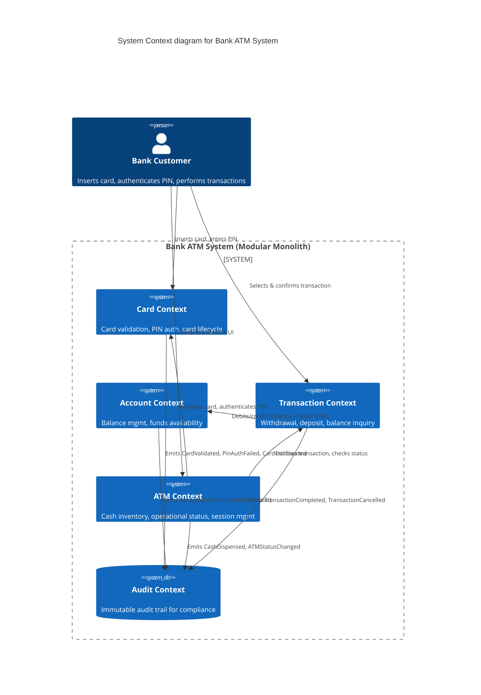
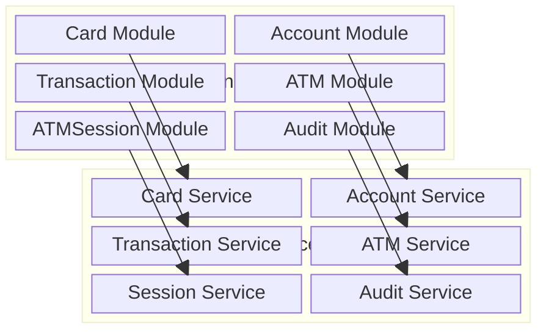

# Context Map — Bank ATM System

## Executive Summary

The Bank ATM System is decomposed into four primary bounded contexts — **Card**, **Account**, **Transaction**, and **ATM** — each owning a distinct slice of the business domain. A fifth **Audit** context acts as a generic supporting subdomain, consuming events from all primary contexts. The system is deployed as a modular monolith (per [ADR-004](../ADR-004-ModularMonolith.md)) with clear seams that enable future extraction into separate microservices. All contexts share a small **Shared Kernel** of domain primitives (e.g., `AggregateRoot<TId>`, `ValueObject`, `Result`, `IDomainEvent`) provided by the `BuildingBlocks.Domain` library.

## Purpose and Scope

This Context Map documents:

- The boundaries and responsibilities of each bounded context
- The aggregates, domain events, and value objects owned by each context
- The relationships (upstream/downstream) between contexts
- The patterns used for context integration (shared kernel, anti-corruption layer)
- The planned mapping from today's modular monolith to future microservices

The map is a living artifact and should be updated whenever context boundaries shift or new integration patterns emerge.

---

## Bounded Contexts

### 1. Card Context

**Namespace:** `Banking.Domain.Cards.*`

| Aspect | Details |
|---|---|
| **Aggregate Root** | `DebitCard` |
| **Responsibility** | Card lifecycle: issuance, PIN verification, status tracking, failed‑attempt monitoring, confiscation |
| **Value Objects** | `CardNumber` (Luhn‑validated, 16 digits), `Pin` (4–6 digits), `ExpirationDate`, `IssueDate` |
| **Enums** | `CardStatus` — `Active`, `Blocked`, `Expired`, `Confiscated` |
| **Domain Events (produced)** | `CardValidatedDomainEvent`, `PinAuthenticatedDomainEvent`, `PinAuthenticationFailedDomainEvent`, `CardConfiscatedDomainEvent`, `CardBlockedDomainEvent` |
| **Domain Events (consumed)** | None (no external events drive card state) |
| **Repository** | `IDebitCardRepository` |
| **Persistence Tables** | `DebitCards`, `OutboxMessages` |

### 2. Account Context

**Namespace:** `Banking.Domain.Aggregates` (flat, pending migration per ADR-006)

| Aspect | Details |
|---|---|
| **Aggregate Root** | `Account` |
| **Responsibility** | Account balance management, funds availability, currency enforcement, account status lifecycle |
| **Value Objects** | `AccountStatus` enum — `Active`, `Frozen`, `Closed` |
| **Domain Events (produced)** | (Planned: `FundsWithdrawnDomainEvent`, `FundsDepositedDomainEvent`, `AccountCreatedDomainEvent`, `DailyLimitExceededDomainEvent`) |
| **Domain Events (consumed)** | None yet |
| **Repository** | `IAccountRepository` |
| **Persistence Tables** | `Accounts`, `OutboxMessages` |

### 3. Transaction Context

**Namespace:** `Banking.Domain.Aggregates` (flat, pending migration per ADR-006)

| Aspect | Details |
|---|---|
| **Aggregate Root** | `ATMTransaction` |
| **Responsibility** | Transaction lifecycle: withdrawal, deposit, balance inquiry; tracking status (Pending → Completed / Failed / Cancelled) |
| **Value Objects** | `TransactionType` enum — `Withdrawal`, `Deposit`, `BalanceInquiry`; `TransactionStatus` enum — `Pending`, `Completed`, `Failed`, `Cancelled` |
| **Domain Events (produced)** | (Planned: `TransactionApprovedDomainEvent`, `TransactionCompletedDomainEvent`, `TransactionCancelledDomainEvent`) |
| **Domain Events (consumed)** | `FundsWithdrawnDomainEvent` — triggers ATM cash inventory update |
| **Repository** | `ITransactionRepository` |
| **Persistence Tables** | `ATMTransactions`, `OutboxMessages` |

### 4. ATM Context

**Namespace:** `Banking.Domain.Aggregates` (flat, pending migration per ADR-006)

**Sub‑aggregate:** `CashDispenser`

| Aspect | Details |
|---|---|
| **Aggregate Roots** | `ATM`, `CashDispenser` |
| **Responsibility** | ATM operational status, cash inventory management, cash dispensing and loading |
| **Value Objects** | `ATMStatus` enum — `Online`, `Offline`, `Maintenance` |
| **Domain Events (produced)** | (Planned: `CashDispensedDomainEvent`, `CashLoadedDomainEvent`, `ATMStatusChangedDomainEvent`) |
| **Domain Events (consumed)** | `FundsWithdrawnDomainEvent` — handled by `AtmCashInventoryHandler` to decrease cash inventory |
| **Repository** | `IATMRepository` |
| **Persistence Tables** | `ATMs`, `CashDispensers`, `OutboxMessages` |

### 5. ATMSession Sub‑context (within ATM/Card boundary)

**Namespace:** `Banking.Domain.ATMSessions.*`

The `ATMSession` aggregate was introduced per **ADR-005** to model the ATM session lifecycle explicitly. Although it sits adjacent to both the ATM and Card contexts, it is owned by the ATM operational flow.

| Aspect | Details |
|---|---|
| **Aggregate Root** | `ATMSession` |
| **Responsibility** | State machine for ATM session flow: card insertion → PIN auth → transaction selection → completion / cancellation |
| **Value Objects** | `SessionId` (strongly‑typed), `ATMId` (strongly‑typed), `CardId` (strongly‑typed), `TransactionNumber` (generated `TXN-{ts}-{random}`) |
| **Enums** | `SessionStatus` — `Started`, `CardValidated`, `PinAuthenticated`, `TransactionSelected`, `Completed`, `Cancelled` |
| **Domain Events (produced)** | `SessionStartedDomainEvent`, `CardValidatedDomainEvent`, `PinAuthenticatedDomainEvent`, `SessionCompletedDomainEvent`, `SessionCancelledDomainEvent` |
| **Domain Events (consumed)** | None directly; session events feed the Audit Context |
| **Persistence Tables** | `ATMSessions`, `OutboxMessages` |

### 6. Audit Context (Generic Supporting Subdomain)

The Audit Context is intentionally kept generic. It does not own any primary business logic; instead it subscribes to domain events from all primary contexts and persists an audit trail.

| Aspect | Details |
|---|---|
| **Aggregate Root** | `AuditLog` (planned) |
| **Responsibility** | Immutable record of all financial and security events for compliance and traceability |
| **Value Objects** | `AuditEntryId`, `AuditType`, `CorrelationId`, `Severity`, `Timestamp` |
| **Domain Events (produced)** | None |
| **Domain Events (consumed)** | All events from Card, Account, Transaction, ATM, and ATMSession contexts |
| **Repository** | `IAuditLogRepository` (planned) |
| **Persistence Tables** | `AuditLogs` |

---

## Context Relationships — C4 Context Diagram

---

## Upstream / Downstream Relationships

| Downstream Context | Upstream Context | Integration Pattern | Mechanism |
|---|---|---|---|
| ATM Context | Card Context | **Conformist** — ATM accepts card validation results as‑is | In‑process method call via MediatR |
| Transaction Context | Account Context | **Conformist** — Transaction uses account balance / limit data | In‑process method call via MediatR |
| ATM Context | Transaction Context | **Partnership** — ATM initiates transactions, Transaction reports back status | Domain events + MediatR notifications |
| Audit Context | Card, Account, Transaction, ATM | **Conformist / Event‑Carried State Transfer** — Audit consumes events passively | Domain events dispatched via `DomainEventDispatcher` |
| ATMSession (sub‑context) | Card, ATM | **Shared Kernel** — uses `AggregateRoot`, `ValueObject`, `IBusinessRule` from `BuildingBlocks.Domain` | Shared library reference |

### Pattern Definitions

- **Conformist:** The downstream context conforms to the upstream context's model without adding translation.
- **Partnership:** Two contexts collaborate; changes are coordinated between both teams.
- **Shared Kernel:** A shared library of domain primitives (`BuildingBlocks.Domain`) that all contexts depend on.
- **Anti‑Corruption Layer (ACL):** A translation layer that prevents upstream model concepts from leaking into the downstream context. An ACL is **not yet needed** because the system is a modular monolith, but it will be introduced when contexts are extracted into microservices.

---

## Shared Kernel

All bounded contexts share the **`BuildingBlocks.Domain`** library, which provides:

- `AggregateRoot<TId>` — Base class with domain event collection
- `Entity<TId>` — Base class with typed ID and value equality
- `ValueObject` — Base class with structural equality via `GetEqualityComponents()`
- `Result` / `Result<T>` — Success/failure result type
- `Guard` — Guard clause utilities with `IBusinessRule`
- `IBusinessRule` — Business rule interface for invariant enforcement
- `IDomainEvent` — Base interface for domain events (extends MediatR `INotification`)
- `StronglyTypedId` — Base record for typed IDs (e.g., `SessionId`, `ATMId`)

This shared kernel is deliberately **small and stable** to avoid tight coupling between contexts.

---

## Anti‑Corruption Layer Notes

In the current modular monolith phase, all contexts share the same process and database, so an ACL is unnecessary. When contexts are extracted into microservices, an ACL will be introduced in the following places:

1. **Card Context → ATM Context:** The ATM's session management must translate between the Card context's `DebitCard` model and the `ATMSession`'s `CardId` value object.
2. **Account Context → Transaction Context:** The Transaction context should not reference `Account` directly; it should use an ACL to query balance and limits.
3. **Audit Context:** Each primary context's events have different schemas; the Audit context should implement an ACL to normalize events into a uniform `AuditLog` entry format.

---

## Future Microservice Decomposition

Each bounded context maps to a future microservice. The `ATMSession` aggregate may be folded into the ATM microservice or extracted independently, depending on operational needs.

### Extraction Priority

| Service | Extraction Complexity | Business Criticality | Notes |
|---|---|---|---|
| **Audit Service** | Low | Medium | Independent, event‑driven — easiest to extract first |
| **Card Service** | Medium | High | Few dependencies on other contexts; PIN hash is self‑contained |
| **Account Service** | Medium | High | Must expose API for balance checks — used by Transaction and ATM |
| **Transaction Service** | High | High | Orchestrates withdrawal flow across multiple services |
| **ATM Service** | High | Medium | Includes session management; depends on Card and Transaction |
| **Session Service** | Medium | Medium | Could remain as part of ATM Service or be extracted separately |

---

## References

- [ADR-001-DDD](../ADR-001-DDD.md) — Domain Driven Design adoption
- [ADR-004-ModularMonolith](../ADR-004-ModularMonolith.md) — Modular monolith decision
- [ADR-005-SessionManagement](./ArchitectureDecisionRecords/ADR-005-SessionManagement.md) — ATMSession aggregate design
- [ADR-006-ModularDomainOrganization](./ArchitectureDecisionRecords/ADR-006-ModularDomainOrganization.md) — Modular domain folder organization
- [Ubiquitous Language](../../UbiquitousLanguage.md) — Shared domain vocabulary
- [Domain Model](../../DomainModel.md) — Detailed aggregate descriptions
