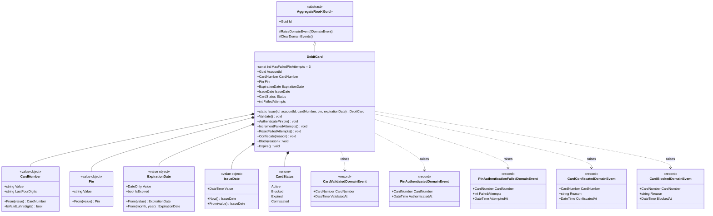
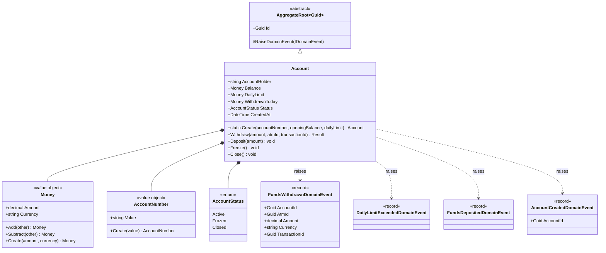
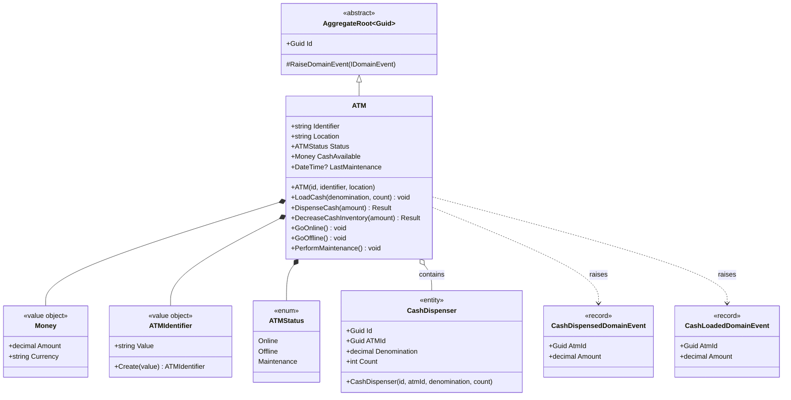
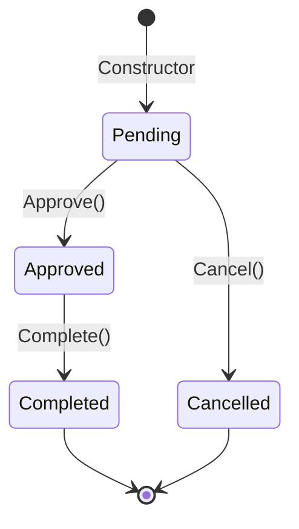
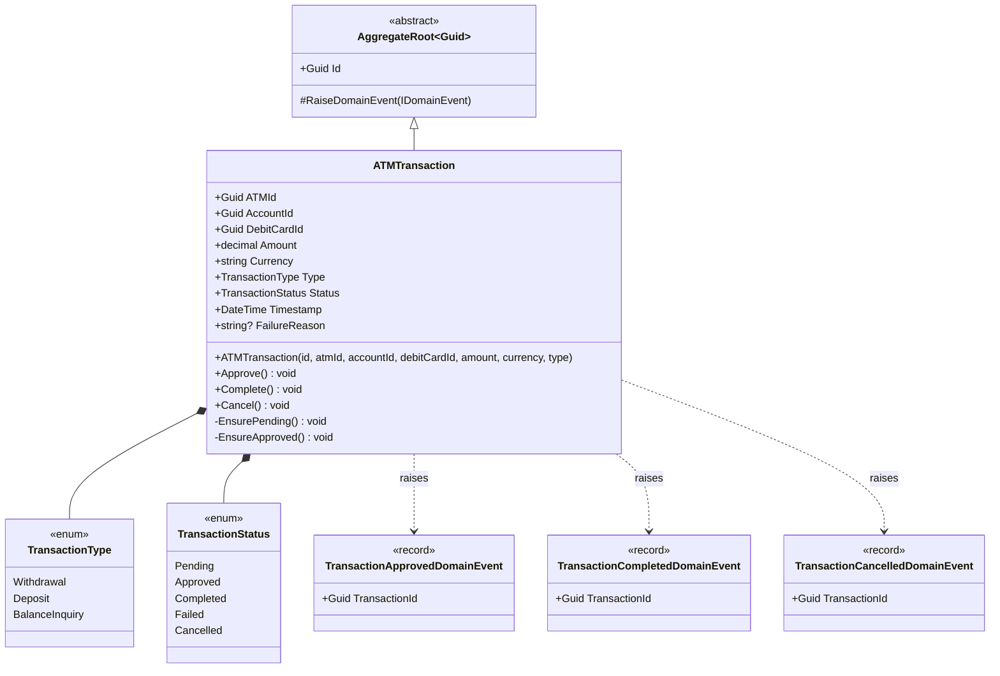
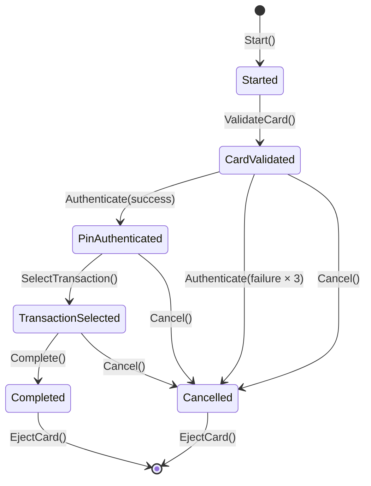
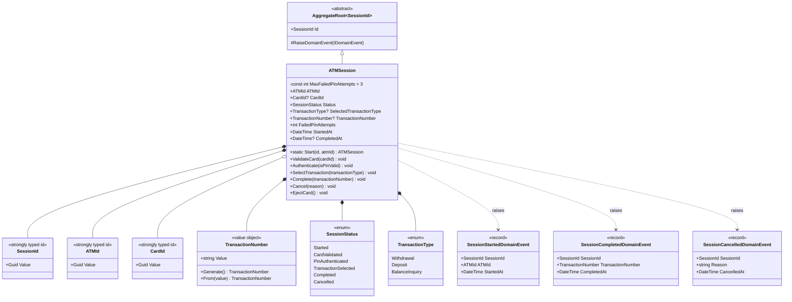

# Aggregate Design

> **References:** [Domain Model](../DomainModel.md) | [Context Map](../ContextMap.md) | [Ubiquitous Language](../UbiquitousLanguage.md) | [Domain Events](./DomainEvents.md) | [Milestone 3 Roadmap](../Roadmap/Milestone3.md)
>
> **Technology Stack:** .NET 10, Clean Architecture, DDD, CQRS with MediatR

---

## Table of Contents

1. [DebitCard Aggregate](#1-debitcard-aggregate)
2. [Account Aggregate](#2-account-aggregate)
3. [ATM Aggregate](#3-atm-aggregate)
4. [ATMTransaction Aggregate](#4-atmtransaction-aggregate)
5. [ATMSession Aggregate](#5-atmsession-aggregate)

---

## 1. DebitCard Aggregate

**Namespace:** `Banking.Domain.Cards.Aggregate`  
**Base Class:** `AggregateRoot<Guid>`  
**Bounded Context:** Card Context  

### Responsibilities

- Card lifecycle management from issuance to terminal disposition (active, blocked, expired, confiscated)
- PIN verification against stored hash with failed-attempt tracking
- Enforcement of the three-strikes PIN policy leading to automatic confiscation
- Manual confiscation trigger (e.g., card reported stolen)
- Administrative blocking and automatic expiration

### State

| Property | Type | Notes |
|---|---|---|
| `Id` | `Guid` | Inherited from `AggregateRoot<Guid>` |
| `AccountId` | `Guid` | Foreign key to the owning Account |
| `CardNumber` | `CardNumber` (VO) | 16-digit, Luhn-validated; exposes `LastFourDigits` |
| `Pin` | `Pin` (VO) | 4–6 digit numeric; stored as hash in production |
| `ExpirationDate` | `ExpirationDate` (VO) | Future date; exposes `IsExpired` |
| `IssueDate` | `IssueDate` (VO) | Non-future date; set to `DateTime.UtcNow` on issue |
| `Status` | `CardStatus` (enum) | `Active`, `Blocked`, `Expired`, `Confiscated` |
| `FailedAttempts` | `int` | Increments on failed PIN; resets on success |

### Behaviors

```csharp
// Static factory — creates a new card in Active status
public static DebitCard Issue(Guid id, Guid accountId, CardNumber cardNumber, Pin pin, ExpirationDate expirationDate)

// Validates card is Active and not expired; raises CardValidatedDomainEvent
public void Validate()

// Verifies PIN; on success resets FailedAttempts, on failure increments and
// auto-confiscates if FailedAttempts >= 3; raises PinAuthenticatedDomainEvent
// or PinAuthenticationFailedDomainEvent / CardConfiscatedDomainEvent
public void AuthenticatePin(Pin pin)

// Manual increment of failed attempts (used by session context)
public void IncrementFailedAttempts()

// Reset failed attempts after successful PIN entry
public void ResetFailedAttempts()

// Immediate confiscation with reason (e.g., stolen card report)
public void Confiscate(string reason)

// Administrative block with reason
public void Block(string reason)

// Automatic expiration when card passes its ExpirationDate
public void Expire()
```

### Business Rules (Invariants)

| Rule | Enforcement | Violation Result |
|---|---|---|
| Card must be `Active` for PIN authentication | `CardMustBeActiveRule` | `BusinessRuleValidationException` |
| Card must be `Active` for validate/confiscate/block | `CardMustBeActiveRule` | `BusinessRuleValidationException` |
| Card must not be expired for validation | `CardMustNotBeExpiredRule` | `BusinessRuleValidationException` |
| Card must not be in a terminal state for Expire() | `CardMustNotBeTerminalRule` | `BusinessRuleValidationException` |
| Max 3 failed PIN attempts before confiscation | `AuthenticatePin()` logic | Automatic confiscation on 3rd failure |
| PIN must be 4–6 digits | `Pin.From()` | `ArgumentException` |
| Card number must be 16 digits with valid Luhn | `CardNumber.From()` | `ArgumentException` |
| Expiration date must be in the future | `ExpirationDate.From()` | `ArgumentException` |

### Domain Events

| Event | Raised By | Payload |
|---|---|---|
| `CardValidatedDomainEvent` | `Validate()` | `CardNumber`, `ValidatedAt` |
| `PinAuthenticatedDomainEvent` | `AuthenticatePin()` (success) | `CardNumber`, `AuthenticatedAt` |
| `PinAuthenticationFailedDomainEvent` | `AuthenticatePin()` (failure) | `CardNumber`, `FailedAttempts`, `AttemptedAt` |
| `CardConfiscatedDomainEvent` | `AuthenticatePin()` / `Confiscate()` / `IncrementFailedAttempts()` | `CardNumber`, `Reason`, `ConfiscatedAt` |
| `CardBlockedDomainEvent` | `Block()` | `CardNumber`, `Reason`, `BlockedAt` |

### Value Objects

| Value Object | Validation | Key Members |
|---|---|---|
| `CardNumber` | Exactly 16 digits; Luhn algorithm check | `Value`, `LastFourDigits`, `From(string)`, `ToString()` (masked) |
| `Pin` | 4–6 digits; numeric only | `Value`, `From(string)`, `ToString()` (redacted) |
| `ExpirationDate` | Must be future date | `Value` (`DateOnly`), `IsExpired` (computed), `From(DateOnly)`, `From(int month, int year)` |
| `IssueDate` | Must not be future | `Value` (`DateTime`), `Now()` (factory), `From(DateTime)` |

### Repository Responsibility

| Method | Signature | Purpose |
|---|---|---|
| `GetByIdAsync` | `Task<DebitCard?> GetByIdAsync(Guid id, CancellationToken ct)` | Load by identity |
| `GetByCardNumberAsync` | `Task<DebitCard?> GetByCardNumberAsync(CardNumber cardNumber, CancellationToken ct)` | Lookup by card number |
| `Add` | `void Add(DebitCard card)` | Persist new card |
| `Update` | `void Update(DebitCard card)` | Persist changes |

### Class Diagram



### Persistence Considerations

- **CardNumber** stored as string column (max 20 chars) with a unique index
- **Pin** stored as hash (SHA-256 or bcrypt) — never plaintext; VO is for in-memory representation
- **ExpirationDate** mapped to SQL `DATE` column
- **IssueDate** mapped to SQL `TIMESTAMP` column
- **Status** stored as string via `HasConversion<string>()` for readability
- **FailedAttempts** simple integer column
- **RowVersion** (byte array) for optimistic concurrency
- Consider owned entity types for value object grouping in EF Core 10

### Microservice Consideration

The DebitCard aggregate is a natural first candidate for extraction into a dedicated **Card Service** because:

- It owns all card-related data with clear boundaries
- PIN verification is security-critical and benefits from isolation
- It has a well-defined event contract (`ICardVerificationService` facade)
- High authentication traffic can scale independently

---

## 2. Account Aggregate

**Namespace:** `Banking.Domain.Aggregates` (newer) / `Bank.Server.Domain.AccountContext.Aggregates` (existing)  
**Base Class:** `AggregateRoot<Guid>`  
**Bounded Context:** Account Context  

### Responsibilities

- Balance management with atomic debit/credit operations
- Daily withdrawal limit enforcement with rolling reset
- Funds availability checks before any withdrawal
- Account status lifecycle (Active, Frozen, Closed)

### State

| Property | Type | Notes |
|---|---|---|
| `Id` | `Guid` | Inherited from `AggregateRoot<Guid>` |
| `AccountHolder` | `string` | Name of the account holder |
| `Balance` | `decimal` / `Money` (VO) | Current balance; `Money` VO wraps Amount + Currency |
| `Currency` | `string` (ISO 4217) | e.g., "USD", "EUR" |
| `Status` | `AccountStatus` (enum) | `Active`, `Frozen`, `Closed` |
| `DailyLimit` | `decimal` / `Money` (VO) | Maximum withdrawable per day |
| `WithdrawnToday` | `decimal` / `Money` (VO) | Cumulative withdrawal for current day |
| `CreatedAt` | `DateTime` | Account opening timestamp |

### Behaviors

```csharp
// Static factory — creates a new active account
public static Account Create(AccountNumber accountNumber, Money openingBalance, Money dailyLimit)

// Withdraw funds — enforces all invariants, raises events
public Result Withdraw(Money amount, Guid atmId, Guid transactionId = default)

// Deposit funds — increases balance
public void Deposit(Money amount)

// Freeze the account — prevents any transactions
public void Freeze()

// Close the account — terminal status
public void Close()
```

### Business Rules (Invariants)

| Rule | Enforcement | Violation Result |
|---|---|---|
| Account must be `Active` for withdrawals | `Withdraw()` check | `Result.Failure("Account is not active.")` |
| Sufficient balance for withdrawal | `Balance.Amount >= amount.Amount` | `Result.Failure("Insufficient funds.")` |
| Daily limit not exceeded | `WithdrawnToday.Amount + amount.Amount <= DailyLimit.Amount` | `Result.Failure("Daily withdrawal limit exceeded.")` + raises `DailyLimitExceededDomainEvent` |
| Currency must match | `Balance.Currency == amount.Currency` | `Result.Failure("Currency mismatch.")` |
| ATM ID must be provided | `atmId != Guid.Empty` | `Result.Failure("ATM id is required.")` |
| Non-negative amounts | `Money.Create(amount, currency)` | `ArgumentException` |

### Domain Events

| Event | Raised By | Payload |
|---|---|---|
| `AccountCreatedDomainEvent` | `Create()` | `AccountId` |
| `FundsWithdrawnDomainEvent` | `Withdraw()` (success) | `AccountId`, `AtmId`, `Amount`, `Currency`, `TransactionId` |
| `FundsDepositedDomainEvent` | `Deposit()` | (empty — extended later) |
| `DailyLimitExceededDomainEvent` | `Withdraw()` (limit hit) | (empty — extended later) |

### Value Objects

| Value Object | Validation | Key Members |
|---|---|---|
| `AccountNumber` | Non-empty string | `Value`, `Create(string)` |
| `Money` | Non-negative amount; structural equality on Amount + Currency | `Amount`, `Currency`, `Add(Money)`, `Subtract(Money)`, `Create(decimal, string)` |
| `AccountStatus` | Enum | `Active`, `Frozen`, `Closed` |

### Repository Responsibility

| Method | Signature | Purpose |
|---|---|---|
| `GetByIdAsync` | `Task<Account?> GetByIdAsync(Guid id, CancellationToken ct)` | Load by identity |
| `GetByAccountNumberAsync` | `Task<Account?> GetByAccountNumberAsync(AccountNumber accountNumber, CancellationToken ct)` | Lookup by account number |
| `Add` | `void Add(Account account)` | Persist new account |
| `Update` | `void Update(Account account)` | Persist changes |

### Class Diagram



### Persistence Considerations

- **Balance, DailyLimit, WithdrawnToday** stored as decimal columns with precision `(18, 2)`
- **Currency** stored as string (3 chars, ISO 4217)
- **Status** stored as string via `HasConversion<string>()`
- **Optimistic concurrency** via `byte[] RowVersion` (EF Core concurrency token) — critical for balance updates to prevent lost updates
- **Daily limit reset logic**: `WithdrawnToday` must be reset to zero at the start of each banking day. This can be implemented as:
  - A background job (scheduled task) that resets at midnight
  - A check in `Withdraw()` that resets `WithdrawnToday` if the last withdrawal was on a previous day (requires tracking `LastWithdrawalDate`)

### Microservice Consideration

The Account aggregate holds the most financially sensitive data. In a microservice extraction:

- Must be the **source of truth** for all financial operations
- Requires **strong consistency** (no eventual consistency for balance updates)
- Should expose an `IAccountLedgerService` interface with idempotency guarantees
- Daily limit enforcement should consider cross-ATM aggregation if needed

---

## 3. ATM Aggregate

**Namespace:** `Banking.Domain.Aggregates` (newer) / `Bank.Server.Domain.ATMContext.Aggregates` (existing)  
**Base Class:** `AggregateRoot<Guid>`  
**Bounded Context:** ATM Context  

### Responsibilities

- Cash inventory management across multiple denominations
- Operational status lifecycle (Online, Offline, Maintenance)
- Cash dispensing with validation of sufficient funds
- Cash loading and reconciliation
- Maintenance tracking

### State

| Property | Type | Notes |
|---|---|---|
| `Id` | `Guid` | Inherited from `AggregateRoot<Guid>` |
| `Identifier` | `string` / `ATMIdentifier` (VO) | Unique ATM machine identifier |
| `Location` | `string` | Physical location description |
| `Status` | `ATMStatus` (enum) | `Online`, `Offline`, `Maintenance` |
| `CashAvailable` | `Money` (VO) | Total cash available (computed or stored) |
| `CashDispensers` | `ICollection<CashDispenser>` | Child entities per denomination |
| `LastMaintenance` | `DateTime?` | Timestamp of last maintenance |

### Behaviors

```csharp
// Constructor — creates a new ATM in Online status
public ATM(Guid id, string identifier, string location)

// Load cash into a specific denomination cassette
// Raises CashLoadedDomainEvent
public void LoadCash(decimal denomination, int count)

// Dispense cash — checks Online status and sufficient funds
// Raises CashDispensedDomainEvent
public Result DispenseCash(Money amount)

// Alias for DispenseCash
public Result DecreaseCashInventory(Money amount)

// Set ATM to Online status
public void GoOnline()

// Set ATM to Offline status
public void GoOffline()

// Perform maintenance (updates LastMaintenance, can transition from Maintenance to Online)
public void PerformMaintenance()
```

### Business Rules (Invariants)

| Rule | Enforcement | Violation Result |
|---|---|---|
| ATM must be `Online` for dispensing | `Status != ATMStatus.Online` | `Result.Failure("ATM offline")` |
| Sufficient cash for requested amount | `CashAvailable.Amount >= amount.Amount` | `Result.Failure("Insufficient ATM cash")` |
| Valid denominations for loading | `denomination > 0` | `ArgumentException` |
| Non-negative count for cash loading | `count >= 0` | `ArgumentException` |

### Domain Events

| Event | Raised By | Payload |
|---|---|---|
| `CashDispensedDomainEvent` | `DispenseCash()` | `AtmId`, `Amount` |
| `CashLoadedDomainEvent` | `LoadCash()` | `AtmId`, `Amount` |
| `ATMStartedDomainEvent` | System startup | (empty) |

### Value Objects

| Value Object | Validation | Key Members |
|---|---|---|
| `ATMIdentifier` | Non-empty string | `Value`, `Create(string)` |
| `ATMStatus` | Enum | `Online`, `Offline`, `Maintenance` |

### Child Entity: CashDispenser

| Property | Type | Notes |
|---|---|---|
| `Id` | `Guid` | Entity identity |
| `ATMId` | `Guid` | FK to owning ATM |
| `Denomination` | `decimal` | e.g., 5, 10, 20, 50, 100 |
| `Count` | `int` | Number of notes available |

### Repository Responsibility

| Method | Signature | Purpose |
|---|---|---|
| `GetByIdAsync` | `Task<ATM?> GetByIdAsync(Guid id, CancellationToken ct)` | Load by identity |
| `GetByIdentifierAsync` | `Task<ATM?> GetByIdentifierAsync(string identifier, CancellationToken ct)` | Lookup by machine code |
| `Add` | `void Add(ATM atm)` | Persist new ATM |
| `Update` | `void Update(ATM atm)` | Persist changes |

### Class Diagram



### Persistence Considerations

- **CashDispenser** is a child entity stored in a separate table (`CashDispensers`) with a FK to ATM
- Cascade delete on ATM → CashDispenser relationship
- **RowVersion** on both ATM and CashDispenser for concurrency
- Cash dispense and load operations must be wrapped in a database transaction
- `CashAvailable` can be computed as `SUM(Denomination * Count)` or stored as a denormalized column for query performance

### Microservice Consideration

- Represents a physical device — high availability is critical
- Cash inventory updates can be **eventually consistent** via the outbox pattern
- The ATM aggregate could expose a gRPC endpoint for real-time status monitoring
- Denominations and cash loading may be managed by a separate **Cash Management Service**

---

## 4. ATMTransaction Aggregate

**Namespace:** `Banking.Domain.Aggregates`  
**Base Class:** `AggregateRoot<Guid>`  
**Bounded Context:** Transaction Context  

### Responsibilities

- Complete transaction lifecycle management
- Audit trail for all financial operations
- Failure recording with structured reason codes
- Immutable record after completion

### State

| Property | Type | Notes |
|---|---|---|
| `Id` | `Guid` | Inherited from `AggregateRoot<Guid>` |
| `ATMId` | `Guid` | FK to the executing ATM |
| `AccountId` | `Guid` | FK to the source/destination account |
| `DebitCardId` | `Guid` | FK to the card used |
| `Amount` | `decimal` | Transaction amount |
| `Currency` | `string` (ISO 4217) | Transaction currency |
| `Type` | `TransactionType` (enum) | `Withdrawal`, `Deposit`, `BalanceInquiry` |
| `Status` | `TransactionStatus` (enum) | `Pending`, `Completed`, `Failed`, `Cancelled` |
| `Timestamp` | `DateTime` | When the transaction was initiated |
| `FailureReason` | `string?` | Structured reason if Failed or Cancelled |

### Behaviors

```csharp
// Constructor — creates a new Pending transaction
public ATMTransaction(Guid id, Guid atmId, Guid accountId, Guid debitCardId, decimal amount, string currency, TransactionType type)

// Approve — transitions from Pending to Approved
// Raises TransactionApprovedDomainEvent
public void Approve()

// Complete — transitions from Approved to Completed
// Raises TransactionCompletedDomainEvent
public void Complete()

// Cancel — transitions from Pending to Cancelled
// Raises TransactionCancelledDomainEvent
public void Cancel()
```

### Business Rules (Invariants)

| Rule | Enforcement | Violation Result |
|---|---|---|
| Lifecycle: Pending → Approved → Completed | State transition guards | `InvalidOperationException` |
| Only Pending transactions can be cancelled | `EnsurePending()` | `InvalidOperationException` |
| Only Approved transactions can be completed | `EnsureApproved()` | `InvalidOperationException` |
| Only Pending transactions can be approved | `EnsurePending()` | `InvalidOperationException` |

### Transaction Lifecycle



### Domain Events

| Event | Raised By | Payload |
|---|---|---|
| `TransactionApprovedDomainEvent` | `Approve()` | `TransactionId` |
| `TransactionCompletedDomainEvent` | `Complete()` | `TransactionId` |
| `TransactionCancelledDomainEvent` | `Cancel()` | `TransactionId` |

### Value Objects

| Value Object | Members |
|---|---|
| `TransactionType` (enum) | `Withdrawal`, `Deposit`, `BalanceInquiry` |
| `TransactionStatus` (enum) | `Pending`, `Approved`, `Completed`, `Failed`, `Cancelled` |

### Repository Responsibility

| Method | Signature | Purpose |
|---|---|---|
| `GetByIdAsync` | `Task<ATMTransaction?> GetByIdAsync(Guid id, CancellationToken ct)` | Load by identity |
| `GetByAccountIdAsync` | `Task<IEnumerable<ATMTransaction>> GetByAccountIdAsync(Guid accountId, CancellationToken ct)` | Account history |
| `Add` | `void Add(ATMTransaction transaction)` | Persist new transaction |
| `Update` | `void Update(ATMTransaction transaction)` | Persist status changes |

### Class Diagram



### Persistence Considerations

- **Append-only** once in Completed state — never modified after final status
- **High write volume** — consider batch inserts or table partitioning by date
- Indexes on `AccountId`, `ATMId`, `Timestamp` for query performance
- `FailureReason` is nullable; only populated for Failed/Cancelled transactions
- **RowVersion** for optimistic concurrency during state transitions

### Microservice Consideration

- Can be extracted as a dedicated **Transaction Service** with high throughput needs
- Transaction history queries benefit from CQRS read-side projections
- Consider event sourcing for complete transaction audit trail
- Read models can be denormalized into a separate reporting database

---

## 5. ATMSession Aggregate

**Namespace:** `Banking.Domain.ATMSessions.Aggregate`  
**Base Class:** `AggregateRoot<SessionId>`  
**Bounded Context:** ATM Session Context (orchestrates Card + ATM + Transaction)  

### Responsibilities

- ATM session lifecycle management from card insertion to eject
- Enforced step-by-step flow as a state machine
- Session-level PIN attempt tracking (complementing DebitCard-level tracking)
- Transaction number generation on successful completion
- Timeout and cancellation handling

### State

| Property | Type | Notes |
|---|---|---|
| `Id` | `SessionId` (StronglyTypedId) | Inherited from `AggregateRoot<SessionId>` |
| `ATMId` | `ATMId` (StronglyTypedId) | The ATM hosting the session |
| `CardId` | `CardId?` (StronglyTypedId) | The inserted card (set after validation) |
| `Status` | `SessionStatus` (enum) | `Started`, `CardValidated`, `PinAuthenticated`, `TransactionSelected`, `Completed`, `Cancelled` |
| `SelectedTransactionType` | `TransactionType?` | Enums: `Withdrawal`, `Deposit`, `BalanceInquiry` |
| `TransactionNumber` | `TransactionNumber?` (VO) | Generated on successful completion |
| `FailedPinAttempts` | `int` | Session-scoped PIN failure count |
| `StartedAt` | `DateTime` | Session start timestamp |
| `CompletedAt` | `DateTime?` | Session end timestamp |

### Behaviors

```csharp
// Static factory — starts a new session in Started status
// Raises SessionStartedDomainEvent
public static ATMSession Start(SessionId id, ATMId atmId)

// ValidateCard — transitions Started → CardValidated
// Raises CardValidatedDomainEvent (session-scoped)
public void ValidateCard(CardId cardId)

// Authenticate — transitions CardValidated → PinAuthenticated (on success)
// or increments FailedPinAttempts → Cancelled (on max attempts)
// Raises PinAuthenticatedDomainEvent or SessionCancelledDomainEvent
public void Authenticate(bool isPinValid)

// SelectTransaction — transitions PinAuthenticated → TransactionSelected
public void SelectTransaction(TransactionType transactionType)

// Complete — transitions TransactionSelected → Completed
// Raises SessionCompletedDomainEvent with TransactionNumber
public void Complete(TransactionNumber transactionNumber)

// Cancel — any non-terminal → Cancelled
// Raises SessionCancelledDomainEvent
public void Cancel(string? reason = null)

// EjectCard — only allowed in terminal states (Completed or Cancelled)
public void EjectCard()
```

### Session State Machine



### Business Rules (Invariants)

| Rule | Enforcement | Violation Result |
|---|---|---|
| Card validation only in `Started` state | `SessionMustBeInStatusRule` | `BusinessRuleValidationException` |
| PIN auth only in `CardValidated` state | `SessionMustBeInStatusRule` | `BusinessRuleValidationException` |
| Transaction selection only in `PinAuthenticated` state | `SessionMustBeInStatusRule` | `BusinessRuleValidationException` |
| Completion only in `TransactionSelected` state | `SessionMustBeInStatusRule` + `SessionMustNotBeTerminalRule` | `BusinessRuleValidationException` |
| Max 3 PIN attempts before cancel | `FailedPinAttempts >= 3` | Automatic session cancellation |
| Only terminal states allow eject | `SessionMustBeTerminalRule` | `BusinessRuleValidationException` |
| Cancel not allowed in terminal states | `SessionMustNotBeTerminalRule` | `BusinessRuleValidationException` |

### Domain Events

| Event | Raised By | Payload |
|---|---|---|
| `SessionStartedDomainEvent` | `Start()` | `SessionId`, `ATMId`, `StartedAt` |
| `CardValidatedDomainEvent` (session) | `ValidateCard()` | `SessionId`, `CardId`, `ValidatedAt` |
| `PinAuthenticatedDomainEvent` (session) | `Authenticate()` (success) | `SessionId`, `AuthenticatedAt` |
| `SessionCompletedDomainEvent` | `Complete()` | `SessionId`, `TransactionNumber`, `CompletedAt` |
| `SessionCancelledDomainEvent` | `Cancel()` / `Authenticate()` (max failures) | `SessionId`, `Reason`, `CancelledAt` |

### Value Objects

| Value Object | Validation | Key Members |
|---|---|---|
| `SessionId` | Guid wrapper | `record SessionId(Guid Value) : StronglyTypedId` |
| `ATMId` | Guid wrapper | `record ATMId(Guid Value) : StronglyTypedId` |
| `CardId` | Guid wrapper | `record CardId(Guid Value) : StronglyTypedId` |
| `TransactionNumber` | Generated format `TXN-yyyyMMddHHmmss-XXXX` | `Generate()`, `From(string)`, `Value` |
| `SessionStatus` | Enum | `Started`, `CardValidated`, `PinAuthenticated`, `TransactionSelected`, `Completed`, `Cancelled` |

### Repository Responsibility

| Method | Signature | Purpose |
|---|---|---|
| `GetByIdAsync` | `Task<ATMSession?> GetByIdAsync(SessionId id, CancellationToken ct)` | Load by identity |
| `Add` | `void Add(ATMSession session)` | Persist new session |
| `Update` | `void Update(ATMSession session)` | Persist state changes |

### Class Diagram



### Persistence Considerations

- **Short-lived entities** — sessions exist only during ATM interaction (minutes at most)
- **High-frequency writes** — every step in the flow persists state changes
- Use `DateTime` with UTC for all timestamps
- Index on `Status` for cleanup queries of stale sessions
- Implement a **background cleanup job** to cancel/expire sessions older than a threshold (e.g., 30 minutes without activity)
- Consider in-memory caching with database backing for performance (sessions are write-heavy, read-rarely)

### Microservice Consideration

- The ATMSession aggregate sits at the **orchestration layer**, coordinating Card, Account, Transaction, and ATM
- Can be extracted as a dedicated **Session Orchestrator** service using Saga/Process Manager pattern
- Alternatively, can remain as a coordinator within the ATM Context
- Session timeout handling may use a deferred message or scheduled job
- The step-by-step flow enforcement makes it a natural fit for a workflow engine (or a simple state machine as implemented)

---

## Document References

| Document | Location |
|---|---|
| ADR-001: Domain-Driven Design | [ADR-001-DDD.md](../ADR-001-DDD.md) |
| ADR-002: Clean Architecture | [ADR-002-CleanArchitecture.md](../ADR-002-CleanArchitecture.md) |
| ADR-003: CQRS with MediatR | [ADR-003-CQRS.md](../ADR-003-CQRS.md) |
| ADR-004: Modular Monolith | [ADR-004-ModularMonolith.md](../ADR-004-ModularMonolith.md) |
| Context Map | [ContextMap.md](../ContextMap.md) |
| Domain Events Catalog | [DomainEvents.md](./DomainEvents.md) |
| Ubiquitous Language | [UbiquitousLanguage.md](../UbiquitousLanguage.md) |
| Milestone 3 Roadmap | [Milestone3.md](../Roadmap/Milestone3.md) |
