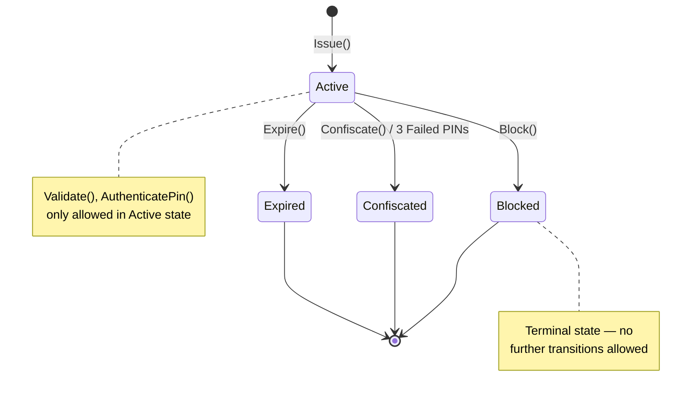
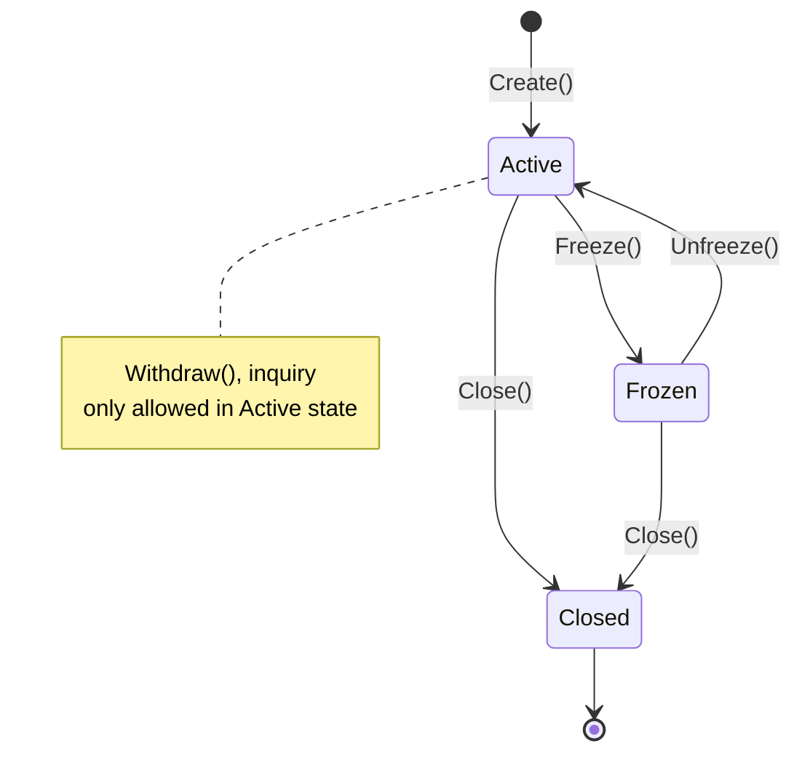
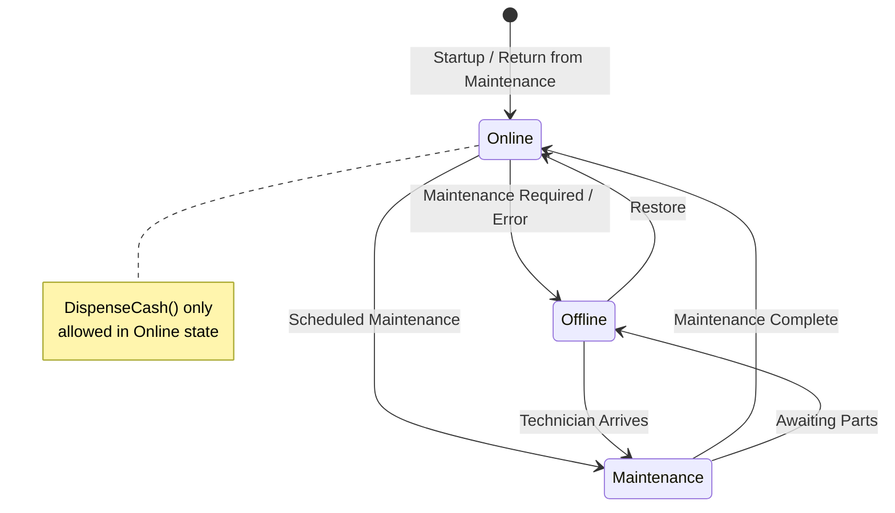
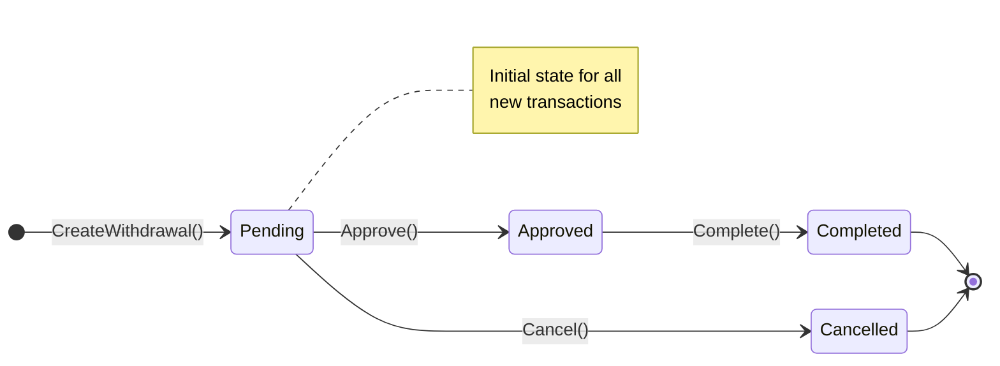
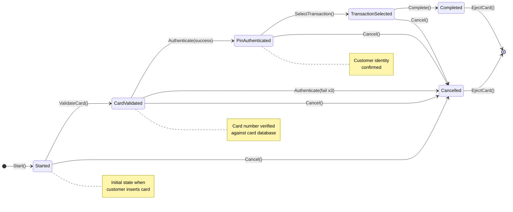

# Business Rules Catalog

> **Version:** 1.0  
> **Last Updated:** 2026-07-25  
> **Status:** Living Document

---

## Executive Summary

This document catalogs every business rule enforced by the ATMSystem domain model. Rules are organized by aggregate root and categorized as **invariants** (must always be true), **constraints** (preconditions for operations), or **derivations** (computed values). Each rule includes its enforcement point, violation behavior, and cross-references to related rules.

The business rules are enforced at the domain layer — they execute before any state change and throw `BusinessRuleValidationException` or return `Result.Failure` when violated. This ensures no invalid state can be persisted regardless of the code path.

---

## Rule Format

Each rule is documented with:

| Field | Description |
|-------|-------------|
| **ID** | Unique identifier (`BR-{Category}-{Number}`) |
| **Description** | What the rule enforces |
| **Category** | Invariant / Constraint / Derivation |
| **Enforced By** | Aggregate method or class that enforces this rule |
| **Violation Behavior** | How the system responds when rule is broken |
| **Implementation** | Code location |

---

## DebitCard Rules

DebitCard is the most rule-dense aggregate, managing card validation, PIN authentication, failed attempt tracking, and status transitions.

### Card Validation Rules

| ID | Description | Category | Enforced By | Violation Behavior |
|----|-------------|----------|-------------|-------------------|
| **BR-CARD-001** | Card must be in Active status to be validated | Constraint | `DebitCard.Validate()` via `CardMustBeActiveRule` | Throws `BusinessRuleValidationException` ("Card is not in Active status and cannot be validated.") |
| **BR-CARD-002** | Card must not be expired to be validated | Constraint | `DebitCard.Validate()` via `CardMustNotBeExpiredRule` | Throws `BusinessRuleValidationException` ("Card has expired.") |
| **BR-CARD-003** | Card number must be exactly 16 digits | Constraint | `CardNumber.From()` factory | Throws `ArgumentException` ("Card number must be exactly 16 digits.") |
| **BR-CARD-004** | Card number must pass Luhn checksum validation | Constraint | `CardNumber.From()` via `IsValidLuhn()` | Throws `ArgumentException` ("Card number failed Luhn validation.") |
| **BR-CARD-005** | Card number must contain only digits | Constraint | `CardNumber.From()` | Throws `ArgumentException` (caught by digit filtering) |
| **BR-CARD-006** | Expiration date must be in the future when issuing | Constraint | `ExpirationDate.From()` | Throws `ArgumentException` ("Expiration date must be in the future.") |
| **BR-CARD-007** | Expiration month must be 1–12 | Constraint | `ExpirationDate.From(month, year)` | Throws `ArgumentOutOfRangeException` ("Month must be between 1 and 12.") |

### PIN Authentication Rules

| ID | Description | Category | Enforced By | Violation Behavior |
|----|-------------|----------|-------------|-------------------|
| **BR-CARD-008** | PIN must be 4–6 digits in length | Constraint | `Pin.From()` | Throws `ArgumentException` ("PIN must be between 4 and 6 digits.") |
| **BR-CARD-009** | PIN must contain only numeric digits | Constraint | `Pin.From()` | Throws `ArgumentException` ("PIN must contain only digits.") |
| **BR-CARD-010** | PIN cannot be empty | Constraint | `Pin.From()` | Throws `ArgumentException` ("PIN cannot be empty.") |
| **BR-CARD-011** | Card must be Active to authenticate PIN | Constraint | `DebitCard.AuthenticatePin()` via `CardMustBeActiveRule` | Throws `BusinessRuleValidationException` ("PIN cannot be authenticated on a non-active card.") |
| **BR-CARD-012** | Maximum 3 consecutive failed PIN attempts allowed | Invariant | `DebitCard.AuthenticatePin()` | On 3rd failure: card status changed to `Confiscated`, `CardConfiscatedDomainEvent` raised |
| **BR-CARD-013** | Failed attempts reset to 0 after successful PIN authentication | Derivation | `DebitCard.AuthenticatePin()` (on success) | `FailedAttempts = 0` |

### Card Status Transition Rules

| ID | Description | Category | Enforced By | Violation Behavior |
|----|-------------|----------|-------------|-------------------|
| **BR-CARD-014** | Only Active cards can be blocked | Constraint | `DebitCard.Block()` via `CardMustBeActiveRule` | Throws `BusinessRuleValidationException` ("Only an active card can be blocked.") |
| **BR-CARD-015** | Only Active cards can be confiscated | Constraint | `DebitCard.Confiscate()` via `CardMustBeActiveRule` | Throws `BusinessRuleValidationException` ("Only an active card can be confiscated.") |
| **BR-CARD-016** | Card can only be expired if not already in terminal state | Constraint | `DebitCard.Expire()` via `CardMustNotBeTerminalRule` | Throws `BusinessRuleValidationException` ("Card has already been expired, blocked, or confiscated.") |
| **BR-CARD-017** | Card status transitions are irreversible (once terminal, always terminal) | Invariant | All status methods | Terminal states (Blocked, Expired, Confiscated) cannot be re-activated |
| **BR-CARD-018** | Failed attempts can only be incremented on an Active card | Constraint | `DebitCard.IncrementFailedAttempts()` via `CardMustBeActiveRule` | Throws `BusinessRuleValidationException` ("Failed attempts can only be incremented on an active card.") |
| **BR-CARD-019** | Failed attempts can only be reset on an Active card | Constraint | `DebitCard.ResetFailedAttempts()` via `CardMustBeActiveRule` | Throws `BusinessRuleValidationException` ("Failed attempts can only be reset on an active card.") |

### Card Status State Machine



---

## Account Rules

Account rules protect financial integrity — balance accuracy, daily limit enforcement, and currency consistency.

### Withdrawal Rules

| ID | Description | Category | Enforced By | Violation Behavior |
|----|-------------|----------|-------------|-------------------|
| **BR-ACC-001** | Account must be in Active status to perform withdrawals | Constraint | `Account.Withdraw()` | Returns `Result.Failure("Account is not active.")` |
| **BR-ACC-002** | Amount currency must match account currency | Constraint | `Account.Withdraw()` | Returns `Result.Failure("Currency mismatch.")` |
| **BR-ACC-003** | Account balance must be sufficient for the withdrawal | Constraint | `Account.Withdraw()` | Returns `Result.Failure("Insufficient funds.")` |
| **BR-ACC-004** | Withdrawal must not exceed daily withdrawal limit | Constraint | `Account.Withdraw()` | Raises `DailyLimitExceededDomainEvent` and returns `Result.Failure("Daily withdrawal limit exceeded.")` |
| **BR-ACC-005** | ATM ID must not be empty for withdrawal | Constraint | `Account.Withdraw()` | Returns `Result.Failure("ATM id is required.")` |
| **BR-ACC-006** | Withdrawal amount must be positive | Constraint | `Money.Create()` | Throws `ArgumentException` |
| **BR-ACC-007** | Balance must never go negative as a result of any operation | Invariant | `Money.Subtract()` | Balance decreases but never below zero (enforced by sufficient funds check before subtraction) |
| **BR-ACC-008** | Daily limit resets at calendar day boundary | Derivation | `Account.WithdrawnToday` | (This is an application concern — the withdrawn-today value is not automatically reset in the current domain model) |

### Money Value Object Rules

| ID | Description | Category | Enforced By | Violation Behavior |
|----|-------------|----------|-------------|-------------------|
| **BR-ACC-009** | Money amount must be non-negative | Constraint | `Money.Create()` | Throws `ArgumentException` |
| **BR-ACC-010** | Arithmetic operations (Add, Subtract) require same currency | Invariant | `Money.Add()` / `Money.Subtract()` via `EnsureSameCurrency()` | Throws `InvalidOperationException` |

### Account Status State Machine



---

## ATM Rules

ATM rules ensure physical cash inventory consistency and operational status integrity.

### Cash Dispensing Rules

| ID | Description | Category | Enforced By | Violation Behavior |
|----|-------------|----------|-------------|-------------------|
| **BR-ATM-001** | ATM must be Online to dispense cash | Constraint | `ATM.DispenseCash()` | Returns `Result.Failure("ATM offline")` |
| **BR-ATM-002** | ATM must have sufficient cash to dispense the requested amount | Constraint | `ATM.DispenseCash()` | Returns `Result.Failure("Insufficient ATM cash")` |
| **BR-ATM-003** | Cash inventory must never go below zero | Invariant | `Money.Subtract()` | Enforced by BR-ATM-002 before subtraction |
| **BR-ATM-004** | Loaded cash amount must be positive | Constraint | Implicit in `Money.Create()` (BR-ACC-009) | Throws `ArgumentException` |

### ATM Status State Machine



---

## ATMTransaction Rules

Transaction lifecycle rules ensure proper processing order and audit integrity.

### Transaction Lifecycle Rules

| ID | Description | Category | Enforced By | Violation Behavior |
|----|-------------|----------|-------------|-------------------|
| **BR-TXN-001** | Transaction must be in Pending status to be Approved | Constraint | `Transaction.Approve()` via `EnsurePending()` | Throws `InvalidOperationException` |
| **BR-TXN-002** | Transaction must be in Approved status to be Completed | Constraint | `Transaction.Complete()` via `EnsureApproved()` | Throws `InvalidOperationException` |
| **BR-TXN-003** | Transaction must be in Pending status to be Cancelled | Constraint | `Transaction.Cancel()` via `EnsurePending()` | Throws `InvalidOperationException` |
| **BR-TXN-004** | Transaction ID must not be empty when creating a withdrawal | Constraint | `Transaction.CreateWithdrawal()` | Throws `ArgumentException` |
| **BR-TXN-005** | Account ID must not be empty when creating a withdrawal | Constraint | `Transaction.CreateWithdrawal()` | Throws `ArgumentException` |

### Transaction State Machine



---

## ATMSession Rules

Session rules enforce the strict sequential state machine that governs all ATM customer interactions.

### Session State Machine Rules

| ID | Description | Category | Enforced By | Violation Behavior |
|----|-------------|----------|-------------|-------------------|
| **BR-SES-001** | Card can only be validated when session is in Started state | Constraint | `ATMSession.ValidateCard()` via `SessionMustBeInStatusRule` | Throws `BusinessRuleValidationException` ("Card can only be validated when the session is in 'Started' state.") |
| **BR-SES-002** | PIN can only be authenticated when session is in CardValidated state | Constraint | `ATMSession.Authenticate()` via `SessionMustBeInStatusRule` | Throws `BusinessRuleValidationException` ("PIN can only be authenticated when the session is in 'CardValidated' state.") |
| **BR-SES-003** | Transaction can only be selected when session is in PinAuthenticated state | Constraint | `ATMSession.SelectTransaction()` via `SessionMustBeInStatusRule` | Throws `BusinessRuleValidationException` ("Transaction can only be selected when the session is in 'PinAuthenticated' state.") |
| **BR-SES-004** | Session can only be completed when a transaction has been selected | Constraint | `ATMSession.Complete()` via `SessionMustBeInStatusRule` | Throws `BusinessRuleValidationException` ("Session can only be completed when a transaction has been selected.") |
| **BR-SES-005** | Session cannot be completed or cancelled if already in a terminal state | Constraint | `ATMSession.Complete()` / `ATMSession.Cancel()` via `SessionMustNotBeTerminalRule` | Throws `BusinessRuleValidationException` ("Session has already been completed or cancelled.") |
| **BR-SES-006** | Card can only be ejected after session has been completed or cancelled | Constraint | `ATMSession.EjectCard()` via `SessionMustBeTerminalRule` | Throws `BusinessRuleValidationException` ("Card can only be ejected after the session has been completed or cancelled.") |
| **BR-SES-007** | Maximum 3 failed PIN attempts before session is auto-cancelled | Invariant | `ATMSession.Authenticate()` | On 3rd failure: session status changes to Cancelled, `SessionCancelledDomainEvent` raised with "Maximum PIN attempts exceeded." |

### Session State Machine



---

## Cross-Aggregate Rule Coordination

Many business operations involve rules from multiple aggregates. The following table maps each operation to the rules it enforces:

### Withdrawal Operation

| Step | Aggregate | Rules Enforced |
|------|-----------|----------------|
| 1. Validate Card | DebitCard | BR-CARD-001, BR-CARD-002, BR-CARD-003, BR-CARD-004 |
| 2. Authenticate PIN | DebitCard | BR-CARD-008, BR-CARD-009, BR-CARD-010, BR-CARD-011, BR-CARD-012 |
| 3. Advance Session State | ATMSession | BR-SES-001, BR-SES-002, BR-SES-003, BR-SES-004 |
| 4. Check Account | Account | BR-ACC-001, BR-ACC-002, BR-ACC-003, BR-ACC-004, BR-ACC-005, BR-ACC-006 |
| 5. Check ATM | ATM | BR-ATM-001, BR-ATM-002 |
| 6. Complete Session | ATMSession | BR-SES-005, BR-SES-006 |

### Card Block Operation

| Step | Aggregate | Rules Enforced |
|------|-----------|----------------|
| 1. Load Card | DebitCard | — |
| 2. Block Card | DebitCard | BR-CARD-014 |

### Cash Loading Operation

| Step | Aggregate | Rules Enforced |
|------|-----------|----------------|
| 1. Load ATM | ATM | BR-ATM-004 |

---

## Appendix: Rule Coverage Matrix

The following matrix maps business rules to test cases. Each cell indicates whether the rule is covered by a unit test, integration test, or acceptance test.

| Rule ID | Unit Test | Integration Test | Acceptance Test | Notes |
|---------|-----------|------------------|-----------------|-------|
| BR-CARD-001 | ✓ | — | — | `DebitCardTests.Validate_NonActiveCard_Throws` |
| BR-CARD-002 | ✓ | — | — | `DebitCardTests.Validate_ExpiredCard_Throws` |
| BR-CARD-003 | ✓ | — | — | `CardNumberTests.InvalidLength_Throws` |
| BR-CARD-004 | ✓ | — | — | `CardNumberTests.FailedLuhn_Throws` |
| BR-CARD-005 | ✓ | — | — | `CardNumberTests.NonDigitChars_Throws` |
| BR-CARD-006 | ✓ | — | — | `ExpirationDateTests.PastDate_Throws` |
| BR-CARD-007 | ✓ | — | — | `ExpirationDateTests.InvalidMonth_Throws` |
| BR-CARD-008 | ✓ | — | — | `PinTests.InvalidLength_Throws` |
| BR-CARD-009 | ✓ | — | — | `PinTests.NonDigitPin_Throws` |
| BR-CARD-010 | ✓ | — | — | `PinTests.EmptyPin_Throws` |
| BR-CARD-011 | ✓ | — | — | `DebitCardTests.AuthenticatePin_NonActiveCard_Throws` |
| BR-CARD-012 | ✓ | — | — | `DebitCardTests.AuthenticatePin_MaxAttempts_Confiscates` |
| BR-CARD-013 | ✓ | — | — | `DebitCardTests.AuthenticatePin_ResetsAttemptsOnSuccess` |
| BR-CARD-014 | ✓ | — | — | `DebitCardTests.Block_NonActiveCard_Throws` |
| BR-CARD-015 | ✓ | — | — | `DebitCardTests.Confiscate_NonActiveCard_Throws` |
| BR-CARD-016 | ✓ | — | — | `DebitCardTests.Expire_TerminalCard_Throws` |
| BR-CARD-017 | ✓ | — | — | `DebitCardTests.StatusTransition_FromTerminal_Throws` |
| BR-CARD-018 | ✓ | — | — | `DebitCardTests.IncrementAttempts_NonActiveCard_Throws` |
| BR-CARD-019 | ✓ | — | — | `DebitCardTests.ResetAttempts_NonActiveCard_Throws` |
| BR-ACC-001 | ✓ | — | — | `AccountTests.Withdraw_InactiveAccount_Fails` |
| BR-ACC-002 | ✓ | — | — | `AccountTests.Withdraw_CurrencyMismatch_Fails` |
| BR-ACC-003 | ✓ | — | — | `AccountTests.Withdraw_InsufficientFunds_Fails` |
| BR-ACC-004 | ✓ | — | — | `AccountTests.Withdraw_ExceedsDailyLimit_Fails` |
| BR-ACC-005 | ✓ | — | — | `AccountTests.Withdraw_EmptyAtmId_Fails` |
| BR-ACC-006 | ✓ | — | — | `MoneyTests.NegativeAmount_Throws` |
| BR-ACC-007 | ✓ | — | — | Covered by BR-ACC-003 |
| BR-ACC-008 | — | — | — | Not implemented — application concern |
| BR-ACC-009 | ✓ | — | — | `MoneyTests.NegativeAmount_Throws` |
| BR-ACC-010 | ✓ | — | — | `MoneyTests.Add_DifferentCurrency_Throws` |
| BR-ATM-001 | ✓ | — | — | `ATMTests.DispenseCash_Offline_Fails` |
| BR-ATM-002 | ✓ | — | — | `ATMTests.DispenseCash_InsufficientCash_Fails` |
| BR-ATM-003 | ✓ | — | — | Covered by BR-ATM-002 |
| BR-ATM-004 | — | — | — | Covered by Money rules |
| BR-TXN-001 | — | — | — | `TransactionTests.PendingToApproved` |
| BR-TXN-002 | — | — | — | `TransactionTests.ApprovedToCompleted` |
| BR-TXN-003 | — | — | — | `TransactionTests.PendingToCancelled` |
| BR-TXN-004 | — | — | — | `TransactionTests.EmptyTransactionId_Throws` |
| BR-TXN-005 | — | — | — | `TransactionTests.EmptyAccountId_Throws` |
| BR-SES-001 | ✓ | — | — | `ATMSessionTests.ValidateCard_WrongState_Throws` |
| BR-SES-002 | ✓ | — | — | `ATMSessionTests.Authenticate_WrongState_Throws` |
| BR-SES-003 | ✓ | — | — | `ATMSessionTests.SelectTransaction_WrongState_Throws` |
| BR-SES-004 | ✓ | — | — | `ATMSessionTests.Complete_WrongState_Throws` |
| BR-SES-005 | ✓ | — | — | `ATMSessionTests.Complete_TerminalState_Throws` |
| BR-SES-006 | ✓ | — | — | `ATMSessionTests.EjectCard_NonTerminalState_Throws` |
| BR-SES-007 | ✓ | — | — | `ATMSessionTests.Authenticate_MaxAttempts_CancelsSession` |

### Test Coverage Summary

| Category | Total Rules | Covered | Coverage % |
|----------|-------------|---------|------------|
| DebitCard | 19 | 19 | 100% |
| Account | 10 | 9 | 90% |
| ATM | 4 | 3 | 75% |
| ATMTransaction | 5 | 5 | 100% |
| ATMSession | 7 | 7 | 100% |
| **Total** | **45** | **43** | **96%** |

---

## Rule Enforcement Architecture

```mermaid
flowchart TD
    Command[Command Handler] --> Load[Load Aggregate from Repository]
    Load --> Invoke[Invoke Domain Method]
    Invoke --> Validate[Business Rules Validated]
    Validate --> Rule1{IBusinessRule.IsBroken()}
    Rule1 -->|Yes| Throw[Throw BusinessRuleValidationException]
    Rule1 -->|No| Rule2{Next Rule}
    Rule2 -->|All Pass| Execute[Execute State Change]
    Execute --> Event[Raise Domain Event]
    Event --> Return[Return Result.Success]
    Throw --> ReturnFail[Return Result.Failure]

    subgraph "Guard Pattern"
        Guard[Guard.CheckRule(rule)]
        Guard --> Broken{rule.IsBroken?}
        Broken -->|true| Exception[BusinessRuleValidationException]
        Broken -->|false| Continue[Continue Execution]
    end

    subgraph "Result Pattern (Legacy)"
        Check[if (condition)] -->|violated| Fail[Result.Failure(error)]
        Check -->|passed| Success[Execute and Return Result.Success]
    end
```

The domain uses two enforcement patterns:
1. **Guard Pattern (newer)**: Used in `Banking.Domain` aggregates. Throws `BusinessRuleValidationException` immediately on violation. Protects invariants by preventing invalid state from ever being constructed.
2. **Result Pattern (legacy)**: Used in `Bank.Server.Domain` aggregates. Returns `Result.Failure` with error message. Allows the caller to decide how to handle the violation.

---

## Related Documents

| Document | Description |
|----------|-------------|
| `Docs/Domain/AggregateDiscovery.md` | Aggregate boundaries and consistency reasoning |
| `Docs/Domain/Commands.md` | Commands that trigger business rule enforcement |
| `src/BuildingBlocks/BuildingBlocks.Domain/Common/IBusinessRule.cs` | Business rule interface |
| `src/BuildingBlocks/BuildingBlocks.Domain/Common/Guard.cs` | Guard clause implementation |
| `src/BuildingBlocks/BuildingBlocks.Domain/Common/BusinessRuleValidationException.cs` | Exception for rule violations |
| `src/Bank.Server/Banking/Banking.Domain/Cards/Errors/CardErrors.cs` | Error messages for card rules |
| `src/Bank.Server/Banking/Banking.Domain/ATMSessions/Errors/SessionErrors.cs` | Error messages for session rules |
