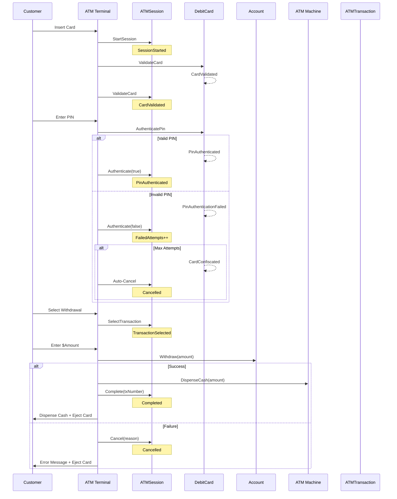
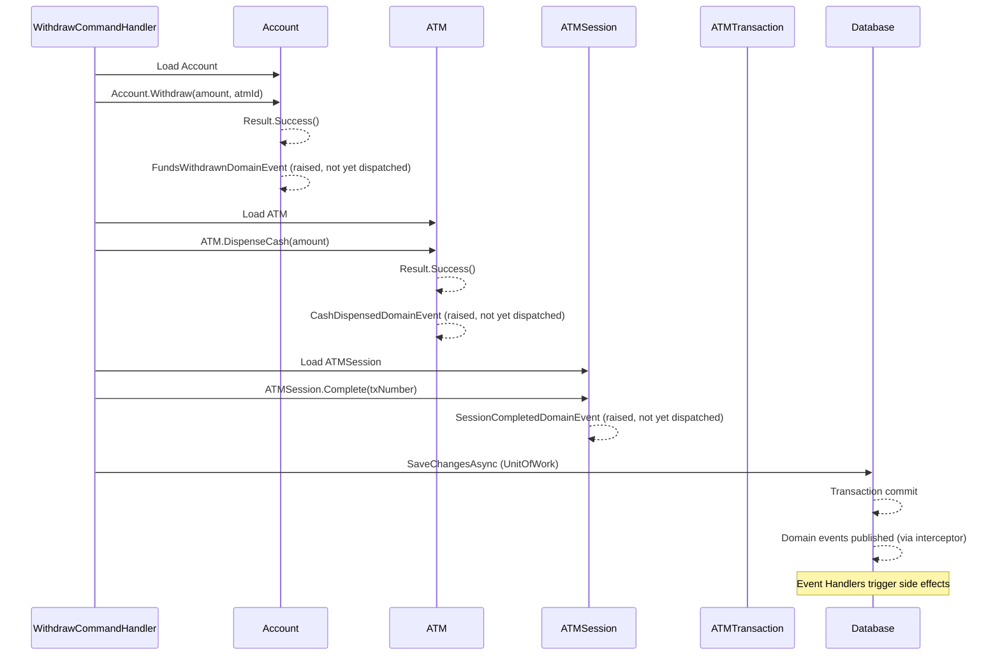

# CQRS Command Catalog

> **Version:** 1.0  
> **Last Updated:** 2026-07-25  
> **Status:** Living Document

---

## Executive Summary

This document catalogs every command in the ATMSystem's CQRS implementation. Commands represent user intent — they change state and are processed through MediatR's pipeline with validation, transaction management, and domain event publishing. Each command targets a specific aggregate root, enforces business rules, and produces domain events as outcomes.

The design follows the principle: **one command → one aggregate root → zero or more domain events**. Cross-aggregate coordination happens through event handlers, not within command handlers.

---

## CQRS with MediatR — Architecture Overview

```
Client Request
      │
      ▼
┌─────────────────────────────────────────────────────────────┐
│                   MediatR Pipeline                           │
│                                                              │
│  ┌──────────────────────────┐                               │
│  │  ValidationBehavior      │  FluentValidation validators  │
│  │  (FluentValidation)      │  → Early exit on bad input    │
│  └──────────────────────────┘                               │
│              │                                               │
│  ┌──────────────────────────┐                               │
│  │  TransactionBehavior     │  Wraps in DB transaction      │
│  │  (IUnitOfWork)           │  → Commit on success          │
│  └──────────────────────────┘                               │
│              │                                               │
│  ┌──────────────────────────┐                               │
│  │  Command Handler         │  Orchestrates aggregate       │
│  │  (ICommandHandler<T>)    │  → Loads aggregate from repo  │
│  └──────────────────────────┘  → Invokes domain method      │
│              │                  → Collects domain events     │
│              ▼                                               │
│  ┌──────────────────────────┐                               │
│  │  Domain Events           │  Published after save         │
│  │  (Event Handlers)        │  → Side effects on other ARs  │
│  └──────────────────────────┘                               │
└─────────────────────────────────────────────────────────────┘
```

---

## Command Table

| Command | Initiator | Target Aggregate | Parameters | Expected Outcomes | Domain Events Raised | Validation Rules |
|---------|-----------|-----------------|------------|-------------------|---------------------|------------------|
| **StartSession** | ATM Terminal | ATMSession | `ATMId` | New session created in `Started` state | `SessionStarted` | ATM must exist and be online |
| **ValidateCard** | ATM Terminal | ATMSession, DebitCard | `SessionId`, `CardNumber` | Card validated, session transitions to `CardValidated` | `CardValidated` | Session must be `Started`; Card must be Active, not expired, not blocked, not stolen, pass Luhn check |
| **AuthenticatePin** | ATM Terminal | ATMSession, DebitCard | `SessionId`, `Pin` | PIN verified or failed attempt tracked | `PinAuthenticated` or `PinAuthenticationFailed` + possibly `CardConfiscated` + `SessionCancelled` | Session must be `CardValidated`; PIN must be 4–6 digits |
| **SelectTransaction** | ATM Terminal | ATMSession | `SessionId`, `TransactionType` | Transaction type selected, session transitions to `TransactionSelected` | (None — internal state) | Session must be `PinAuthenticated` |
| **CompleteWithdrawal** | System | ATMSession, Account, ATM | `SessionId`, `AccountId`, `Amount` | Funds withdrawn, cash dispensed, session completed | `FundsWithdrawn`, `CashDispensed`, `SessionCompleted` | Session must be `TransactionSelected`; Account active + currency match + sufficient funds + daily limit; ATM online + sufficient cash |
| **CompleteTransfer** | System | ATMSession, Account (source), Account (destination) | `SessionId`, `SourceAccountId`, `DestAccountId`, `Amount` | Source debited, destination credited, session completed | `FundsWithdrawn`, `FundsDeposited`, `SessionCompleted` | Both accounts active; source sufficient funds; source daily limit; currency match |
| **BalanceInquiry** | ATM Terminal | Account | `SessionId`, `AccountId` | Balance displayed to customer | (None — query side) | Session must be `PinAuthenticated` |
| **CancelSession** | Customer / ATM Terminal / System | ATMSession | `SessionId`, `Reason` | Session terminated in `Cancelled` state | `SessionCancelled` | Session must not already be terminal |
| **EjectCard** | ATM Terminal | ATMSession | `SessionId` | Card returned to customer | (None — physical action) | Session must be `Completed` or `Cancelled` |
| **BlockCard** | Bank Operator | DebitCard | `CardId`, `Reason` | Card status changed to `Blocked` | `CardBlocked` | Card must be `Active` |
| **ConfiscateCard** | ATM Terminal / System | DebitCard | `CardId`, `Reason` | Card status changed to `Confiscated` | `CardConfiscated` | Card must be `Active` |
| **LoadCash** | Bank Operator / Technician | ATM | `ATMId`, `Amount` | ATM cash inventory increased | `CashLoaded` | ATM must exist; amount must be positive |
| **DispenseCash** | ATM Terminal / System | ATM | `ATMId`, `Amount` | Cash inventory decreased | `CashDispensed` | ATM must be `Online`; sufficient cash available |
| **Withdraw (Account)** | System | Account | `AccountId`, `Amount`, `AtmId` | Account balance decreased, withdrawn-today increased | `FundsWithdrawn` or `DailyLimitExceeded` | Account must be Active; currency match; sufficient funds; daily limit not exceeded |
| **Transfer (Account)** | System | Account (source) | `SourceAccountId`, `DestAccountId`, `Amount` | Source balance decreased, dest balance increased | `FundsWithdrawn`, `FundsDeposited` | Source account active; destination active; sufficient funds; daily limit; currency match |

---

## Command Details

### StartSession

Begins a new interactive ATM session.

```
Command:    StartSession
Initiator:  ATM Terminal (physical card insertion triggers this)
Target:     ATMSession
Pipeline:   Validate ATM exists → ATMSession.Start(ATMId) → Persist → Publish SessionStarted
```

**State Transition:** `[none]` → `Started`

**Validation:**
- ATM ID must reference a valid, online ATM terminal

**Domain Events Raised:** `SessionStartedDomainEvent(SessionId, ATMId, StartedAt)`

---

### ValidateCard

Validates the inserted debit card against the card database.

```
Command:    ValidateCard
Initiator:  ATM Terminal (after card is read by Card Reader)
Target:     ATMSession, DebitCard
Pipeline:   Load ATMSession → Load DebitCard → DebitCard.Validate() → ATMSession.ValidateCard(CardId)
              → Persist → Publish events
```

**State Transition:** `Started` → `CardValidated`

**Validation:**
- Session must be in `Started` state
- Card must be active (`CardStatus.Active`)
- Card must not be expired (`ExpirationDate.IsExpired == false`)
- Card number must pass Luhn checksum
- Card must not be blocked, confiscated, or stolen

**Domain Events Raised:** `CardValidatedDomainEvent`

---

### AuthenticatePin

Verifies the customer-entered PIN against the card's stored PIN.

```
Command:    AuthenticatePin
Initiator:  ATM Terminal (after customer enters PIN on PIN Pad)
Target:     ATMSession, DebitCard
Pipeline:   Load ATMSession → Load DebitCard → DebitCard.AuthenticatePin(pin) → ATMSession.Authenticate(result)
              → Persist → Publish events
```

**State Transitions:**
- **Success:** `CardValidated` → `PinAuthenticated`
- **Failure (< 3 attempts):** `CardValidated` → `CardValidated` (no state change, FailedAttempts incremented)
- **Failure (= 3 attempts):** `CardValidated` → `Cancelled`, Card status → `Confiscated`

**Validation:**
- Session must be in `CardValidated` state
- Card must be active
- PIN must be 4–6 digits

**Domain Events Raised:**
- `PinAuthenticatedDomainEvent` (on success)
- `PinAuthenticationFailedDomainEvent` (on failure)
- `CardConfiscatedDomainEvent` (on 3rd failure)
- `SessionCancelledDomainEvent` (on 3rd failure)

---

### SelectTransaction

Customer selects the type of transaction they want to perform.

```
Command:    SelectTransaction
Initiator:  ATM Terminal (customer presses button: Withdrawal, Deposit, Balance, Transfer)
Target:     ATMSession
Pipeline:   Load ATMSession → ATMSession.SelectTransaction(type) → Persist
```

**State Transition:** `PinAuthenticated` → `TransactionSelected`

**Validation:**
- Session must be in `PinAuthenticated` state
- Transaction type must be a known type

**Domain Events Raised:** None (internal state transition)

---

### CompleteWithdrawal

Processes a cash withdrawal through funds deduction and cash dispensing.

```
Command:    CompleteWithdrawal
Initiator:  System (orchestrated after customer confirms amount)
Target:     ATMSession, Account, ATM
Pipeline:
  1. Load ATMSession (verify TransactionSelected)
  2. Load Account → Account.Withdraw(amount)
  3. Load ATM → ATM.DispenseCash(amount)
  4. ATMSession.Complete(transactionNumber)
  5. Persist all → Publish: FundsWithdrawn, CashDispensed, SessionCompleted
```

**State Transition:** `TransactionSelected` → `Completed`

**Validation:**
- Session must be in `TransactionSelected` state
- Account must be `Active`
- Currency must match account currency
- Sufficient funds in account (`Balance >= Amount`)
- Daily limit not exceeded (`WithdrawnToday + Amount <= DailyLimit`)
- ATM must be `Online`
- ATM must have sufficient cash (`CashAvailable >= Amount`)

**Domain Events Raised:**
- `FundsWithdrawnDomainEvent`
- `CashDispensedDomainEvent`
- `SessionCompletedDomainEvent`

---

### CompleteTransfer

Transfers funds between two accounts.

```
Command:    CompleteTransfer
Initiator:  System (orchestrated after customer confirms transfer)
Target:     ATMSession, Account (source), Account (destination)
Pipeline:
  1. Load ATMSession (verify TransactionSelected)
  2. Load Source Account → Source.Withdraw(amount)
  3. Load Destination Account → Destination.Deposit(amount)
  4. ATMSession.Complete(transactionNumber)
  5. Persist → Publish: FundsWithdrawn, FundsDeposited, SessionCompleted
```

**State Transition:** `TransactionSelected` → `Completed`

**Validation:**
- Both accounts must be `Active`
- Source account must have sufficient funds
- Source daily limit must not be exceeded
- Currencies must match between accounts

**Domain Events Raised:**
- `FundsWithdrawnDomainEvent` (source)
- `FundsDepositedDomainEvent` (destination)
- `SessionCompletedDomainEvent`

---

### BalanceInquiry

Retrieves the current balance of an account (query side, not a command).

```
Query:      GetBalanceQuery
Initiator:  ATM Terminal (customer selects "Balance Inquiry")
Target:     Account
Pipeline:   Load Account → Return Balance.Amount
```

**Validation:**
- Session must be in `PinAuthenticated` state
- Account must exist

**Note:** This is technically a Query (`IQuery<TResponse>`), not a Command, since it does not modify state. Listed here for completeness of the session flow.

---

### CancelSession

Terminates an ATM session before completion.

```
Command:    CancelSession
Initiator:  Customer (presses Cancel), ATM Terminal (timeout), System (error)
Target:     ATMSession
Pipeline:   Load ATMSession → ATMSession.Cancel(reason) → Persist → Publish SessionCancelled
```

**State Transition:** Any non-terminal state → `Cancelled`

**Validation:**
- Session must not already be `Completed` or `Cancelled`

**Domain Events Raised:** `SessionCancelledDomainEvent(SessionId, Reason, CancelledAt)`

---

### EjectCard

Physically returns the card to the customer after session end.

```
Command:    EjectCard
Initiator:  ATM Terminal (after session reaches Completed or Cancelled state)
Target:     ATMSession
Pipeline:   Load ATMSession → ATMSession.EjectCard()
```

**Validation:**
- Session must be in `Completed` or `Cancelled` state

**Domain Events Raised:** None

---

### BlockCard

Blocks a debit card administratively (e.g., reported stolen).

```
Command:    BlockCard
Initiator:  Bank Operator
Target:     DebitCard
Pipeline:   Load DebitCard → DebitCard.Block(reason) → Persist → Publish CardBlocked
```

**Validation:**
- Card must be in `Active` status

**Domain Events Raised:** `CardBlockedDomainEvent(CardNumber, Reason, BlockedAt)`

---

### ConfiscateCard

Marks a card as confiscated by the ATM.

```
Command:    ConfiscateCard
Initiator:  ATM Terminal / System (automatic on 3rd PIN failure)
Target:     DebitCard
Pipeline:   Load DebitCard → DebitCard.Confiscate(reason) → Persist → Publish CardConfiscated
```

**Validation:**
- Card must be in `Active` status

**Domain Events Raised:** `CardConfiscatedDomainEvent(CardNumber, Reason, ConfiscatedAt)`

---

### LoadCash

Adds cash to an ATM's inventory (during maintenance).

```
Command:    LoadCash
Initiator:  Bank Operator / Maintenance Technician
Target:     ATM
Pipeline:   Load ATM → ATM.LoadCash(amount) → Persist → Publish CashLoaded
```

**Validation:**
- ATM must exist
- Amount must be positive

**Domain Events Raised:** `CashLoadedDomainEvent(AtmId, Amount)`

---

### DispenseCash

Decreases an ATM's cash inventory when cash is dispensed.

```
Command:    DispenseCash
Initiator:  System (during CompleteWithdrawal flow)
Target:     ATM
Pipeline:   Load ATM → ATM.DispenseCash(amount) → Persist → Publish CashDispensed
```

**Validation:**
- ATM must be `Online`
- ATM must have sufficient cash (`CashAvailable >= Amount`)

**Domain Events Raised:** `CashDispensedDomainEvent(AtmId, Amount)`

---

### Withdraw (Account)

Deducts funds from an account. This is the core Account aggregate method called by withdrawal flows.

```
Command:    WithdrawCommand
Initiator:  System (called by CompleteWithdrawal orchestration)
Target:     Account
Pipeline:   Load Account → Account.Withdraw(amount, atmId, transactionId) → Persist → Publish FundsWithdrawn
```

**Validation:**
- `atmId` must not be empty
- Account must be `Active`
- Currency must match
- Daily limit not exceeded (`WithdrawnToday + amount <= DailyLimit`)
- Sufficient funds (`Balance >= amount`)

**Domain Events Raised:**
- `FundsWithdrawnDomainEvent` (on success)
- `DailyLimitExceededDomainEvent` (if limit hit)

---

## Command Flow Diagrams

### Session Lifecycle Command Flow



### Withdrawal Orchestration Flow



---

## Command Handling Pipeline

Every command flows through the MediatR pipeline in the following order:

### Pipeline Stages

```
Inbound Request
      │
      ▼
┌──────────────────────────────────────┐
│ 1. LoggingBehavior                   │
│    Logs: CommandName, Timestamp,     │
│          CorrelationId                │
└──────────────────────────────────────┘
      │
      ▼
┌──────────────────────────────────────┐
│ 2. ValidationBehavior                │
│    Runs: All registered              │
│          IValidator<TCommand>        │
│    On failure: Returns               │
│       Result.Failure(errors)         │
│    Does NOT call next()              │
└──────────────────────────────────────┘
      │
      ▼
┌──────────────────────────────────────┐
│ 3. TransactionBehavior               │
│    Wraps execution in DB transaction │
│    Calls next() → receives response  │
│    If success: SaveChangesAsync()    │
│    If failure: Rollback              │
└──────────────────────────────────────┘
      │
      ▼
┌──────────────────────────────────────┐
│ 4. PerformanceBehavior               │
│    Measures handler execution time   │
│    Logs warnings for slow handlers   │
└──────────────────────────────────────┘
      │
      ▼
┌──────────────────────────────────────┐
│ 5. Command Handler                   │
│    Loads aggregate from repository   │
│    Invokes domain method             │
│    Returns Result                    │
└──────────────────────────────────────┘
      │
      ▼
┌──────────────────────────────────────┐
│ 6. UnhandledExceptionBehavior        │
│    Catches unhandled exceptions      │
│    Returns 500 / Result.Failure      │
└──────────────────────────────────────┘
```

### Pipeline Code References

| Component | Location | Purpose |
|-----------|----------|---------|
| `ValidationBehavior<TRequest, TResponse>` | `BuildingBlocks.Application.Behaviors.ValidationBehavior` | Runs FluentValidation validators before handler |
| `TransactionBehavior<TRequest, TResponse>` | `BuildingBlocks.Application.Behaviors.TransactionBehavior` | Wraps command execution in DB transaction via `IUnitOfWork` |
| `LoggingBehavior<TRequest, TResponse>` | `BuildingBlocks.Application.Behaviors.LoggingBehavior` | Logs request/response information |
| `PerformanceBehavior<TRequest, TResponse>` | `BuildingBlocks.Application.Behaviors.PerformanceBehavior` | Logs slow-performing handlers |
| `UnhandledExceptionBehavior<TRequest, TResponse>` | `BuildingBlocks.Application.Behaviors.UnhandledExceptionBehavior` | Global exception handler |

### Validator Pattern

```csharp
// Example: WithdrawCommandValidator
public class WithdrawCommandValidator : AbstractValidator<WithdrawCommand>
{
    public WithdrawCommandValidator()
    {
        RuleFor(x => x.AccountNumber).NotEmpty();
        RuleFor(x => x.Amount).GreaterThan(0);
    }
}
```

---

## Related Documents

| Document | Description |
|----------|-------------|
| `Docs/Domain/AggregateDiscovery.md` | Detailed aggregate root definitions, boundaries, and consistency reasoning |
| `Docs/Domain/BusinessRules.md` | Complete catalog of business rules enforced by each command |
| `Docs/Domain/EventStorm.md` | Event-driven flows showing commands in context |
| `Docs/Architecture/ArchitectureDecisionRecords/ADR-003-CQRS.md` | Decision record for adopting CQRS with MediatR |
| `src/BuildingBlocks/BuildingBlocks.Application/CQRS/` | CQRS interfaces: `ICommand`, `IQuery`, `ICommandHandler` |
| `src/BuildingBlocks/BuildingBlocks.Application/Behaviors/` | Pipeline behavior implementations |
