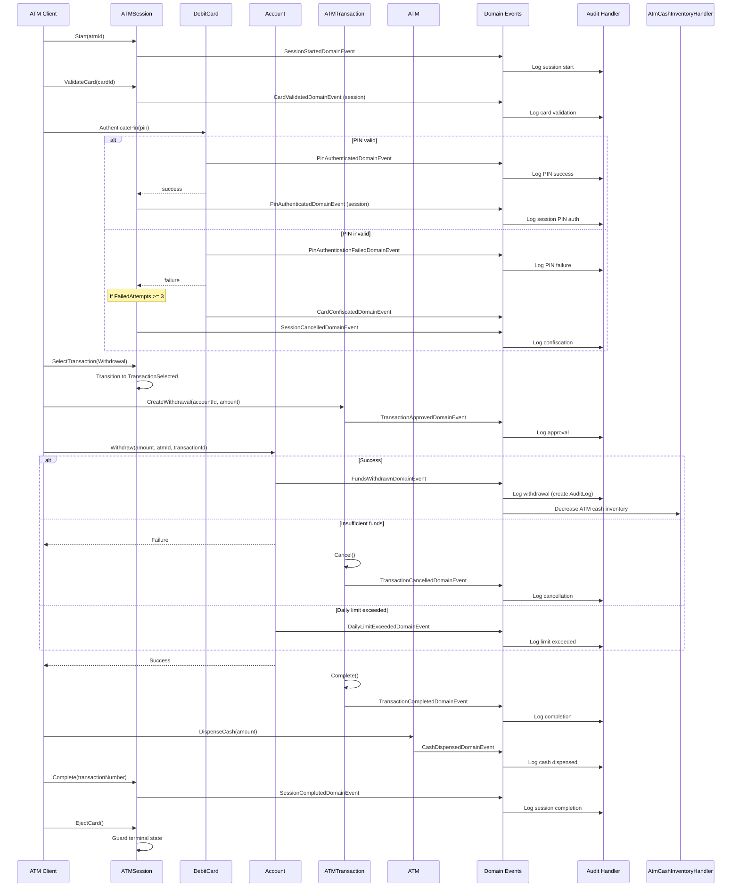
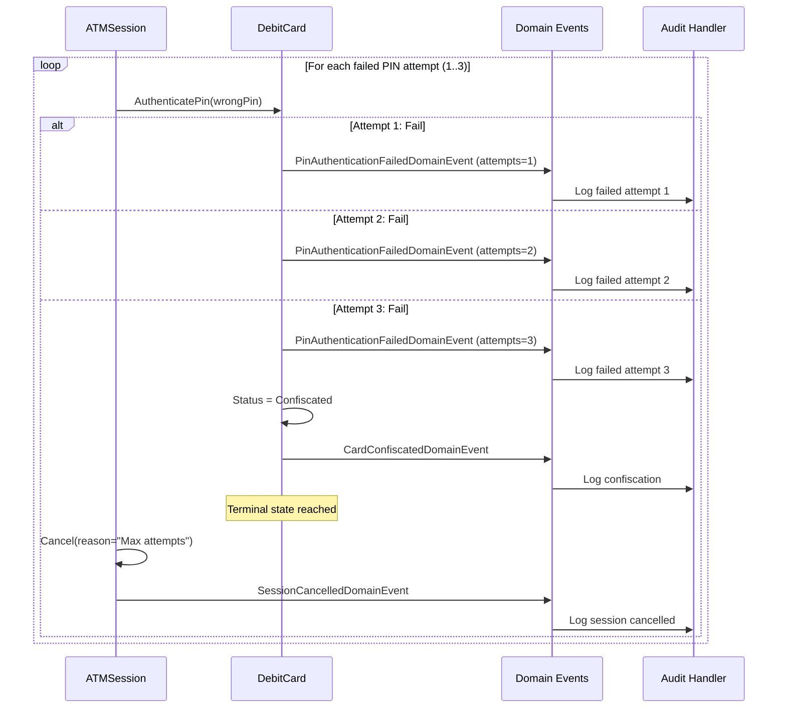
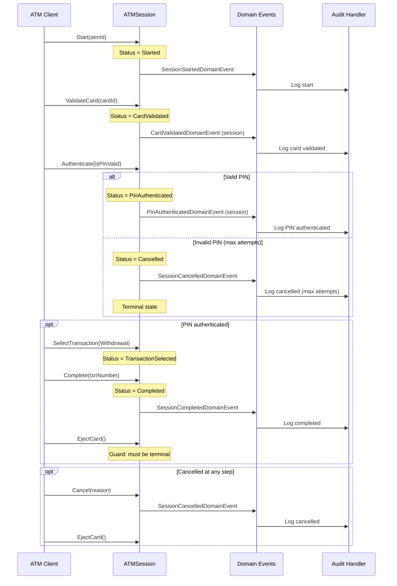
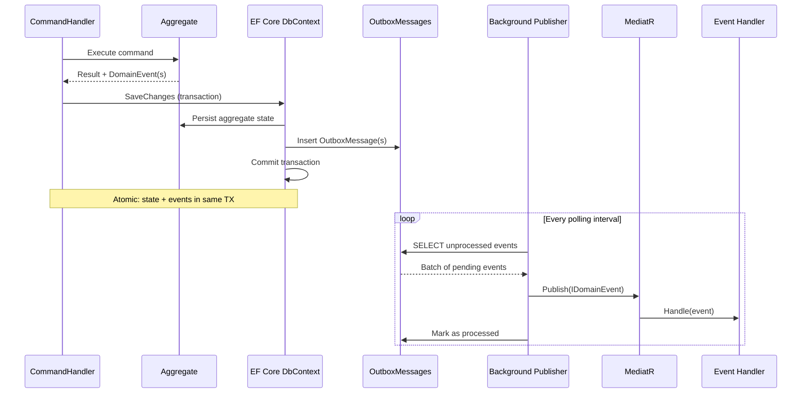

# Domain Events Catalog

> **References:** [Aggregate Design](./AggregateDesign.md) | [Context Map](../ContextMap.md) | [ADR-003: CQRS](../ADR-003-CQRS.md)
>
> **Last Updated:** 2026-07-25

---

## Executive Summary

Domain events are the backbone of the ATMSystem's **event-driven architecture**. They enable loose coupling between bounded contexts while maintaining consistency through eventual synchronization. Each domain event represents a meaningful business occurrence that domain experts care about — a card being validated, funds being withdrawn, a transaction being completed.

### Role in the Architecture

1. **Cross-context communication** — Events allow the ATM Context to notify the Account Context of a withdrawal, which in turn updates cash inventory
2. **Audit trail** — Every financial operation produces an event that can be persisted for compliance
3. **CQRS separation** — Commands produce events; queries consume projected state
4. **Microservice readiness** — Each event is a contract that can be serialized across service boundaries

### Event Pipeline

```
Aggregate Method → RaiseDomainEvent() → EF Core SaveChanges
                                              ↓
                                   OutboxMessage persisted
                                              ↓
                                   Background processor
                                              ↓
                                   MediatR INotification
                                              ↓
                                   Event Handlers
```

### Dispatch Mechanism

Events are raised via `AggregateRoot.RaiseDomainEvent()` and collected in an internal list. When `SaveChangesAsync()` is called on the `DbContext`, a `PublishDomainEventsInterceptor` (or a dedicated dispatcher) extracts all pending events and publishes them through MediatR's `IPublisher`. This ensures events are dispatched within the same transaction scope as the aggregate persistence.

---

## Complete Domain Events Table

| # | Event | Producer Aggregate | Raised By Method | Payload | Consumers | Published Via |
|---|---|---|---|---|---|---|
| 1 | `CardValidatedDomainEvent` | DebitCard | `Validate()` | `CardNumber`, `ValidatedAt` | ATMSession handler, Audit handler | MediatR `INotification` |
| 2 | `PinAuthenticatedDomainEvent` | DebitCard | `AuthenticatePin()` (success) | `CardNumber`, `AuthenticatedAt` | ATMSession handler | MediatR `INotification` |
| 3 | `PinAuthenticationFailedDomainEvent` | DebitCard | `AuthenticatePin()` (failure) | `CardNumber`, `FailedAttempts`, `AttemptedAt` | Audit handler, Notification handler | MediatR `INotification` |
| 4 | `CardConfiscatedDomainEvent` | DebitCard | `AuthenticatePin()` / `Confiscate()` / `IncrementFailedAttempts()` | `CardNumber`, `Reason`, `ConfiscatedAt` | ATMSession handler, Audit handler | MediatR `INotification` |
| 5 | `CardBlockedDomainEvent` | DebitCard | `Block()` | `CardNumber`, `Reason`, `BlockedAt` | Audit handler, Notification handler | MediatR `INotification` |
| 6 | `AccountCreatedDomainEvent` | Account | `Create()` | `AccountId` | Audit handler | MediatR `INotification` |
| 7 | `FundsWithdrawnDomainEvent` | Account | `Withdraw()` (success) | `AccountId`, `AtmId`, `Amount`, `Currency`, `TransactionId` | `AtmCashInventoryHandler`, `FundsWithdrawnDomainEventHandler` (audit) | MediatR `INotification` |
| 8 | `FundsDepositedDomainEvent` | Account | `Deposit()` | (empty — extended later) | Audit handler | MediatR `INotification` |
| 9 | `DailyLimitExceededDomainEvent` | Account | `Withdraw()` (limit hit) | (empty — extended later) | Notification handler, Audit handler | MediatR `INotification` |
| 10 | `TransactionApprovedDomainEvent` | ATMTransaction | `Approve()` | `TransactionId` | Account handler, Audit handler | MediatR `INotification` |
| 11 | `TransactionCompletedDomainEvent` | ATMTransaction | `Complete()` | `TransactionId` | Session handler, Audit handler, Receipt handler | MediatR `INotification` |
| 12 | `TransactionCancelledDomainEvent` | ATMTransaction | `Cancel()` | `TransactionId` | Account reversal handler, Audit handler | MediatR `INotification` |
| 13 | `CashDispensedDomainEvent` | ATM | `DispenseCash()` | `AtmId`, `Amount` | Audit handler, Inventory handler | MediatR `INotification` |
| 14 | `CashLoadedDomainEvent` | ATM | `LoadCash()` | `AtmId`, `Amount` | Audit handler, Inventory handler | MediatR `INotification` |
| 15 | `ATMStartedDomainEvent` | ATM | System startup | (empty) | Monitoring handler | MediatR `INotification` |
| 16 | `SessionStartedDomainEvent` | ATMSession | `Start()` | `SessionId`, `ATMId`, `StartedAt` | Audit handler, ATM dashboard | MediatR `INotification` |
| 17 | `CardValidatedDomainEvent` (session) | ATMSession | `ValidateCard()` | `SessionId`, `CardId`, `ValidatedAt` | Audit handler | MediatR `INotification` |
| 18 | `PinAuthenticatedDomainEvent` (session) | ATMSession | `Authenticate()` (success) | `SessionId`, `AuthenticatedAt` | Audit handler | MediatR `INotification` |
| 19 | `SessionCompletedDomainEvent` | ATMSession | `Complete()` | `SessionId`, `TransactionNumber`, `CompletedAt` | Audit handler, ATM dashboard | MediatR `INotification` |
| 20 | `SessionCancelledDomainEvent` | ATMSession | `Cancel()` / `Authenticate()` (max failures) | `SessionId`, `Reason`, `CancelledAt` | Audit handler, ATM dashboard | MediatR `INotification` |

---

## Detailed Event Descriptions

### Card Context Events

#### 1. CardValidatedDomainEvent

| Aspect | Detail |
|---|---|
| **When raised** | After `DebitCard.Validate()` confirms the card is Active and not expired |
| **Payload** | `CardNumber` (VO), `ValidatedAt` (UTC timestamp) |
| **Who handles it** | ATMSession handler (marks card as validated in session), Audit handler |
| **Side effects** | None within the Card Context; triggers session state transition |
| **Idempotent** | Yes — validation is a read-only check |
| **Event class** | `Banking.Domain.Cards.Events.CardValidatedDomainEvent` |

#### 2. PinAuthenticatedDomainEvent

| Aspect | Detail |
|---|---|
| **When raised** | After `DebitCard.AuthenticatePin()` successfully matches the PIN; resets `FailedAttempts` to 0 |
| **Payload** | `CardNumber` (VO), `AuthenticatedAt` (UTC timestamp) |
| **Who handles it** | ATMSession handler (transitions session to PinAuthenticated state) |
| **Side effects** | `FailedAttempts` reset on the aggregate |
| **Idempotent** | Yes — represents a successful PIN entry |
| **Event class** | `Banking.Domain.Cards.Events.PinAuthenticatedDomainEvent` |

#### 3. PinAuthenticationFailedDomainEvent

| Aspect | Detail |
|---|---|
| **When raised** | After `DebitCard.AuthenticatePin()` fails to match the provided PIN |
| **Payload** | `CardNumber` (VO), `FailedAttempts` (int), `AttemptedAt` (UTC timestamp) |
| **Who handles it** | Audit handler (records failed attempt), Notification handler (possible alert) |
| **Side effects** | `FailedAttempts` incremented on the aggregate |
| **Idempotent** | No — each failure is a distinct event |
| **Event class** | `Banking.Domain.Cards.Events.PinAuthenticationFailedDomainEvent` |

#### 4. CardConfiscatedDomainEvent

| Aspect | Detail |
|---|---|
| **When raised** | When `FailedAttempts >= 3` in `AuthenticatePin()` or `IncrementFailedAttempts()`; or when `Confiscate()` is called manually |
| **Payload** | `CardNumber` (VO), `Reason` (string — e.g., "Maximum PIN attempts exceeded"), `ConfiscatedAt` (UTC timestamp) |
| **Who handles it** | ATMSession handler (cancels session), Audit handler (records confiscation) |
| **Side effects** | Card transitions to `Confiscated` terminal status |
| **Idempotent** | Yes — subsequent attempts to raise are guarded by `CardMustBeActiveRule` |
| **Event class** | `Banking.Domain.Cards.Events.CardConfiscatedDomainEvent` |

#### 5. CardBlockedDomainEvent

| Aspect | Detail |
|---|---|
| **When raised** | When `DebitCard.Block()` is called (administrative action) |
| **Payload** | `CardNumber` (VO), `Reason` (string), `BlockedAt` (UTC timestamp) |
| **Who handles it** | Audit handler (records block), Notification handler (alerts customer) |
| **Side effects** | Card transitions to `Blocked` terminal status |
| **Idempotent** | Yes — guarded by `CardMustBeActiveRule` |
| **Event class** | `Banking.Domain.Cards.Events.CardBlockedDomainEvent` |

---

### Account Context Events

#### 6. AccountCreatedDomainEvent

| Aspect | Detail |
|---|---|
| **When raised** | After `Account.Create()` is called |
| **Payload** | `AccountId` (Guid) |
| **Who handles it** | Audit handler (records account opening) |
| **Side effects** | None within the Account Context |
| **Idempotent** | Yes — creation is a one-time event |
| **Event class** | `Bank.Server.Domain.AccountContext.DomainEvents.AccountCreatedDomainEvent` |

#### 7. FundsWithdrawnDomainEvent

| Aspect | Detail |
|---|---|
| **When raised** | After `Account.Withdraw()` successfully validates all business rules and debits the balance |
| **Payload** | `AccountId` (Guid), `AtmId` (Guid), `Amount` (decimal), `Currency` (string), `TransactionId` (Guid) |
| **Who handles it** | `AtmCashInventoryHandler` — decreases ATM cash inventory; `FundsWithdrawnDomainEventHandler` (audit) — creates `AuditLog` entry |
| **Side effects** | Account balance reduced; ATM cash inventory decreased (eventual consistency) |
| **Idempotent** | Yes — `TransactionId` can be used for deduplication |
| **Event class** | `Bank.Server.Domain.AccountContext.DomainEvents.FundsWithdrawnDomainEvent` |

#### 8. FundsDepositedDomainEvent

| Aspect | Detail |
|---|---|
| **When raised** | After `Account.Deposit()` successfully credits the balance |
| **Payload** | (empty — to be extended with `AccountId`, `Amount`, `Currency`, `TransactionId`) |
| **Who handles it** | Audit handler (planned) |
| **Side effects** | Account balance increased |
| **Idempotent** | Planned — will use transaction ID for deduplication |
| **Event class** | `Bank.Server.Domain.AccountContext.DomainEvents.FundsDepositedDomainEvent` |

#### 9. DailyLimitExceededDomainEvent

| Aspect | Detail |
|---|---|
| **When raised** | When `Account.Withdraw()` detects `WithdrawnToday + amount > DailyLimit` |
| **Payload** | (empty — to be extended with AccountId, Limit, RequestedAmount, etc.) |
| **Who handles it** | Notification handler (planned — would alert customer), Audit handler |
| **Side effects** | None on the aggregate; withdrawal is rejected |
| **Idempotent** | Yes — represents a rejection, not state mutation |
| **Event class** | `Bank.Server.Domain.AccountContext.DomainEvents.DailyLimitExceededDomainEvent` |

---

### Transaction Context Events

#### 10. TransactionApprovedDomainEvent

| Aspect | Detail |
|---|---|
| **When raised** | After `ATMTransaction.Approve()` transitions the transaction from Pending to Approved |
| **Payload** | `TransactionId` (Guid) |
| **Who handles it** | Account handler (prepares funds hold), Audit handler |
| **Side effects** | Transaction status becomes Approved |
| **Idempotent** | Yes — guarded by `EnsurePending()` |
| **Event class** | `Bank.Server.Domain.TransactionContext.DomainEvents.TransactionApprovedDomainEvent` |

#### 11. TransactionCompletedDomainEvent

| Aspect | Detail |
|---|---|
| **When raised** | After `ATMTransaction.Complete()` transitions from Approved to Completed |
| **Payload** | `TransactionId` (Guid) |
| **Who handles it** | Session handler (transitions session to Completed), Audit handler, Receipt handler (planned) |
| **Side effects** | Transaction finalized; session completes; funds are irrevocably moved |
| **Idempotent** | Yes — guarded by `EnsureApproved()` |
| **Event class** | `Bank.Server.Domain.TransactionContext.DomainEvents.TransactionCompletedDomainEvent` |

#### 12. TransactionCancelledDomainEvent

| Aspect | Detail |
|---|---|
| **When raised** | After `ATMTransaction.Cancel()` transitions from Pending to Cancelled |
| **Payload** | `TransactionId` (Guid) |
| **Who handles it** | Account reversal handler (releases any funds hold), Audit handler |
| **Side effects** | Transaction voided; any pending holds released |
| **Idempotent** | Yes — guarded by `EnsurePending()` |
| **Event class** | `Bank.Server.Domain.TransactionContext.DomainEvents.TransactionCancelledDomainEvent` |

---

### ATM Context Events

#### 13. CashDispensedDomainEvent

| Aspect | Detail |
|---|---|
| **When raised** | After `ATM.DispenseCash()` validates conditions and decrements cash |
| **Payload** | `AtmId` (Guid), `Amount` (decimal) |
| **Who handles it** | Audit handler (records dispense), Inventory handler (updates cash levels) |
| **Side effects** | ATM cash inventory reduced; physical cash dispensed |
| **Idempotent** | Yes — cash deduction is atomic |
| **Event class** | `Bank.Server.Domain.ATMContext.DomainEvents.CashDispensedDomainEvent` |

#### 14. CashLoadedDomainEvent

| Aspect | Detail |
|---|---|
| **When raised** | After `ATM.LoadCash()` increases cash inventory |
| **Payload** | `AtmId` (Guid), `Amount` (decimal) |
| **Who handles it** | Audit handler (records load), Inventory handler (tracks supply chain) |
| **Side effects** | ATM cash inventory increased |
| **Idempotent** | Yes — cash addition is atomic |
| **Event class** | `Bank.Server.Domain.ATMContext.DomainEvents.CashLoadedDomainEvent` |

#### 15. ATMStartedDomainEvent

| Aspect | Detail |
|---|---|
| **When raised** | On system startup when the ATM comes online |
| **Payload** | (empty) |
| **Who handles it** | Monitoring handler (updates operational dashboard) |
| **Side effects** | ATM status becomes Online |
| **Idempotent** | Yes — startup is a one-time event |
| **Event class** | `Bank.Server.Domain.ATMContext.DomainEvents.ATMStartedDomainEvent` |

---

### Session Context Events

#### 16. SessionStartedDomainEvent

| Aspect | Detail |
|---|---|
| **When raised** | After `ATMSession.Start()` creates a new session |
| **Payload** | `SessionId` (SessionId VO), `ATMId` (ATMId VO), `StartedAt` (DateTime) |
| **Who handles it** | Audit handler (records session start), ATM dashboard (shows active session) |
| **Side effects** | Session enters Started state; ATM marked as in-use |
| **Idempotent** | Yes — session creation is transactional |
| **Event class** | `Banking.Domain.ATMSessions.Events.SessionStartedDomainEvent` |

#### 17. CardValidatedDomainEvent (session-scoped)

| Aspect | Detail |
|---|---|
| **When raised** | After `ATMSession.ValidateCard()` sets the `CardId` and transitions to `CardValidated` |
| **Payload** | `SessionId` (SessionId VO), `CardId` (CardId VO), `ValidatedAt` (DateTime) |
| **Who handles it** | Audit handler (records card validation in session context) |
| **Side effects** | Session state → `CardValidated`; CardId stored in session |
| **Idempotent** | Yes — guarded by state machine |
| **Event class** | `Banking.Domain.ATMSessions.Events.CardValidatedDomainEvent` |

#### 18. PinAuthenticatedDomainEvent (session-scoped)

| Aspect | Detail |
|---|---|
| **When raised** | After `ATMSession.Authenticate(true)` confirms PIN validity |
| **Payload** | `SessionId` (SessionId VO), `AuthenticatedAt` (DateTime) |
| **Who handles it** | Audit handler (records PIN auth in session context) |
| **Side effects** | Session state → `PinAuthenticated` |
| **Idempotent** | Yes — guarded by state machine |
| **Event class** | `Banking.Domain.ATMSessions.Events.PinAuthenticatedDomainEvent` |

#### 19. SessionCompletedDomainEvent

| Aspect | Detail |
|---|---|
| **When raised** | After `ATMSession.Complete()` transitions to Completed with a transaction number |
| **Payload** | `SessionId` (SessionId VO), `TransactionNumber` (TransactionNumber VO), `CompletedAt` (DateTime) |
| **Who handles it** | Audit handler (records completed session), ATM dashboard (frees ATM) |
| **Side effects** | Session state → `Completed`; `TransactionNumber` generated; ATM released for next user |
| **Idempotent** | Yes — guarded by state machine |
| **Event class** | `Banking.Domain.ATMSessions.Events.SessionCompletedDomainEvent` |

#### 20. SessionCancelledDomainEvent

| Aspect | Detail |
|---|---|
| **When raised** | When `ATMSession.Cancel()` is called, or when `Authenticate()` exceeds `MaxFailedPinAttempts` |
| **Payload** | `SessionId` (SessionId VO), `Reason` (string), `CancelledAt` (DateTime) |
| **Who handles it** | Audit handler (records cancellation reason), ATM dashboard (frees ATM) |
| **Side effects** | Session state → `Cancelled`; `CompletedAt` set; card may be ejected or retained depending on reason |
| **Idempotent** | Yes — guarded by `SessionMustNotBeTerminalRule` |
| **Event class** | `Banking.Domain.ATMSessions.Events.SessionCancelledDomainEvent` |

---

## Domain Events by Bounded Context

### Card Context (Banking.Domain.Cards.Events)

```
CardValidatedDomainEvent
PinAuthenticatedDomainEvent
PinAuthenticationFailedDomainEvent
CardConfiscatedDomainEvent
CardBlockedDomainEvent
```

### Account Context (Bank.Server.Domain.AccountContext.DomainEvents)

```
AccountCreatedDomainEvent
FundsWithdrawnDomainEvent
FundsDepositedDomainEvent
DailyLimitExceededDomainEvent
```

### Transaction Context (Bank.Server.Domain.TransactionContext.DomainEvents)

```
TransactionApprovedDomainEvent
TransactionCompletedDomainEvent
TransactionCancelledDomainEvent
```

### ATM Context (Bank.Server.Domain.ATMContext.DomainEvents)

```
CashDispensedDomainEvent
CashLoadedDomainEvent
ATMStartedDomainEvent
```

### Session Context (Banking.Domain.ATMSessions.Events)

```
SessionStartedDomainEvent
CardValidatedDomainEvent (session)
PinAuthenticatedDomainEvent (session)
SessionCompletedDomainEvent
SessionCancelledDomainEvent
```

---

## Event Flow Diagrams

### Flow 1: Full Withdrawal Flow



### Flow 2: Card Confiscation Flow



### Flow 3: Session Lifecycle Flow



---

## Event Versioning Strategy

### Current Approach (v1)

All current events are **v1** (implicit). The event record name is the version identifier:

```csharp
// v1 of FundsWithdrawnDomainEvent
public sealed record FundsWithdrawnDomainEvent(
    Guid AccountId,
    Guid AtmId,
    decimal Amount,
    string Currency,
    Guid TransactionId) : DomainEvent;
```

### Versioning Policy

| Aspect | Decision |
|---|---|
| **Versioning scheme** | Assembly version + event schema version via `[Obsolete]` or new record type |
| **Backward compatibility** | New fields are optional (`null`); consumers should ignore unknown fields |
| **Breaking changes** | Create a new event type with v2 suffix (e.g., `FundsWithdrawnDomainEventV2`) |
| **Consumer migration** | Old consumers receive both old and new events during migration period |
| **Deprecation** | Old events marked `[Obsolete]` for two release cycles before removal |

### Future Versioning (Planned)

When extracting to microservices, we will adopt a **CloudEvents**-compliant envelope:

```json
{
  "specversion": "1.0",
  "type": "com.bankatm.account.fundsWithdrawn.v2",
  "source": "/bank-server/account-context",
  "id": "event-guid",
  "time": "2026-07-25T10:30:00Z",
  "data": {
    "accountId": "guid",
    "atmId": "guid",
    "amount": 100.00,
    "currency": "USD",
    "transactionId": "guid"
  }
}
```

---

## Outbox Pattern

### Purpose

The transactional outbox pattern ensures **reliable event delivery** without distributed transactions. When an aggregate raises domain events during a command, both the aggregate state AND the events are persisted atomically in the same database transaction.

### Outbox Table Schema

| Column | Type | Description |
|---|---|---|
| `Id` | `Guid` (PK) | Unique event identifier |
| `Type` | `string` | Full assembly-qualified event type name |
| `Content` | `string` (JSON) | Serialized event payload |
| `CreatedAtUtc` | `DateTime` | When the event was created |
| `ProcessedAtUtc` | `DateTime?` | When the event was published (null = pending) |
| `Error` | `string?` | Serialization error message if processing failed |
| `RetryCount` | `int` | Number of processing attempts |

### Flow



### Implementation Status

| Component | Status | Location |
|---|---|---|
| `OutboxMessage` entity | Prepared | `BuildingBlocks.Infrastructure.Persistence` |
| `OutboxMessageConfiguration` | Prepared | EF Core configuration |
| Interceptor to extract events | Prepared | `PublishDomainEventsInterceptor` |
| Background processor | Planned | `BackgroundService` that polls outbox table |
| Deduplication logic | Planned | Idempotency check on `EventId` |

### Idempotency

Event handlers SHOULD be idempotent. The `EventId` (Guid) in the `IDomainEvent` interface can be used for deduplication:

```csharp
public sealed class FundsWithdrawnDomainEventHandler
    : INotificationHandler<FundsWithdrawnDomainEvent>
{
    public async Task Handle(FundsWithdrawnDomainEvent notification, CancellationToken ct)
    {
        // Skip if already processed
        if (await _processedEvents.ContainsAsync(notification.EventId, ct))
            return;

        // Process event
        // ...

        // Mark as processed
        await _processedEvents.AddAsync(notification.EventId, ct);
    }
}
```

---

## References

| Document | Location |
|---|---|
| Aggregate Design (full details per aggregate) | [AggregateDesign.md](./AggregateDesign.md) |
| Commands and Queries | [Commands.md](./Commands.md) (planned) |
| Architecture Decision: CQRS | [ADR-003-CQRS.md](../ADR-003-CQRS.md) |
| Architecture Decision: Modular Monolith | [ADR-004-ModularMonolith.md](../ADR-004-ModularMonolith.md) |
| Ubiquitous Language | [UbiquitousLanguage.md](../UbiquitousLanguage.md) |
| Milestone 3 Roadmap | [Milestone3.md](../Roadmap/Milestone3.md) |
