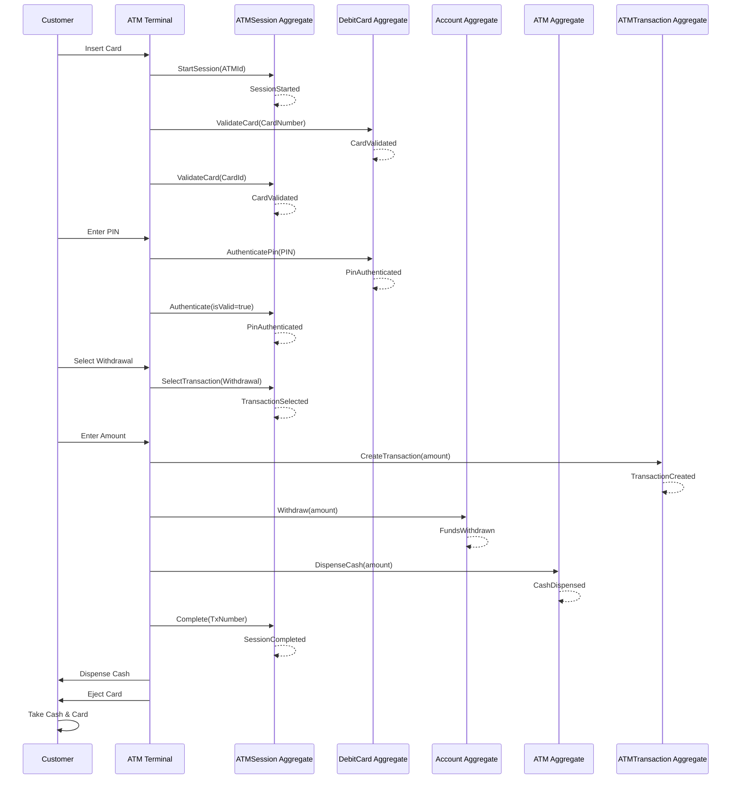
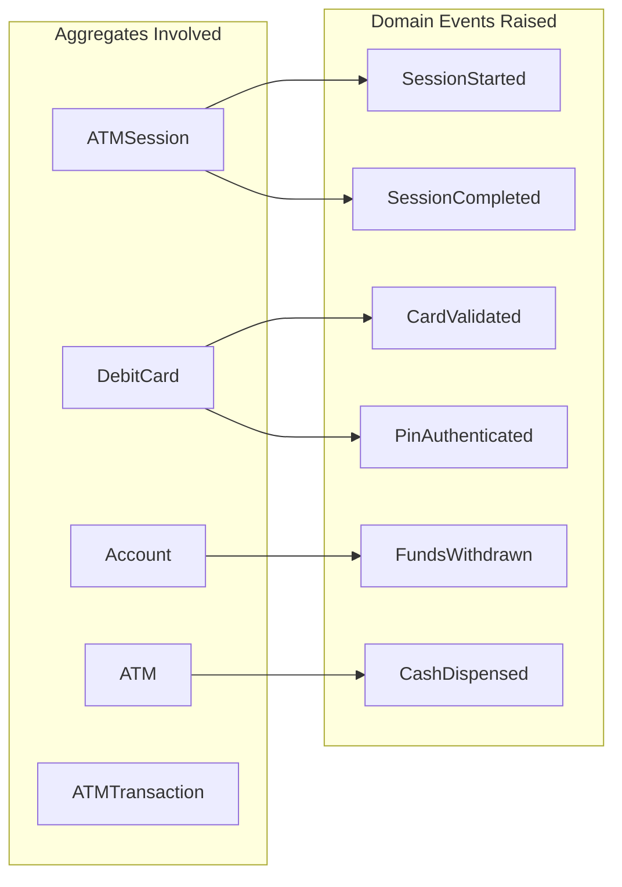
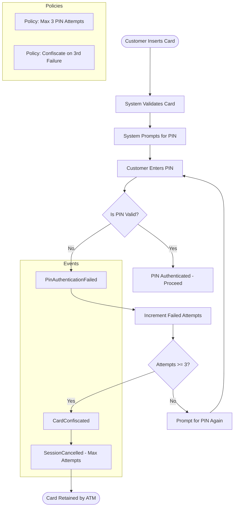
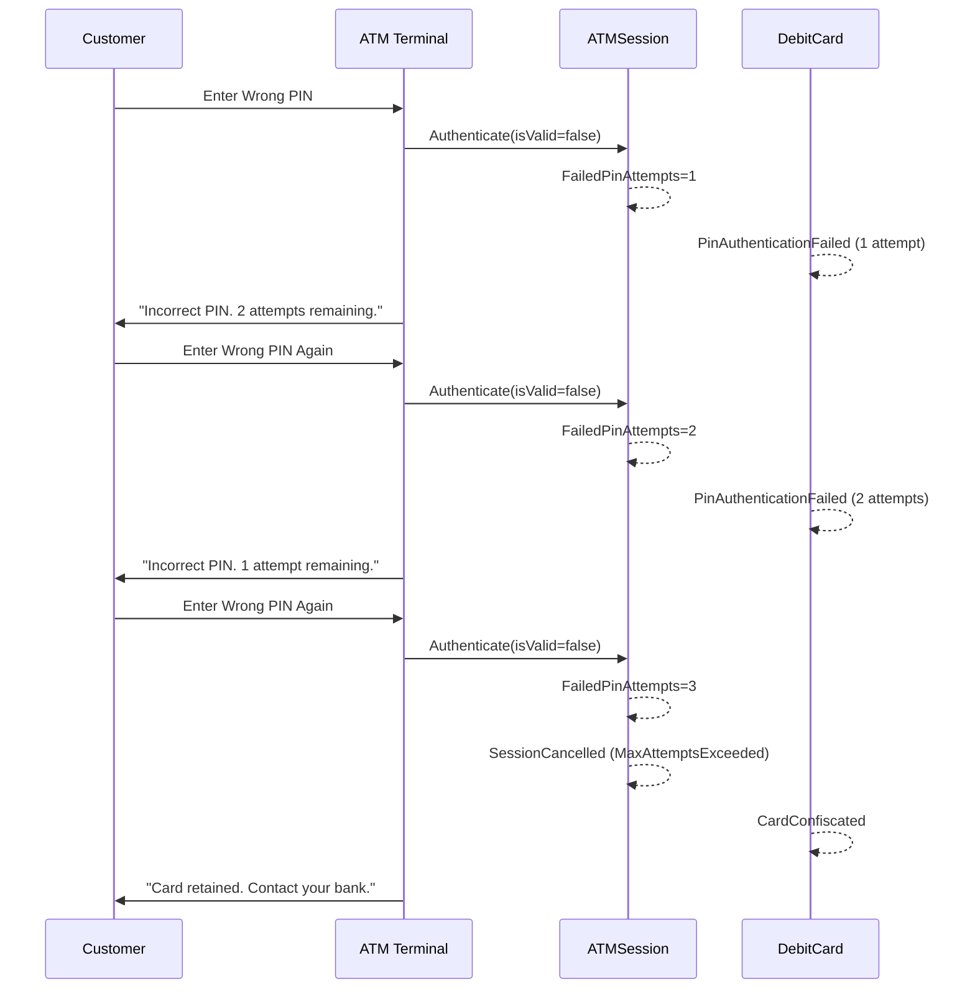
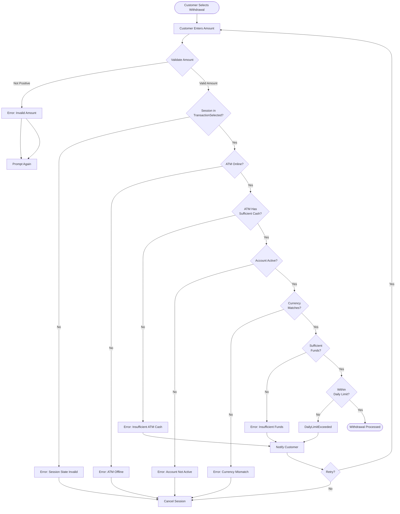
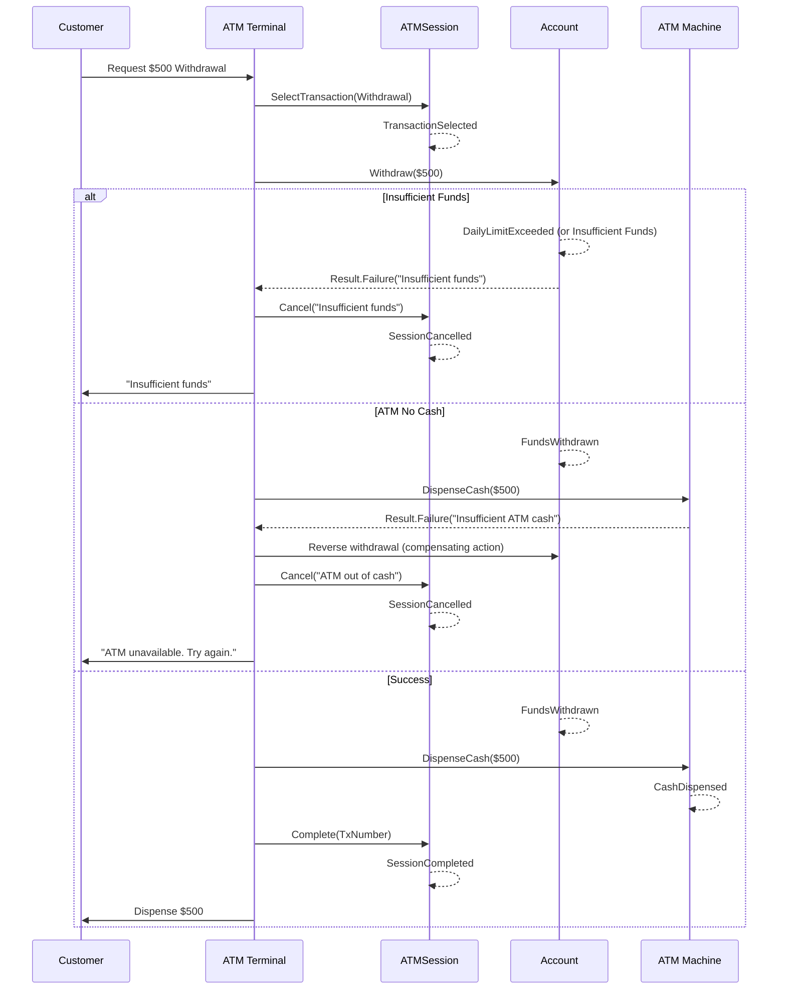
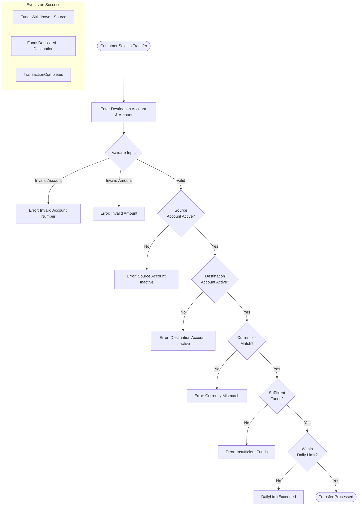
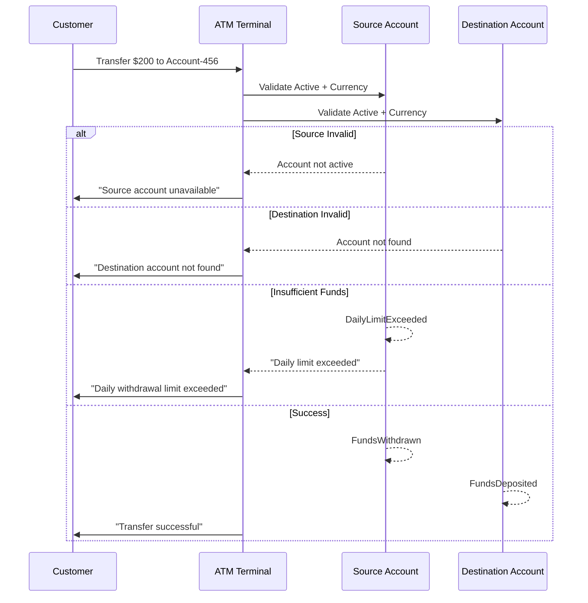
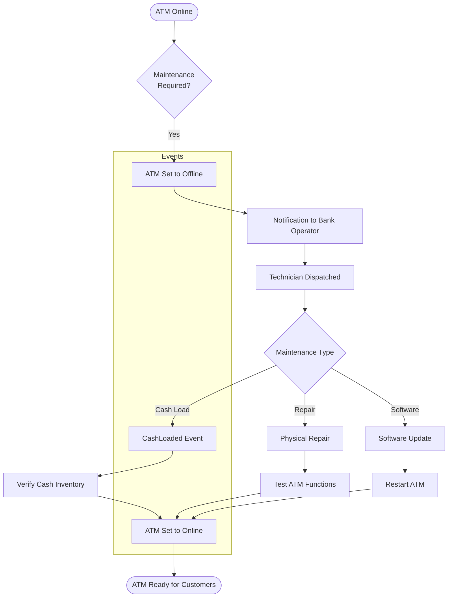
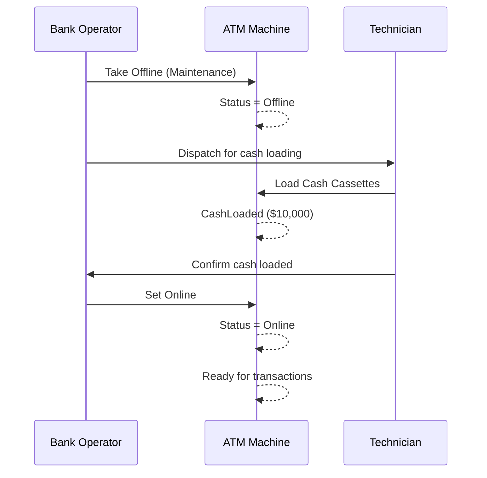

# Event Storming

> **Version:** 1.0  
> **Last Updated:** 2026-07-25  
> **Status:** Living Document

---

## Executive Summary

Event Storming is a collaborative workshop technique used to discover the domain model through the lens of domain events — things that happened in the system. This document captures the results of Event Storming sessions conducted for the ATMSystem, mapping out all flows (happy path, failure modes, maintenance operations) as sequences of domain events, commands, and aggregate interactions.

The process revealed five aggregate boundaries — DebitCard, Account, ATM, ATMSession, and ATMTransaction — by identifying where consistency requirements diverge. It also surfaced hot spots around cross-aggregate coordination and eventual consistency requirements.

---

## Methodology

The Event Storming sessions followed the standard "Big Picture" to "Process Level" to "Design Level" progression:

1. **Chaotic Exploration** — Domain experts and developers posted all domain events on a timeline without concern for ordering.
2. **Enforce Timeline** — Events were reorganized chronologically to identify flows.
3. **Add Commands and Actors** — Commands (arrows pointing into the system) and actors (who triggers what) were added.
4. **Add Aggregates** — Events were grouped by aggregate boundaries based on consistency needs.
5. **Identify Hot Spots** — Areas of uncertainty, policy gaps, and technical constraints were flagged.

---

## Event Storming Legend

```
┌──────────────────────┐
│     Domain Event     │  Orange sticky — something that happened in the domain
│  (Past Tense Verb)   │  e.g., "Card Validated", "Funds Withdrawn"
└──────────────────────┘

┌──────────────────────┐
│       Command        │  Blue sticky — an action/intent that triggers events
│   (Imperative Verb)  │  e.g., "Authenticate PIN", "Complete Withdrawal"
└──────────────────────┘

┌──────────────────────┐
│       Aggregate      │  Large yellow sticky — consistency boundary
│  (Noun, Capitalized) │  e.g., "ATMSession", "Account", "DebitCard"
└──────────────────────┘

┌──────────────────────┐
│        Actor         │  Small pink sticky — who performs the action
│    (User/Role/System)│  e.g., "Customer", "System", "Bank Operator"
└──────────────────────┘

┌──────────────────────┐
│        Policy        │  Purple sticky — business rules / constraints
│   (If/Then/When)     │  e.g., "If 3 failed PIN attempts → Confiscate Card"
└──────────────────────┘

┌╌╌╌╌╌╌╌╌╌╌╌╌╌╌╌╌╌╌╌╌╌╌┐
╎      Hot Spot         ╎  Red sticky — question, risk, or uncertainty
╎   (Question/Block)    ╎  e.g., "What happens if ATM goes offline mid-session?"
└╌╌╌╌╌╌╌╌╌╌╌╌╌╌╌╌╌╌╌╌╌╌┘

┌──────────────────────┐
│      Read Model      │  Green sticky — data displayed to the user
│    (Information)      │  e.g., "Balance", "Transaction History"
└──────────────────────┘
```

---

## The Happy Path

The primary customer flow — card insertion through successful withdrawal and session completion.





---

## Failed Authentication Path

When a customer enters an incorrect PIN, the system tracks failed attempts and confiscates the card after 3 failures.



### Retry Scenario



---

## Withdrawal Failures

Multiple failure modes exist during the withdrawal flow, each raising specific events and providing customer feedback.





---

## Transfer Failures

Transfers involve two accounts (source and destination) and must validate both.





---

## ATM Maintenance Events

ATM maintenance operations managed by bank operators and technicians.





### Cash Inventory Lifecycle

```mermaid
stateDiagram-v2
    [*] --> Online: ATM Startup
    Online --> Offline: Maintenance Required
    Online --> Offline: System Error
    Offline --> CashLoading: Technician Arrives
    CashLoading --> CashLoaded: Cash Cassettes Replaced
    CashLoaded --> Testing: System Self-Check
    Testing --> Online: All Checks Passed
    Testing --> Offline: Repair Needed
    CashLoaded --> CashLow: Cash Below Threshold
    CashLow --> CashLoading: Refill Triggered

    state Online {
        [*] --> Idle
        Idle --> TransactionActive: Customer Insert Card
        TransactionActive --> Idle: Session Complete
    end
```

---

## Aggregate Boundaries Identified

The Event Storming sessions revealed five distinct aggregate boundaries based on consistency requirements:

| Aggregate | Events Owned | Consistency Boundary Rationale |
|-----------|-------------|-------------------------------|
| **ATMSession** | SessionStarted, CardValidated, PinAuthenticated, SessionCompleted, SessionCancelled | Session lifecycle must be strictly sequential (state machine). High change frequency per session. Short-lived. |
| **DebitCard** | CardIssued, CardValidated, PinAuthenticated, PinAuthenticationFailed, CardConfiscated, CardBlocked | Card data (PIN, status, attempts) must be consistent. Global uniqueness of card number. Long-lived. |
| **Account** | AccountCreated, FundsWithdrawn, FundsDeposited, DailyLimitExceeded | Balance accuracy and daily limit enforcement require strong consistency. Concurrency protection for financial operations. Long-lived. |
| **ATM** | CashDispensed, CashLoaded | Cash inventory accuracy is critical. Physical device state (online/offline) must be consistent with capability. Long-lived. |
| **ATMTransaction** | TransactionCreated, TransactionCompleted, TransactionFailed | Audit trail for every financial operation. References other aggregates by ID, does not own their data. Append-only. |

---

## Coordination Between Aggregates

Aggregate coordination follows a **domain event → event handler** pattern rather than direct cross-aggregate calls:

```
ATMSession  --->  SessionCompletedDomainEvent
                      │
                      ▼
              Event Handler Orchestrator
                      │
          ┌───────────┼───────────┐
          ▼           ▼           ▼
    DebitCard     Account       ATM
    (update     (deduct      (dispense
     status)     funds)       cash)
```

**Key coordination rules:**
1. Within a single command handler, only one aggregate is modified directly.
2. Side effects on other aggregates are triggered by domain events published after `SaveChangesAsync`.
3. Compensating actions (e.g., reversing a withdrawal if cash dispensing fails) are implemented in event handlers.
4. The `TransactionBehavior` pipeline ensures atomicity within the primary aggregate; side effects are eventually consistent.

---

## Hot Spots and Open Questions

| ID | Hot Spot | Status | Notes |
|----|----------|--------|-------|
| **HS-01** | What happens if the ATM goes offline mid-session (after PIN auth but before cash dispensed)? | Open | Need session timeout policy. Should we auto-cancel sessions when ATM goes offline? |
| **HS-02** | Cash dispensing failure after funds withdrawn — how to reconcile? | Open | Currently no compensating transaction implemented. Account balance is debited but cash may not dispense. |
| **HS-03** | Daily limit reset — is it calendar day or rolling 24-hour window? | Decision Needed | Current implementation uses calendar day (UTC midnight). Should confirm with domain experts. |
| **HS-04** | Card confiscation race condition — customer removes card during PIN entry. | Open | The physical card ejection/retention mechanism is outside the software model. Need a timeout policy. |
| **HS-05** | Session timeout — how long should a session be idle before auto-cancellation? | Open | Not yet implemented. Recommendation: 30 seconds between steps, 2 minutes total. |
| **HS-06** | Transfer atomicity — should both accounts be debited/credited atomically, or is eventual consistency acceptable? | Open | Current design does not support transfers fully. If both accounts are in the same bounded context, consider a database transaction. |
| **HS-07** | Are "Deposit" transactions in scope for v1? | Open | Deposit functionality is mentioned in domain events but not yet implemented. |
| **HS-08** | Receipt printing — is this a domain concern or purely infrastructure? | Open | If receipt data contains business information, it should be modeled. Currently out of scope. |
| **HS-09** | How do we handle cash denomination logic? | Open | `CashDispenser` aggregate exists but denominations are not factored into dispensing logic. |
| **HS-10** | Domain event dispatching is currently commented out in infrastructure. | Known Issue | Events raised via `RaiseDomainEvent` are collected but not dispatched through event infrastructure. Only MediatR `INotification` works. |
