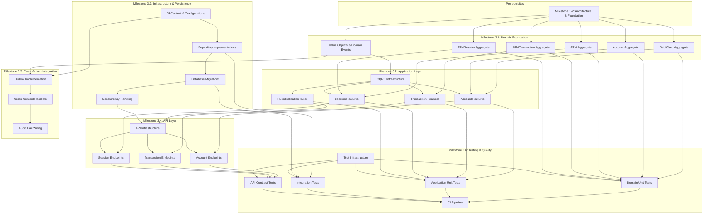
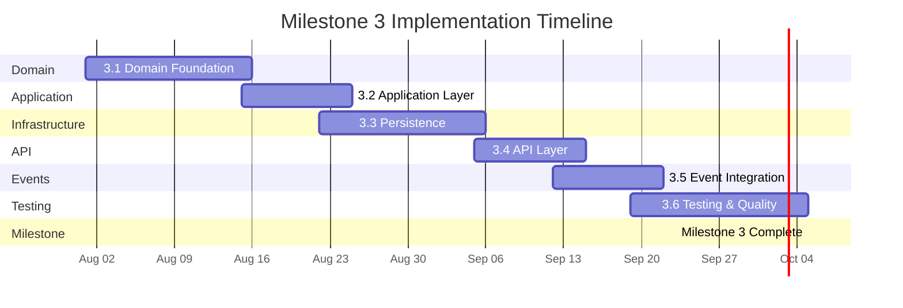

# Milestone 3: Full Implementation Roadmap

> **References:** [Project Summary](../Summary.md) | [Aggregate Design](../Domain/AggregateDesign.md) | [Domain Events](../Domain/DomainEvents.md) | [Context Map](../ContextMap.md)
>
> **Target Release:** Q3 2026

---

## Executive Summary

Milestone 3 represents the **full implementation phase** of the ATMSystem. It transforms the architectural foundation (laid in Milestones 1–2) into a working, tested, production-grade application. The milestone covers six sub-milestones spanning the entire Clean Architecture stack — from domain aggregates through persistence, API exposure, event-driven integration, and comprehensive testing.

### Milestone 3 Goals

1. **Complete all five aggregate implementations** with full business rule enforcement
2. **Implement CQRS application layer** with commands, queries, handlers, and validators
3. **Establish infrastructure and persistence** with EF Core configurations, migrations, and repository implementations
4. **Expose REST API** with Swagger documentation and proper request/response DTOs
5. **Wire event-driven integration** with domain event handlers, cross-context coordination, and outbox processing
6. **Achieve quality thresholds** through unit tests, integration tests, and API contract tests

### Prerequisites (Milestones 1–2)

- Architecture Decision Records (ADRs) documented
- Bounded context map defined
- Ubiquitous language established
- Solution structure scaffolded with Clean Architecture layering
- NuGet packages configured (MediatR, FluentValidation, EF Core, Npgsql)
- BuildingBlocks shared libraries in place

---

## Milestone 3.1: Domain Foundation

**Duration:** 3 weeks  
**Dependencies:** Milestones 1–2 (architecture decisions, solution structure)

### Objectives

Implement all five domain aggregates with full business rule enforcement, value objects, domain events, and error catalogues. The domain layer must be pure C# with zero infrastructure dependencies.

### Deliverables

| Deliverable | Artifact | Acceptance Criteria |
|---|---|---|
| DebitCard aggregate | `Banking.Domain.Cards.Aggregate.DebitCard` | All 8 behaviors implemented; 5 domain events; 3 business rules |
| Account aggregate | `Bank.Server.Domain.AccountContext.Aggregates.Account` | Withdraw/deposit/freeze/close; 4 domain events; 3 invariants |
| ATM aggregate | `Bank.Server.Domain.ATMContext.Aggregates.ATM` | Cash dispense/load; status management; 2 domain events |
| ATMTransaction aggregate | `Banking.Domain.Aggregates.ATMTransaction` | Full lifecycle (Approve/Complete/Cancel); 3 domain events |
| ATMSession aggregate | `Banking.Domain.ATMSessions.Aggregate.ATMSession` | 6-state machine; all transitions guarded; 5 domain events |
| Value Objects | `CardNumber`, `Pin`, `ExpirationDate`, `IssueDate`, `Money`, `AccountNumber`, `ATMIdentifier`, `SessionId`, `TransactionNumber` | All with validation, equality, immutability |
| Domain Events | All 20 events per catalog | Implemented as records implementing `IDomainEvent` |
| Error Catalogues | `CardErrors`, `SessionErrors`, aggregate-specific error classes | Static classes with descriptive error constants |

### Tasks

1. **DebitCard aggregate** (3 days)
   - Implement `CardNumber` value object with Luhn validation
   - Implement `Pin` value object with 4–6 digit validation
   - Implement `ExpirationDate` and `IssueDate` value objects
   - Implement `DebitCard` aggregate with all behaviors
   - Implement all 5 domain events
   - Implement `CardErrors` error catalogue
   - Implement nested business rule classes

2. **Account aggregate** (3 days)
   - Implement `AccountNumber`, `Money` value objects
   - Implement `Account` aggregate with Withdraw, Deposit, Freeze, Close
   - Implement 4 domain events
   - Implement specification classes (`SufficientFundsSpecification`, `DailyLimitSpecification`)

3. **ATM aggregate** (2 days)
   - Implement `ATMIdentifier` value object, `ATMStatus` enum
   - Implement `ATM` aggregate with cash management and status transitions
   - Implement `CashDispenser` child entity
   - Implement `CashDispensedDomainEvent`, `CashLoadedDomainEvent`

4. **ATMTransaction aggregate** (2 days)
   - Implement `TransactionType` and `TransactionStatus` enums
   - Implement `ATMTransaction` aggregate with full lifecycle
   - Implement 3 domain events

5. **ATMSession aggregate** (3 days)
   - Implement `SessionId`, `ATMId`, `CardId` strongly-typed IDs
   - Implement `TransactionNumber` value object
   - Implement `ATMSession` with full state machine
   - Implement 5 domain events
   - Implement `SessionErrors` error catalogue
   - Implement all nested business rule classes

6. **Domain event base classes** (1 day)
   - Ensure `IDomainEvent` interface is correct
   - Ensure `DomainEvent` abstract base record is correct
   - Verify `AggregateRoot.RaiseDomainEvent()` mechanism

### Acceptance Criteria

- All aggregates compile in a domain-layer-only project (zero infrastructure dependencies)
- All business rules throw appropriate exceptions with descriptive messages
- All value objects reject invalid inputs with `ArgumentException` or `DomainException`
- All domain events are raised at the correct point in aggregate methods
- State machines (Account lifecycle, Transaction lifecycle, Session flow) enforce legal transitions
- All error catalogues are complete and match aggregate behaviors

### Effort Estimate

| Activity | Days |
|---|---|
| DebitCard aggregate | 3 |
| Account aggregate | 3 |
| ATM aggregate | 2 |
| ATMTransaction aggregate | 2 |
| ATMSession aggregate | 3 |
| Domain events & base classes | 1 |
| Code review & refinement | 1 |
| **Total** | **15 working days** |

---

## Milestone 3.2: Application Layer

**Duration:** 2 weeks  
**Dependencies:** Milestone 3.1 (domain foundation complete)

### Objectives

Implement the full CQRS application layer with commands, queries, handlers (command and query), and FluentValidation validators. Establish MediatR pipeline behaviors for cross-cutting concerns.

### Deliverables

| Deliverable | Artifact | Acceptance Criteria |
|---|---|---|
| Withdraw command/query | `Features/Accounts/Withdraw/` | Command, handler, validator, query all wired |
| Balance inquiry query | `Features/Accounts/GetBalance/` | Query returns account balance |
| Transaction commands | `Features/Transactions/` | Create, Complete, Cancel transactions |
| Session commands | `Features/ATM/` | StartSession, InsertCard, AuthenticatePin, CancelSession |
| Pipeline behaviors | `BuildingBlocks.Application/Behaviors/` | Validation, Transaction, Logging behaviors active |
| DTOs and mappers | Request/Response DTOs per feature | All commands/queries return typed results |

### Tasks

1. **CQRS infrastructure setup** (2 days)
   - Verify `ICommand<T>`, `IQuery<T>` base interfaces
   - Register MediatR in DI with assembly scanning
   - Implement `ValidationBehavior<TRequest, TResponse>`
   - Implement `TransactionBehavior<TRequest, TResponse>`
   - Implement `LoggingBehavior<TRequest, TResponse>`

2. **Account features** (3 days)
   - Implement `WithdrawCommand`, `WithdrawCommandHandler`, `WithdrawCommandValidator`
   - Implement `GetBalanceQuery`, `GetBalanceQueryHandler`
   - Unit test all handlers with mocked repositories

3. **Transaction features** (2 days)
   - Implement `CreateTransactionCommand` + handler
   - Implement `CompleteTransactionCommand` + handler
   - Implement `CancelTransactionCommand` + handler
   - Implement `GetTransactionHistoryQuery` + handler

4. **ATM / Session features** (3 days)
   - Implement `StartSessionCommand` + handler
   - Implement `InsertCardCommand` + handler
   - Implement `AuthenticatePinCommand` + handler
   - Implement `CancelSessionCommand` + handler

5. **FluentValidation rules** (2 days)
   - Card number format validation
   - PIN format validation
   - Amount range validation (positive, non-zero)
   - Account existence check (async validator)
   - ATM availability check (async validator)

### Acceptance Criteria

- All commands return `Result` or `Result<T>` with success/failure semantics
- All queries return typed response DTOs
- Validators prevent invalid commands before reaching handlers
- Pipeline behaviors execute in correct order: Validation → Transaction → Logging → Handler
- All handlers are async and accept `CancellationToken`
- Handlers do NOT contain domain logic (they delegate to aggregates)

### Effort Estimate

| Activity | Days |
|---|---|
| CQRS infrastructure | 2 |
| Account features | 2 |
| Transaction features | 2 |
| ATM / Session features | 3 |
| Validation rules | 1 |
| **Total** | **10 working days** |

---

## Milestone 3.3: Infrastructure & Persistence

**Duration:** 3 weeks  
**Dependencies:** Milestone 3.1 (domain), Milestone 3.2 (application abstractions)

### Objectives

Implement EF Core persistence layer with entity configurations, database migrations, repository implementations, and value object mappings. Ensure all aggregates are correctly persisted with proper concurrency handling.

### Deliverables

| Deliverable | Artifact | Acceptance Criteria |
|---|---|---|
| DbContext | `BankingDbContext` + `BaseDbContext` | All `DbSet<>` properties; interceptor registration |
| Entity configurations | 5+ Fluent API configurations | `DebitCardConfiguration`, `AccountConfiguration`, `ATMConfiguration`, `ATMTransactionConfiguration`, `CashDispenserConfiguration` |
| Repository implementations | 5 repository classes | `DebitCardRepository`, `AccountRepository`, `ATMRepository`, `ATMTransactionRepository`, `ATMSessionRepository` |
| Database migrations | Initial + value object migrations | Applied automatically in development |
| Value object persistence | Owned types / JSON columns | `Money`, `CardNumber`, `Pin`, etc. correctly persisted |
| Outbox infrastructure | `OutboxMessage` + configuration | Entity, configuration, interceptor scaffolded |

### Tasks

1. **DbContext setup** (2 days)
   - Configure `BankingDbContext` with all `DbSet<>` properties
   - Register `PublishDomainEventsInterceptor`
   - Register `AuditInterceptor`
   - Configure connection string and PostgreSQL provider

2. **Entity configurations** (3 days)
   - `DebitCardConfiguration` — value objects as owned types or columns
   - `AccountConfiguration` — Money mapping, concurrency token
   - `ATMConfiguration` — Enum conversions, identifier mapping
   - `ATMTransactionConfiguration` — All FK relationships
   - `CashDispenserConfiguration` — Child entity mapping
   - `OutboxMessageConfiguration` — JSON content column

3. **Repository implementations** (3 days)
   - Implement `DebitCardRepository` with full CRUD + `GetByCardNumberAsync`
   - Implement `AccountRepository` with `GetByAccountNumberAsync`
   - Implement `ATMRepository` with `GetByIdentifierAsync`
   - Implement `ATMTransactionRepository` with `GetByAccountIdAsync`
   - Implement `ATMSessionRepository` with session management
   - Register all repositories in DI

4. **Database migrations** (2 days)
   - Create initial migration with all tables
   - Create value object migration (owned types)
   - Test migration application against PostgreSQL
   - Add seed data for development/testing

5. **Concurrency handling** (2 days)
   - Add `RowVersion` byte[] to all aggregates
   - Test optimistic concurrency with parallel withdrawal attempts
   - Implement retry logic in `TransactionBehavior`

### Acceptance Criteria

- All aggregate roots have corresponding DbSet
- All value objects are persisted (as owned types or columns)
- All repository methods return correct data from PostgreSQL
- Migrations are repeatable and idempotent
- Optimistic concurrency prevents lost updates
- Database schema matches the domain model exactly

### Effort Estimate

| Activity | Days |
|---|---|
| DbContext setup | 2 |
| Entity configurations | 3 |
| Repository implementations | 3 |
| Database migrations | 2 |
| Concurrency handling | 2 |
| Integration testing | 3 |
| **Total** | **15 working days** |

---

## Milestone 3.4: API Layer

**Duration:** 2 weeks  
**Dependencies:** Milestone 3.2 (application), Milestone 3.3 (infrastructure)

### Objectives

Expose the application layer through REST API controllers with Swagger/OpenAPI documentation, proper request/response DTOs, error handling middleware, and health checks.

### Deliverables

| Deliverable | Artifact | Acceptance Criteria |
|---|---|---|
| Account controller | `AccountsController` | POST withdraw, GET balance |
| Transaction controller | `TransactionsController` | POST create, POST complete, POST cancel, GET history |
| ATM controller | `ATMController` | POST start-session, POST insert-card, POST auth-pin, POST cancel-session |
| Health checks | `/health` | Returns 200 with database connectivity |
| Swagger documentation | Swagger UI | All endpoints documented with schemas |
| Global error handling | `ExceptionMiddleware` | Consistent JSON error responses |
| Request/Response DTOs | Per endpoint | Validated, documented, versioned |

### Tasks

1. **API infrastructure** (2 days)
   - Configure ASP.NET Core minimal API or controllers
   - Set up Swagger/OpenAPI with XML comments
   - Implement `ExceptionMiddleware` for structured error responses
   - Configure Serilog/structured logging
   - Add CORS for development

2. **Account endpoints** (2 days)
   - `POST /api/accounts/{id}/withdraw` — map to `WithdrawCommand`
   - `GET /api/accounts/{id}/balance` — map to `GetBalanceQuery`
   - Request/Response DTOs with validation attributes

3. **Transaction endpoints** (3 days)
   - `POST /api/transactions` — create transaction
   - `POST /api/transactions/{id}/approve` — approve transaction
   - `POST /api/transactions/{id}/complete` — complete transaction
   - `POST /api/transactions/{id}/cancel` — cancel transaction
   - `GET /api/accounts/{id}/transactions` — transaction history

4. **ATM / Session endpoints** (3 days)
   - `POST /api/atms/{atmId}/sessions` — start session
   - `POST /api/atms/{atmId}/sessions/{sessionId}/card` — insert card
   - `POST /api/atms/{atmId}/sessions/{sessionId}/pin` — authenticate PIN
   - `POST /api/atms/{atmId}/sessions/{sessionId}/cancel` — cancel session
   - `POST /api/atms/{atmId}/sessions/{sessionId}/eject` — eject card

### Acceptance Criteria

- All endpoints return proper HTTP status codes (200, 201, 400, 404, 409, 500)
- Swagger UI renders all endpoints with example requests
- Validation errors return 400 with structured error details
- Health endpoint reflects database connectivity
- All endpoints accept and return JSON
- Postman/curl collection works end-to-end with test data

### Effort Estimate

| Activity | Days |
|---|---|
| API infrastructure | 2 |
| Account endpoints | 2 |
| Transaction endpoints | 2 |
| ATM / Session endpoints | 3 |
| Swagger & documentation | 1 |
| **Total** | **10 working days** |

---

## Milestone 3.5: Event-Driven Integration

**Duration:** 2 weeks  
**Dependencies:** Milestone 3.1 (domain events), Milestone 3.3 (outbox infrastructure), Milestone 3.4 (API trigger)

### Objectives

Wire domain events to their handlers for cross-context coordination. Implement the outbox pattern for reliable event delivery. Ensure that events raised by aggregate methods trigger appropriate side effects in other bounded contexts.

### Deliverables

| Deliverable | Artifact | Acceptance Criteria |
|---|---|---|
| Outbox processor | Background service polling `OutboxMessages` | Events published within 1 second of persistence |
| AtmCashInventoryHandler | `INotificationHandler<FundsWithdrawnDomainEvent>` | Decreases ATM cash on withdrawal |
| Audit trail handlers | Multiple `INotificationHandler<>` | All financial events create `AuditLog` entries |
| Session event handlers | Session-to-transaction coordination | Session events trigger correct transaction flows |
| Idempotency service | Deduplication on EventId | Handlers skip already-processed events |

### Tasks

1. **Outbox implementation** (3 days)
   - Implement `OutboxMessageProcessor` background service
   - Poll `OutboxMessages` table on configurable interval
   - Deserialize and publish events via MediatR
   - Mark events as processed on success
   - Implement retry with exponential backoff
   - Implement dead-letter after max retries

2. **Cross-context event handlers** (3 days)
   - Implement `AtmCashInventoryHandler` (FundsWithdrawn → ATM)
   - Implement `FundsWithdrawnDomainEventHandler` (audit logging)
   - Implement `TransactionCompletedHandler` (session completion)
   - Implement `CardConfiscatedHandler` (session cancellation)
   - Register all handlers in DI

3. **Audit trail wiring** (2 days)
   - Connect all domain events to `AuditLog` creation
   - Implement `IAuditLogRepository` and `AuditLogRepository`
   - Implement audit event handler per event type

4. **Event serialization** (1 day)
   - Ensure all domain events are JSON-serializable
   - Add `System.Text.Json` attributes where needed
   - Test round-trip serialization

5. **Integration testing** (3 days)
   - Test full withdrawal flow end-to-end
   - Verify cash inventory decreases after withdrawal
   - Verify audit log entries are created
   - Test outbox recovery after transient failures

### Acceptance Criteria

- Withdrawal flow produces: `FundsWithdrawnDomainEvent` → ATM cash decrease + Audit log entry
- Confiscation flow produces: `CardConfiscatedDomainEvent` → Session cancelled + Audit log entry
- Outbox processes events within 1 second in development
- No events lost on application restart (outbox guarantees at-least-once delivery)
- Event handlers are idempotent (duplicate events are safely ignored)
- All 20 domain events have corresponding handlers

### Effort Estimate

| Activity | Days |
|---|---|
| Outbox implementation | 3 |
| Cross-context handlers | 3 |
| Audit trail wiring | 2 |
| Event serialization | 1 |
| Integration testing | 1 |
| **Total** | **10 working days** |

---

## Milestone 3.6: Testing & Quality

**Duration:** 3 weeks  
**Dependencies:** All previous milestones

### Objectives

Achieve high quality through comprehensive testing across all layers. Establish testing standards, achieve target code coverage, and validate all business rules through automated tests.

### Deliverables

| Deliverable | Artifact | Acceptance Criteria |
|---|---|---|
| Unit tests — Domain | `Tests/Domain/` | 90%+ branch coverage on all aggregates |
| Unit tests — Application | `Tests/Application/` | All command/query handlers tested |
| Integration tests — Persistence | `Tests/Infrastructure/` | All repository operations against real PostgreSQL |
| API contract tests | `Tests/Api/` | All endpoints return correct status codes and schemas |
| Test project setup | xUnit + FluentAssertions + NSubstitute | CI-ready test projects |
| CI pipeline | GitHub Actions workflow | Tests run on every PR |

### Tasks

1. **Test infrastructure** (2 days)
   - Create `Tests/Domain.Tests`, `Tests/Application.Tests`, `Tests/Infrastructure.Tests`, `Tests/Api.Tests`
   - Configure xUnit, FluentAssertions, NSubstitute, Bogus (test data generation)
   - Configure Testcontainers for PostgreSQL in integration tests
   - Create test base classes and fixtures

2. **Domain unit tests** (5 days)
   - **DebitCard tests** (2 days): Issue, Validate, AuthenticatePin success/failure, 3-strikes rule, Confiscate, Block, Expire, all error cases
   - **Account tests** (1 day): Create, Withdraw success/failure, Deposit, Freeze, Close, daily limit, insufficient funds, currency mismatch
   - **ATM tests** (0.5 day): Cash dispense/load, status transitions, error cases
   - **ATMTransaction tests** (0.5 day): Full lifecycle, illegal transitions
   - **ATMSession tests** (1 day): Full state machine, all transition guards, max PIN attempts

3. **Application unit tests** (3 days)
   - Test all command handlers with mocked aggregates
   - Test all query handlers with mocked repositories
   - Test all FluentValidation validators
   - Test pipeline behaviors (validation, transaction, logging)

4. **Integration tests** (3 days)
   - Repository tests with Testcontainers PostgreSQL
   - Test insert/update/query for each aggregate
   - Test concurrency (parallel withdrawal attempts)
   - Test migration application

5. **API contract tests** (2 days)
   - Test all endpoints via `WebApplicationFactory`
   - Verify HTTP status codes
   - Verify response schemas match OpenAPI spec
   - Test error paths (404, 400, 409)

6. **CI pipeline** (1 day)
   - Configure GitHub Actions workflow
   - Build solution
   - Run all tests
   - Generate coverage report
   - Fail on below-threshold coverage

### Acceptance Criteria

| Metric | Target |
|---|---|
| Domain layer branch coverage | ≥ 90% |
| Application layer line coverage | ≥ 85% |
| Infrastructure integration tests | All repository methods |
| API contract tests | All endpoints covered |
| Test execution time (CI) | < 5 minutes |
| No flaky tests | 100% reliable |

### Effort Estimate

| Activity | Days |
|---|---|
| Test infrastructure | 2 |
| Domain unit tests | 5 |
| Application unit tests | 3 |
| Integration tests | 3 |
| API contract tests | 2 |
| CI pipeline | 1 |
| **Total** | **16 working days** |

---

## Overall Milestone 3 Dependency Graph



---

## Risk Register

| ID | Risk | Probability | Impact | Mitigation | Contingency |
|---|---|---|---|---|---|
| R1 | Domain complexity underestimated (especially ATMSession state machine) | Medium | High | Review state machine design with team; validate all transitions before coding | Extend Milestone 3.1 by 3 days; reduce scope of edge cases |
| R2 | Concurrency issues with balance updates under load | Medium | High | Implement pessimistic locking fallback; use EF Core retry logic | Add dedicated concurrency tests in Milestone 3.6 |
| R3 | Outbox processor introduces latency | Low | Medium | Tune polling interval; consider Change Data Capture (CDC) for high throughput | Implement MediatR direct dispatch fallback for non-critical events |
| R4 | PostgreSQL migration issues in production-like environments | Low | Medium | Test migrations against Docker PostgreSQL; use idempotent migration scripts | Rollback to previous migration; manual DBA intervention |
| R5 | Incomplete domain event coverage (missed events) | Medium | Medium | Cross-reference Aggregate Design document with Domain Events catalog; code review | Add events in iterative cycle; minor API version bump |
| R6 | Test flakiness in integration tests | Medium | Low | Use Testcontainers with fixed PostgreSQL image; retry policy on transient failures | Quarantine flaky tests; fix and re-run |
| R7 | Pipeline behavior ordering issues (Validation vs. Transaction) | Low | Medium | Unit test pipeline behaviors; integration test with real MediatR pipeline | Document ordering requirement; add behavioral integration test |
| R8 | API contract drift between endpoints and Swagger | Low | Medium | Use Swagger middleware to validate responses match schema; CI pipeline check | Manual OpenAPI diff review before release |

### Risk Heat Map

```mermaid
quadrantChart
    title Risk Heat Map
    x-axis Low Probability --> High Probability
    y-axis Low Impact --> High Impact
    quadrant-1 Critical (Act Immediately)
    quadrant-2 High Priority (Monitor)
    quadrant-3 Medium Priority (Accept)
    quadrant-4 Low Priority (Ignore)
    R1: [0.65, 0.85]
    R2: [0.70, 0.90]
    R3: [0.30, 0.60]
    R4: [0.25, 0.55]
    R5: [0.55, 0.60]
    R6: [0.55, 0.30]
    R7: [0.25, 0.45]
    R8: [0.30, 0.40]
```

---

## Definition of Done

A task, deliverable, or milestone is considered **Done** when ALL of the following criteria are met:

### Code Quality

- [ ] Code compiles without warnings
- [ ] All StyleCop/EditorConfig rules pass
- [ ] No `TODO`, `FIXME`, or `HACK` comments left in production code
- [ ] Naming follows `.NET` conventions and Ubiquitous Language
- [ ] No magic strings or numbers (constants/errors in dedicated classes)
- [ ] All public APIs have XML documentation comments

### Architecture

- [ ] Layer dependencies point inward (Domain ← Application ← Infrastructure ← API)
- [ ] No infrastructure dependency leaks into Domain or Application projects
- [ ] All abstractions (interfaces) are in the appropriate layer
- [ ] Aggregate boundaries respect transactional consistency
- [ ] Value objects are immutable with structural equality

### Testing

- [ ] Domain layer: ≥ 90% branch coverage on aggregates
- [ ] Application layer: all handler logic exercised
- [ ] Infrastructure: all repository methods integration-tested against PostgreSQL
- [ ] API: all endpoints contract-tested
- [ ] No flaky tests (100 runs × 3 = 0 failures)
- [ ] Tests run successfully in CI

### Documentation

- [ ] Code is self-documenting (no comments explaining "what" — only "why")
- [ ] Swagger/OpenAPI documentation is complete with example values
- [ ] Architecture decisions affecting the component are recorded in ADRs
- [ ] Domain events are documented in the Domain Events catalog
- [ ] Aggregate design matches the Aggregate Design document

### Integration

- [ ] All domain events have corresponding handlers
- [ ] Outbox processes events reliably
- [ ] Cross-context coordination works end-to-end
- [ ] Database migrations apply cleanly to a fresh PostgreSQL instance
- [ ] Health endpoint reports all dependencies as healthy

### Review

- [ ] Code reviewed by at least one other team member
- [ ] ADRs referenced if the implementation deviates from documented decisions
- [ ] Performance considerations documented (N+1 queries, indexing, etc.)

---

## Timeline Summary



| Milestone | Start | End | Working Days |
|---|---|---|---|
| 3.1 Domain Foundation | Week 1 | Week 3 | 15 |
| 3.2 Application Layer | Week 3 | Week 5 | 10 |
| 3.3 Infrastructure & Persistence | Week 4 | Week 7 | 15 |
| 3.4 API Layer | Week 7 | Week 9 | 10 |
| 3.5 Event-Driven Integration | Week 8 | Week 10 | 10 |
| 3.6 Testing & Quality | Week 10 | Week 13 | 16 |
| **Milestone 3 Complete** | **Week 14** | | **76 total** |

---

## References

| Document | Location |
|---|---|
| Aggregate Design (per-aggregate details) | [Domain/AggregateDesign.md](../Domain/AggregateDesign.md) |
| Domain Events Catalog | [Domain/DomainEvents.md](../Domain/DomainEvents.md) |
| Context Map | [ContextMap.md](../ContextMap.md) |
| Architecture Decision Records | [Architecture/ArchitectureDecisionRecords/](../Architecture/ArchitectureDecisionRecords/) |
| Project Summary | [Summary.md](../Summary.md) |
| Ubiquitous Language | [UbiquitousLanguage.md](../UbiquitousLanguage.md) |
