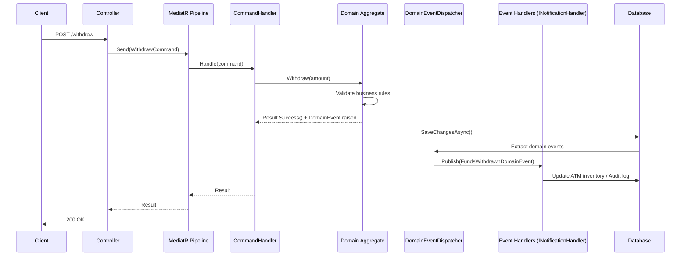

# 🏧 ATM System — Modular Monolith Bank Simulation

A comprehensive **bank ATM operations simulation** built with **.NET 10**, following **Domain-Driven Design (DDD)**, **Clean Architecture**, and **CQRS** patterns. The system models real-world banking workflows — card authentication, account management, cash withdrawals, transfers, ATM cash inventory, and audit logging — all exposed through a REST API backed by PostgreSQL.

> **Intended as a training/reference codebase** demonstrating how to structure a non-trivial financial application with rich business rules isolated from infrastructure concerns, with a clear path toward future microservice extraction.

---

## 📋 Table of Contents

- [Architecture Overview](#architecture-overview)
- [Solution Structure](#solution-structure)
- [Bounded Contexts](#bounded-contexts)
- [Technology Stack](#technology-stack)
- [Design Decisions (ADRs)](#design-decisions-adrs)
- [Domain Model Highlights](#domain-model-highlights)
- [API Endpoints](#api-endpoints)
- [Infrastructure](#infrastructure)
- [Event-Driven Architecture](#event-driven-architecture)
- [Building Blocks (Shared Libraries)](#building-blocks-shared-libraries)
- [Getting Started](#getting-started)
- [Current State & Roadmap](#current-state--roadmap)
- [Documentation](#documentation)

---

## Architecture Overview

```
┌───────────────────────────────────────────────────────────────┐
│                     Bank.Server.Api                           │
│               (Controllers, Swagger, Health)                  │
├───────────────────────────┬───────────────────────────────────┤
│                                                               │
│               Bank.Server.Application                         │
│     (Commands, Queries, Handlers, Validators, Events)         │
│                                                               │
│  ┌─────────────────────────────────────────────────────────┐  │
│  │               Features (CQRS-based)                     │  │
│  │  ┌───────────┐  ┌──────────┐  ┌──────────────────┐     │  │
│  │  │ Accounts  │  │   ATM    │  │  Transactions    │     │  │
│  │  │ (Withdraw,│  │(InsertCard│  │  (Create, Cancel,│    │  │
│  │  │  Balance) │  │ AuthPIN, │  │   Complete,      │    │  │
│  │  │           │  │ Session) │  │   History)       │    │  │
│  │  └───────────┘  └──────────┘  └──────────────────┘     │  │
│  └─────────────────────────────────────────────────────────┘  │
├───────────────────────────┬───────────────────────────────────┤
│                                                               │
│                    Bank.Server.Domain                          │
│     (Aggregates, Value Objects, Domain Events, Rules)         │
│                                                               │
│  ┌───────────┐  ┌──────────┐  ┌───────────┐  ┌───────────┐  │
│  │  Card     │  │ Account  │  │Transaction│  │    ATM    │  │
│  │ Context   │  │ Context  │  │  Context  │  │  Context  │  │
│  └───────────┘  └──────────┘  └───────────┘  └───────────┘  │
│  ┌─────────────────────────────────────────────────────────┐  │
│  │                  Audit Context                          │  │
│  └─────────────────────────────────────────────────────────┘  │
├───────────────────────────┬───────────────────────────────────┤
│                                                               │
│                  Bank.Server.Infrastructure                   │
│     (EF Core, PostgreSQL, Repositories, Outbox, Migrations)   │
└───────────────────────────────────────────────────────────────┘

                    ── Cross-Cutting ──
┌───────────────────────────────────────────────────────────────┐
│                     BuildingBlocks                            │
│  (Domain Primitives, MediatR Behaviors, UoW, Event Dispatch) │
└───────────────────────────────────────────────────────────────┘
```

### Key Design Principles

| Principle                | Implementation                                                                    |
| ------------------------ | --------------------------------------------------------------------------------- |
| **Domain-Driven Design** | Four bounded contexts with rich domain models, ubiquitous language, domain events |
| **Clean Architecture**   | Domain innermost layer with zero dependencies; API outermost                      |
| **CQRS**                 | Commands for mutations (withdraw, transfer), Queries for reads (balance)          |
| **Modular Monolith**     | Single deployable unit organized by bounded context, ready for future extraction  |

---

## Solution Structure

```
ATMSystem/
├── BankATM.slnx                          # Solution file (Visual Studio solution XML)
├── docker/
│   ├── docker-compose.yml                # API + PostgreSQL stack
│   ├── postgres/                         # PostgreSQL init scripts (if any)
│   └── seq/                              # Seq log server config (if any)
├── Docs/
│   ├── Summary.md                        # Project documentation summary
│   ├── ContextMap.md                     # Bounded context relationships
│   ├── DomainModel.md                    # Domain model details
│   ├── UbiquitousLanguage.md             # Shared domain vocabulary
│   ├── ADR-001-DDD.md                    # Architecture Decision: DDD
│   ├── ADR-002-CleanArchitecture.md      # Architecture Decision: Clean Architecture
│   ├── ADR-003-CQRS.md                   # Architecture Decision: CQRS
│   └── ADR-004-ModularMonolith.md        # Architecture Decision: Modular Monolith
├── src/
│   ├── Bank.Server/
│   │   ├── Bank.Server.Api/              # ASP.NET Core Web API entry point
│   │   ├── Bank.Server.Application/      # CQRS commands/queries, handlers, validators
│   │   ├── Bank.Server.Domain/           # Domain model (entities, value objects, events)
│   │   └── Bank.Server.Infrastructure/   # EF Core, repositories, migrations
│   ├── ATM.Client/                       # Placeholder ATM client project
│   ├── BuildingBlocks/                   # Shared cross-cutting libraries
│   │   ├── BuildingBlocks.Application/   # ICommand, IQuery, Behaviors, IUnitOfWork
│   │   ├── BuildingBlocks.Domain/        # AggregateRoot, ValueObject, Result, Entity
│   │   ├── BuildingBlocks.Infrastructure/# Persistence helpers, event accessors
│   │   ├── BuildingBlocks.Contracts/     # Shared contracts (scaffolded)
│   │   ├── BuildingBlocks.Messaging/     # Messaging abstractions (scaffolded)
│   │   ├── BuildingBlocks.Observability/ # Observability (scaffolded)
│   │   ├── BuildingBlocks.Persistence/   # Persistence (scaffolded)
│   │   └── BuildingBlocks.Security/      # Security (scaffolded)
│   └── BuildingBlocks.SharedKernel/      # Domain-level shared kernel (DomainEvent base)
└── Tests/                                # Reserved for future test projects
```

### Layer Responsibilities

| Layer                       | Project                      | Responsibility                                                                               |
| --------------------------- | ---------------------------- | -------------------------------------------------------------------------------------------- |
| **API**                     | `Bank.Server.Api`            | Controllers, Swagger, Health checks, Program.cs entry point                                  |
| **Application**             | `Bank.Server.Application`    | Use cases, CQRS handlers, validators, event handlers, feature organization                   |
| **Domain**                  | `Bank.Server.Domain`         | Business entities, value objects, domain events, specifications, aggregate roots             |
| **Infrastructure**          | `Bank.Server.Infrastructure` | EF Core DbContext, repository implementations, database migrations, domain event dispatching |
| **Shared (BuildingBlocks)** | Multiple projects            | Domain primitives, MediatR pipeline behaviors, unit-of-work, base classes                    |

---

## Bounded Contexts

The domain is organized into **four primary bounded contexts** plus an **Audit context**:

### 1. 🃏 Card Context

| Aspect               | Details                                                                                                                                              |
| -------------------- | ---------------------------------------------------------------------------------------------------------------------------------------------------- |
| **Aggregate Root**   | `Card`                                                                                                                                               |
| **Responsibilities** | Card issuance, PIN verification, status tracking, failed attempt monitoring, confiscation                                                            |
| **Domain Events**    | `CardIssuedDomainEvent`, `CardValidatedDomainEvent`, `PinValidationFailedDomainEvent`, `CardConfiscatedDomainEvent`, `CardMarkedAsStolenDomainEvent` |
| **Value Objects**    | `CardNumber`, `CardStatus`                                                                                                                           |
| **Specifications**   | `CardNotBlockedSpecification`, `CardNotExpiredSpecification`, `CardNotStolenSpecification`                                                           |
| **Repository**       | `ICardRepository`                                                                                                                                    |

### 2. 💰 Account Context

| Aspect               | Details                                                                                                                |
| -------------------- | ---------------------------------------------------------------------------------------------------------------------- |
| **Aggregate Root**   | `Account`                                                                                                              |
| **Responsibilities** | Balance management, daily withdrawal limits, funds availability, currency enforcement                                  |
| **Domain Events**    | `AccountCreatedDomainEvent`, `FundsWithdrawnDomainEvent`, `FundsDepositedDomainEvent`, `DailyLimitExceededDomainEvent` |
| **Value Objects**    | `AccountNumber`, `AccountStatus`, `Money`                                                                              |
| **Specifications**   | `DailyLimitSpecification`, `SufficientFundsSpecification`                                                              |
| **Repository**       | `IAccountRepository`                                                                                                   |

The `Account.Withdraw()` method enforces:

- ✅ Account must be active
- ✅ Currency must match
- ✅ Must not exceed daily limit
- ✅ Must have sufficient funds
- ✅ Raises `FundsWithdrawnDomainEvent` on success
- ✅ Raises `DailyLimitExceededDomainEvent` when limit is hit

### 3. 🔄 Transaction Context

| Aspect               | Details                                                                                                               |
| -------------------- | --------------------------------------------------------------------------------------------------------------------- |
| **Aggregate Root**   | `Transaction`                                                                                                         |
| **Responsibilities** | Withdrawal, transfer, balance inquiry operations; transaction lifecycle management                                    |
| **Domain Events**    | `TransactionApprovedDomainEvent`, `TransactionCompletedDomainEvent`, `TransactionCancelledDomainEvent`                |
| **Value Objects**    | `TransactionStatus` (Pending, Approved, Completed, Cancelled), `TransactionType` (Withdraw, Transfer, BalanceInquiry) |
| **Repository**       | `ITransactionRepository`                                                                                              |

Lifecycle: **Pending** → **Approved** → **Completed** / **Cancelled**

### 4. 🏧 ATM Context

| Aspect               | Details                                                                      |
| -------------------- | ---------------------------------------------------------------------------- |
| **Aggregate Root**   | `ATM`                                                                        |
| **Responsibilities** | Cash inventory management, operational status, cash dispensing and loading   |
| **Domain Events**    | `CashDispensedDomainEvent`, `CashLoadedDomainEvent`, `ATMStartedDomainEvent` |
| **Value Objects**    | `ATMIdentifier`, `ATMStatus` (Online, Offline, Maintenance)                  |
| **Repository**       | `IATMRepository`                                                             |

### 5. 📋 Audit Context

| Aspect               | Details                                                                    |
| -------------------- | -------------------------------------------------------------------------- |
| **Aggregate Root**   | `AuditLog`                                                                 |
| **Responsibilities** | Recording financial events (withdrawals, transfers, etc.) for traceability |
| **Value Objects**    | `AuditEntryId`, `AuditType`, `CorrelationId`, `Severity`                   |
| **Repository**       | `IAuditLogRepository`                                                      |

### Context Relationships

```
ATM Context ──────► Card Context         (Card insertion, PIN auth)
ATM Context ──────► Transaction Context  (Initiate transactions)
Transaction Context ──► Account Context  (Balance checks, withdrawals)
Transaction Context ──► Card Context     (Card validation)
```

---

## Technology Stack

| Layer                     | Technology                                                | Purpose                                           |
| ------------------------- | --------------------------------------------------------- | ------------------------------------------------- |
| **Runtime**               | .NET 10                                                   | Modern, cross-platform runtime                    |
| **API Framework**         | ASP.NET Core                                              | REST API with controllers, Swagger, health checks |
| **API Documentation**     | Swashbuckle (Swagger)                                     | OpenAPI/Swagger UI for API exploration            |
| **Application Mediation** | MediatR                                                   | CQRS command/query dispatch, pipeline behaviors   |
| **Validation**            | FluentValidation                                          | Request validation pipeline                       |
| **ORM**                   | Entity Framework Core 10 (Npgsql)                         | Data persistence with PostgreSQL                  |
| **Database**              | PostgreSQL 15                                             | Relational database                               |
| **Containerization**      | Docker, docker-compose                                    | Development and deployment containers             |
| **Logging**               | .NET Built-in ILogger                                     | Structured logging                                |
| **Patterns**              | DDD, CQRS, Clean Architecture, Domain Events, Outbox, UoW | Enterprise-grade architecture                     |

---

## Design Decisions (ADRs)

### ADR-001: Domain-Driven Design ✅ Accepted

**Context:** Complex business rules (card validation, transaction processing, account constraints) must remain independent of infrastructure.

**Decision:** Use DDD with four bounded contexts (Card, Account, Transaction, ATM) — each with its own aggregate root, domain events, value objects, and specifications.

### ADR-002: Clean Architecture ✅ Accepted

**Context:** Need testability, separation of concerns, and long-term maintainability.

**Decision:** Four-layer architecture (Domain → Application → Infrastructure → API) with inward-pointing dependencies. Domain has zero external dependencies.

### ADR-003: CQRS with MediatR ✅ Accepted

**Context:** ATM operations naturally separate into commands (withdraw, transfer) and queries (balance inquiry).

**Decision:** Commands modify state via MediatR `IRequest<Result>`; Queries return data via `IRequest<TResponse>`. Pipeline behaviors handle validation, logging, and transactions.

### ADR-004: Modular Monolith ✅ Accepted

**Context:** Early-stage project where business rules aren't yet validated; microservices would add unnecessary complexity.

**Decision:** Start with a modular monolith organized by bounded context. Each context is a logical module that can be extracted into a separate microservice later.

---

## Domain Model Highlights

### `Account` Aggregate

```csharp
public sealed class Account : AggregateRoot<Guid>
{
    public AccountNumber AccountNumber { get; }
    public Money Balance { get; }
    public Money DailyLimit { get; }
    public Money WithdrawnToday { get; }
    public AccountStatus Status { get; }

    public Result Withdraw(Money amount, Guid atmId, Guid transactionId = default);
    // Enforces: active status, currency match, daily limit, sufficient funds
    // Raises: FundsWithdrawnDomainEvent or DailyLimitExceededDomainEvent
}
```

### `Card` Aggregate

```csharp
public sealed class Card : AggregateRoot<Guid>
{
    public CardNumber CardNumber { get; }
    public string PinHash { get; }
    public CardStatus Status { get; }
    public int FailedPinAttempts { get; }
    public DateOnly StartDate { get; }
    public DateOnly ExpiryDate { get; }

    public static Card Issue(CardNumber, pinHash, startDate, expiryDate);
    // Raises: CardIssuedDomainEvent
}
```

### `ATM` Aggregate

```csharp
public sealed class ATM : AggregateRoot<Guid>
{
    public Money CashAvailable { get; }
    public ATMIdentifier ATMIdentifier { get; }
    public ATMStatus Status { get; }

    public Result DispenseCash(Money amount);    // Enforces online status & sufficient cash
    public Result DecreaseCashInventory(Money amount);  // Alias for DispenseCash
    public void LoadCash(Money amount);          // Adds cash inventory
}
```

### `Transaction` Aggregate

```csharp
public sealed class Transaction : AggregateRoot<Guid>
{
    public TransactionStatus Status { get; }
    public TransactionType Type { get; }
    public Money Amount { get; }
    public Guid? FromAccountId { get; }
    public Guid? ToAccountId { get; }

    public static Transaction CreateWithdrawal(Guid transactionId, Guid accountId, Money amount);
    public void Approve();    // Pending → Approved
    public void Complete();   // Approved → Completed
    public void Cancel();     // Pending → Cancelled
}
```

### Value Objects

All value objects are immutable and implement structural equality via the base `ValueObject` class:

- **`Money`** — Amount + Currency, with `Add()` and `Subtract()` methods that enforce same-currency
- **`AccountNumber`** — Typed wrapper for account identifiers
- **`CardNumber`** — Typed wrapper for card identifiers
- **`ATMIdentifier`** — Typed wrapper for ATM identifiers
- **`CardStatus`** / **`AccountStatus`** / **`ATMStatus`** / **`TransactionStatus`** — Enumeration-like status tracking

---

## API Endpoints

Base URL (local dev): `http://localhost:5125`  
Base URL (Docker): `http://localhost:8080`

| Method | Route                                 | Description                                            | Status                                |
| ------ | ------------------------------------- | ------------------------------------------------------ | ------------------------------------- |
| `POST` | `/api/transactions/withdraw`          | Cash withdrawal — legacy handler (stub)                | ⚠️ Partial                            |
| `POST` | `/api/transactions/withdraw`          | Cash withdrawal via legacy `WithdrawCommandHandler`    | ⚠️ Legacy stub                        |
| `GET`  | `/api/transactions/balance`           | Account balance query                                  | ⚠️ Stub (returns hardcoded $1,250.75) |
| `POST` | `/api/transactions/transfer`          | Fund transfer between accounts                         | ⚠️ Stub (returns OK)                  |
| `POST` | `/api/databasetest/seed-test-account` | Seed a test account ($1,000 balance, $500 daily limit) | ✅ Working                            |
| `GET`  | `/api/databasetest/accounts`          | List all accounts                                      | ✅ Working                            |
| `GET`  | `/health`                             | Health check endpoint                                  | ✅ Working                            |
| `GET`  | `/swagger`                            | Swagger UI (development only)                          | ✅ Working                            |

> **Note:** The `WithdrawCommand` is also implemented via the CQRS `Features/Accounts/Withdraw/WithdrawCommandHandler` (using MediatR) — but there is no API controller wired to it yet. The `TransactionsController` uses the legacy `Handlers/WithdrawCommandHandler` which is commented out.

---

## Infrastructure

### Database

- **Provider:** PostgreSQL 15 via Npgsql EF Core provider
- **Database name:** `bankdb` (default)
- **Connection string** (from `appsettings.json`):
  ```
  Host=localhost;Port=5432;Database=bankdb;Username=bank;Password=bank123
  ```

### EF Core Setup

- `BankDbContext` — Main DbContext with `DbSet<>` for each aggregate
- **Entity configurations** — Fluent API configurations in `Configurations/` (AccountConfiguration, CardConfiguration, ATMConfigurations, TransactionConfiguration, OutboxMessageConfiguration)
- **Migrations** — Applied automatically on startup in Development environment
  - `20260617142743_initialCreate` — Initial schema
  - `20260622172816_addValueObjects` — Value object support
  - `20260624224332_MigrationForChangeLater` — Schema refinements

### Repositories

Each bounded context has a dedicated repository interface (in Application layer) and implementation (in Infrastructure layer):

| Repository Interface     | Implementation          | Aggregate     |
| ------------------------ | ----------------------- | ------------- |
| `IAccountRepository`     | `AccountRepository`     | `Account`     |
| `ICardRepository`        | `CardRepository`        | `Card`        |
| `ITransactionRepository` | `TransactionRepository` | `Transaction` |
| `IATMRepository`         | `ATMRepository`         | `ATM`         |
| `IAuditLogRepository`    | `AuditLogRepository`    | `AuditLog`    |

### Docker

The `docker-compose.yml` defines two services:

1. **bank-api** — ASP.NET Core API container (port 8080)
   - Builds from `Dockerfile.dev` for hot-reload development
   - Health check at `/health` (curl-based)
   - Depends on healthy postgres container

2. **postgres** — PostgreSQL 15 Alpine (port 5432)
   - Persisted volume `postgres_data`
   - Health check via `pg_isready`
   - Configurable via environment variables (POSTGRES_USER, POSTGRES_PASSWORD, POSTGRES_DB)

---

## Event-Driven Architecture

### Domain Events Flow



### Key Event Handlers

| Event                             | Handler                   | Action                                        |
| --------------------------------- | ------------------------- | --------------------------------------------- |
| `FundsWithdrawnDomainEvent`       | `AtmCashInventoryHandler` | Decreases ATM cash inventory after withdrawal |
| `FundsWithdrawnDomainEvent`       | (Planned)                 | Creates audit log entry                       |
| `TransactionCompletedDomainEvent` | (Planned)                 | Marks transaction as complete                 |
| `CashDispensedDomainEvent`        | (Planned)                 | Updates cash inventory audit trail            |

### Domain Event Infrastructure

- **`IDomainEvent`** — Base interface extending `INotification` (MediatR), with `EventId` and `OccurredOnUtc`
- **`DomainEvent`** — Abstract base record in `BuildingBlocks.SharedKernel`
- **`DomainEventsExtractor`** — Extracts pending domain events from EF Core change tracker
- **`DomainEventDispatcher`** — Dispatches extracted events via MediatR publisher (currently commented out)
- **Outbox** — `OutboxMessage` entity prepared for reliable event publishing (transactional outbox pattern)

---

## Building Blocks (Shared Libraries)

### BuildingBlocks.Domain

| Class                             | Description                                                                       |
| --------------------------------- | --------------------------------------------------------------------------------- |
| `AggregateRoot<TId>`              | Base class with domain event collection (`RaiseDomainEvent`, `ClearDomainEvents`) |
| `Entity<TId>`                     | Base class with typed ID and value equality                                       |
| `ValueObject`                     | Abstract base with structural equality via `GetEqualityComponents()`              |
| `Result` / `Result<T>`            | Success/failure result type with error messages                                   |
| `Guard`                           | Guard clause utilities                                                            |
| `Currency`                        | Currency value object                                                             |
| `IBusinessRule`                   | Business rule interface                                                           |
| `BusinessRuleValidationException` | Exception for rule violations                                                     |
| `DomainException`                 | Base domain exception                                                             |

### BuildingBlocks.Application

| Class                                      | Description                                                                             |
| ------------------------------------------ | --------------------------------------------------------------------------------------- |
| `ICommand` / `ICommand<TResponse>`         | CQRS command marker interfaces (resolve to `Result`)                                    |
| `IQuery<TResponse>`                        | CQRS query marker interface                                                             |
| `IUnitOfWork`                              | Unit of work abstraction (`SaveChangesAsync`)                                           |
| `ValidationBehavior<TRequest, TResponse>`  | MediatR pipeline — validates commands via FluentValidation                              |
| `TransactionBehavior<TRequest, TResponse>` | MediatR pipeline — wraps command execution in a database transaction with retry support |
| `LoggingBehavior<TRequest, TResponse>`     | MediatR pipeline — logs request/response                                                |

### TransactionBehavior Pipeline

The `TransactionBehavior` automatically wraps command execution in an **explicit database transaction**:

1. ✅ Skips if request is not a command (queries pass through)
2. ✅ Skips if a transaction is already active
3. ✅ Opens a new execution strategy transaction
4. ✅ Commits on success, rolls back + logs on failure
5. ✅ Supports retries via EF Core execution strategy

---

## Getting Started

### Prerequisites

- [.NET 10 SDK](https://dotnet.microsoft.com/download/dotnet/10.0)
- PostgreSQL 15 (local or via Docker)
- Docker Desktop (optional, for compose stack)

### Run Locally

```bash
# 1. Clone the repository
git clone <repo-url>
cd ATMSystem

# 2. Start PostgreSQL manually or via Docker
# (ensure connection string in appsettings.json is valid)

# 3. Run the API
dotnet run --project src/Bank.Server/Bank.Server.Api

# 4. Open browser
# http://localhost:5125/swagger
```

> ⚠️ EF Core migrations run automatically on startup in Development mode.

### Run with Docker

```bash
# 1. Navigate to docker directory
cd docker

# 2. Create .env file with required variables:
#    POSTGRES_USER=bank
#    POSTGRES_PASSWORD=bank123
#    POSTGRES_DB=bankdb
#    CONNECTION_STRING=Host=postgres;Port=5432;Database=bankdb;Username=bank;Password=bank123
#    ASPNETCORE_ENVIRONMENT=Development
#    ASPNETCORE_URLS=http://+:8080

# 3. Start the stack
docker compose up --build

# 4. Open browser
# http://localhost:8080/swagger
```

### Quick Smoke Test

```bash
# Seed a test account
curl -X POST http://localhost:5125/api/databasetest/seed-test-account

# List all accounts
curl http://localhost:5125/api/databasetest/accounts

# Check health
curl http://localhost:5125/health
```

---

## Current State & Roadmap

### ✅ Implemented

- Rich domain model for all five bounded contexts (Card, Account, Transaction, ATM, Audit)
- Value objects with immutability and structural equality (`Money`, `CardNumber`, `AccountNumber`, etc.)
- Domain events for all aggregate operations
- Specifications for cross-cutting business rules (`DailyLimitSpecification`, `SufficientFundsSpecification`, `CardNotExpiredSpecification`, etc.)
- Clean Architecture project layout with inward-pointing dependencies
- EF Core persistence with Fluent API configurations and database migrations
- Repository pattern for all aggregates
- CQRS infrastructure using MediatR with separate Command/Query interfaces
- MediatR pipeline behaviors (Validation, Transaction, Logging)
- FluentValidation validators for commands
- Domain event handler for ATM cash inventory (`AtmCashInventoryHandler`)
- Docker compose for API + PostgreSQL
- Health checks (/health endpoint)
- Swagger/OpenAPI documentation

### 🚧 In Progress / Planned

| Item                     | Status         | Notes                                                                               |
| ------------------------ | -------------- | ----------------------------------------------------------------------------------- |
| `ATM.Client`             | 🔲 Placeholder | Empty .NET project waiting for implementation                                       |
| Balance query API        | ⚠️ Stub        | Returns hardcoded value; should use `GetBalanceQueryHandler`                        |
| Transfer API             | ⚠️ Stub        | Returns 200 OK without processing                                                   |
| Withdraw API             | ⚠️ Legacy      | Uses commented-out legacy handler; should wire to MediatR-based handler             |
| Card PIN validation      | 🔲 Missing     | Domain model exists; not exposed via API                                            |
| ATM session flow         | 🔲 Missing     | `InsertCard`, `AuthenticatePin`, `StartSession`, `CancelSession` are empty stubs    |
| Domain event dispatching | ⚠️ Commented   | `DomainEventDispatcher` logic is commented out; events not automatically dispatched |
| Audit event handlers     | 🔲 Missing     | Needs `INotificationHandler<FundsWithdrawnDomainEvent>` for audit logging           |
| Test projects            | 🔲 Missing     | `Tests/` directory exists but empty                                                 |
| Building blocks          | ⚠️ Scaffolded  | Security, Observability, Messaging, Persistence, Contracts — mostly empty           |
| Duplicate handler paths  | ⚠️ Issue       | `Handlers/` (legacy) vs `Features/` (new CQRS); both registered for withdraw        |
| Microservice extraction  | 🔲 Future      | Per ADR-004, bounded contexts can be extracted into separate services               |

### Known Issues

1. **Duplicate WithdrawCommandHandler registration** — Both `Handlers/WithdrawCommandHandler` (legacy stub) and `Features/Accounts/Withdraw/WithdrawCommandHandler` (CQRS MediatR) exist. Only the legacy one is wired to the API controller.
2. **DomainEventDispatcher logic is commented out** — Domain events are raised but not automatically dispatched through the event infrastructure. Currently only MediatR's native `INotification` handler pattern works.
3. **`AtmCashInventoryHandler` dispatches events but changes aren't persisted** — The handler calls `atm.DecreaseCashInventory()` but doesn't call `SaveChangesAsync` on the repository/DbContext.
4. **CQRS Features project structure** — Some feature files (ATM InsertCard, AuthenticatePin, etc.) are empty `internal class` stubs.

---

## Documentation

### In-Repo Docs

| File                                | Description                          |
| ----------------------------------- | ------------------------------------ |
| `Docs/Summary.md`                   | High-level project summary           |
| `Docs/ContextMap.md`                | Bounded context relationships        |
| `Docs/DomainModel.md`               | Detailed domain model (Card context) |
| `Docs/UbiquitousLanguage.md`        | Shared domain vocabulary             |
| `Docs/ADR-001-DDD.md`               | DDD adoption rationale               |
| `Docs/ADR-002-CleanArchitecture.md` | Clean Architecture decision          |
| `Docs/ADR-003-CQRS.md`              | CQRS with MediatR decision           |
| `Docs/ADR-004-ModularMonolith.md`   | Modular monolith decision            |

### Project References

- [.NET 10 SDK](https://dotnet.microsoft.com/download/dotnet/10.0)
- [Entity Framework Core](https://learn.microsoft.com/en-us/ef/core/)
- [MediatR](https://github.com/jbogard/MediatR)
- [FluentValidation](https://docs.fluentvalidation.net/)
- [Npgsql (PostgreSQL EF Provider)](https://www.npgsql.org/efcore/)
- [Swashbuckle (Swagger)](https://github.com/domaindrivendev/Swashbuckle.AspNetCore)

---

## License

This is a **training/reference project**. Refer to repository maintainers for contribution guidelines and licensing information.
